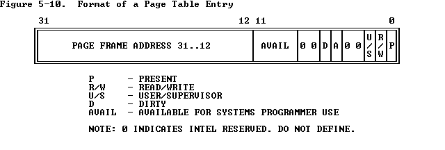
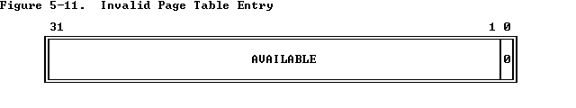

# Lab 2

## Introduction

* 内存管理包括两个部分：
  * 第一个是内核的物理内存分配器，因此内核可以分配内存并在以后释放它。 您的分配器将以4096字节为单位运行，称为页面。 您的任务是维护数据结构，记录哪些物理页面是空闲的，哪些是已分配的，以及共享每个已分配页面的进程数。 您还将编写用于分配和释放内存页面的例程。
  * 第二个是虚拟内存，它将内核和用户软件使用的虚拟地址映射到物理内存中的地址。 当指令使用内存时，x86硬件的内存管理单元（MMU）执行映射，查询一组页表。 您将修改JOS以根据我们提供的规范设置MMU的页面表。

### Getting started

lab2包括了一些新的文件：

- `inc/memlayout.h`
- `kern/pmap.c`
- `kern/pmap.h`
- `kern/kclock.h`
- `kern/kclock.c`

memlayout.h描述了必须通过修改pmap.c来实现的虚拟地址空间的布局。 memlayout.h和pmap.h定义了用于跟踪哪些物理内存页面是空闲的PageInfo结构。 kclock.c和kclock.h操纵PC的电池供电时钟和CMOS RAM硬件，其中BIOS记录PC包含的物理内存量等。 pmap.c中的代码需要读取此设备硬件以确定有多少物理内存。

## Physical Page Management

操作系统必须跟踪物理RAM中哪些是空闲的以及哪些是正在使用的。 JOS以页面粒度管理PC的物理内存，以便它可以使用MMU映射和保护每个分配的内存。

#### Exercise 1

> In the file `kern/pmap.c`, you must implement code for the following functions (probably in the order given).
>
> ```
> boot_alloc()`
> `mem_init()` (only up to the call to `check_page_free_list(1)`)
> `page_init()`
> `page_alloc()`
> `page_free()
> ```
>
> `check_page_free_list()` and `check_page_alloc()` test your physical page allocator. You should boot JOS and see whether `check_page_alloc()` reports success. Fix your code so that it passes. You may find it helpful to add your own `assert()`s to verify that your assumptions are correct.

首先来看boot_alloc()，它只在虚拟内存系统启动的时候作用，并不是真正的分配器，而且仅仅是分配内存，并不对内存进行操作。Lab1中我们知道了32位机器不会超过4MB，所以我们也知道了什么时候会出现越界异常。ROUNDUP宏在第一个参数附近寻找第二个参数对齐的地址，PADDR获取变量的地址。修改boot_alloc()如下：

```c
	if (n == 0)
		return nextfree;
	char* pre_free = nextfree;
	nextfree = ROUNDUP(nextfree+n, PGSIZE);
	if (PADDR(nextfree) >= 0x400000)
		panic("boot alloc memory overflow 4MB!");
	return pre_free;
//这里刚开始出了一点小错，返回成更新后的nextfree。但想一想就知道分配完要使用的虚拟地址肯定之前的。
```

然后mem_init()。这里只需要分配npages个页面，并且初始化为0就可以了，仿照上面create initial page dictionary，很容易写出来。

```c
	pages = (struct PageInfo*) boot_alloc(npages * sizeof(struct PageInfo));
	memset(pages, 0, npages * sizeof(struct PageInfo));
```

然后page_init()。我们先来看一下内存中的布局：


根据注释，初始化内存页分为四种情况：

* 保存IDT和BIOS结构的第一块内存页要被标为占用，即0-4KB。
* [PGSIZE, npages_basemem * PGSIZE)空闲。
* IO洞[IOPHYSMEM, EXTPHYSMEM)永远不能被分配。
* 拓展内存[EXTPHYSMEM, ...)有些已经被kernel占用，有些没有。

被kernel占用的地址可以通过boot_alloc(0)来获取，代码如下：

```
	size_t i;
	for (i = 1; i < npages_basemem; i++) {
		pages[i].pp_ref = 0;
		pages[i].pp_link = page_free_list;
		page_free_list = &pages[i];
	}
	i = PADDR(boot_alloc(0)) / PGSIZE;
	for(; i < npages; i++) {
		pages[i].pp_ref = 0;
		pages[i].pp_link = page_free_list;
		page_free_list = &pages[i];
	}
```

然后page_alloc()。用page2kva(page)可以得到对应页面的虚拟地址：

```c
	// Out of free memory
	if (!page_free_list)
		return NULL;
	struct PageInfo* used_page = page_free_list;
	page_free_list = used_page->pp_link;
	used_page->pp_link = NULL;
	if (alloc_flags & ALLOC_ZERO)
		memset(page2kva(used_page), 0, PGSIZE);
	return used_page;
```

然后page_free()。与page_alloc()一样，一个是从链表头删除，一个是在链表头添加：

```c
	if (pp->pp_ref || pp->pp_link != NULL)
		panic("Error in page free!");
	pp->pp_link = page_free_list;
	page_free_list = pp;
```


## Virtual Memory

#### Exercise 2

> Look at chapters 5 and 6 of the [Intel 80386 Reference Manual](https://pdos.csail.mit.edu/6.828/2018/readings/i386/toc.htm), if you haven't done so already. Read the sections about page translation and page-based protection closely (5.2 and 6.4). We recommend that you also skim the sections about segmentation; while JOS uses the paging hardware for virtual memory and protection, segment translation and segment-based protection cannot be disabled on the x86, so you will need a basic understanding of it.

* 一个页框是一个4KB的连续物理内存单元。页字节对齐并且大小固定。
* 虚拟地址通过页表与物理地址对应。


* 页表是一个32位页的数组。它本身就是一页，因此包含4KB内存（1K个32位入口）。
* 二级页表：高一级是一个页目录，可以寻址1K个二级页表。二级页表可以寻址1K页。所以一共可以寻址$2^{32}$的地址空间。
* 当前页目录的物理地址呗保存在CR3寄存器中，也被称为页目录基寄存器（PDBR）。



* 页框地址指明了一个页的物理开始地址。因为页是4K对齐的，所以低12位一直为0。在一个页目录中，页框地址是一个页表的地址。在二级页表中，页框地址是包含需要内存操作数的页框地址。
* Present bit表明一个页表入口是否可以被用来地址转换。P=1代表入口可用。



* 页目录自身没有present bit。一个页目录可能在连接的任务暂停时不可用，但是操作系统必须保证在任务完成之前，页目录已经在内存中。


* 对应意义：
  * P —— Present，判断对应物理页面是否存在，存在为1，否则为0;
  * W —— Write，该位用来判断对所指向的物理页面是否可写，1可写，0不可写；
  * U —— User，该位用来定义页面的访问者应该具备的权限。为1是User权限即可，如果为 0，表示需要高特权级才能访问；
  * WT —— 1=Write-through，0=Write-back；
  * CD —— Cache Disabled，1为禁用缓存，0不禁用；
  * D —— Dirty，是否被修改;
  * A —— Accessed，最近是否被访问;
  * AVL —— Available，可以被系统程序所使用;
  * 0 —— 保留位。

* 在页表发生变化时，系统程序员必须刷新页转换Cache：

  1. By reloading CR3 with a MOV instruction; for example:

     ```
     MOV CR3, EAX
     ```

  2. By performing a task switch to a TSS that has a different CR3 image than the current TSS .

* 页保护有两种
  * 限制访问域：超级权限(U/S=0)和用户权限(U/S=1)
    * The current level (U or S) is related to CPL. If CPL is 0, 1, or 2, the processor is executing at supervisor level. If CPL is 3, the processor is executing at user level.
  * 类型检查：只读(R/W=0)和读写(R/W=1)

### Virtual, Linear, and Physical Addresses

* 虚拟地址由段选择器和段内的偏移量组成。 
* 线性地址是在段转换之后但在页面转换之前获得的。 
* 物理地址是在段和页面转换之后最终得到的，以及最终在硬件总线上传输到RAM的内容。

在其他博客里找到一个更加形象的图：


C 指针是虚拟地址的偏移部分。在boot/boot.S中，引入全局描述符表(GDT)将所有段基址设为0到 0xffffffff，关闭了段转换。因此线性地址等于虚拟地址的偏移量。

#### Exercise 3

> While GDB can only access QEMU's memory by virtual address, it's often useful to be able to inspect physical memory while setting up virtual memory. Review the QEMU [monitor commands](https://pdos.csail.mit.edu/6.828/2018/labguide.html#qemu)from the lab tools guide, especially the `xp` command, which lets you inspect physical memory. To access the QEMU monitor, press Ctrl-a c in the terminal (the same binding returns to the serial console).
>
> Use the xp command in the QEMU monitor and the x command in GDB to inspect memory at corresponding physical and virtual addresses and make sure you see the same data.
>
> Our patched version of QEMU provides an info pg command that may also prove useful: it shows a compact but detailed representation of the current page tables, including all mapped memory ranges, permissions, and flags. Stock QEMU also provides an info mem command that shows an overview of which ranges of virtual addresses are mapped and with what permissions.

随便选取一个地址：


* 当我们处于保护模式（我们最开始在boot / boot.S中进入的），就无法直接使用线性或物理地址。所有内存引用都被解释为虚拟地址并由MMU转换，这意味着C中的所有指针都是虚拟地址。

* JOS内核通常需要将地址操作为不透明值或整数，而不需要解引用它们，例如在物理内存分配器中。有时这些是虚拟地址，有时它们是物理地址。为了帮助记录代码，JOS源区分了两种情况：类型uintptr_t表示不透明的虚拟地址，physaddr_t表示物理地址。这两种类型实际上只是32位整数（uint32_t）的同义词，因此编译器不会阻止将一种类型分配给另一种类型！由于它们是整数类型（不是指针），编译器只会在解引用时报错。

* | C type       | Address type |
  | ------------ | ------------ |
  | `T*`         | Virtual      |
  | `uintptr_t`  | Virtual      |
  | `physaddr_t` | Physical     |

> **Question**
>
> 1. Assuming that the following JOS kernel code is correct, what type should variable x have, uintptr_t or physaddr_t ?
>
>    ```
>    	mystery_t x;
>    	char* value = return_a_pointer();
>    	*value = 10;
>    	x = (mystery_t) value;
>    ```

C类型的指针，所以是`uintptr_t`。

* JOS内核有时需要读取或修改只知道物理地址的内存。例如，向页表添加映射可能需要分配物理内存来存储页目录，然后初始化该内存。但是，内核无法绕过虚拟地址转换，因此无法直接加载和存储到物理地址。 JOS在虚拟地址0xf0000000处从物理地址0开始重新映射所有物理内存的一个原因是帮助内核在只知道物理地址的情况下读写内存。为了将物理地址转换为内核实际可以读写的虚拟地址，内核必须将0xf0000000加上物理地址，以在重映射区域中找到其对应的虚拟地址。可以使用KADDR（pa）完成。
* 在给定存储内核数据结构的存储器的虚拟地址的情况下，JOS内核有时也需要能够找到物理地址。由boot_alloc（）分配的内核全局变量和内存位于加载内核的区域，从0xf0000000开始，这是我们映射所有物理内存的区域。因此，要将此区域中的虚拟地址转换为物理地址，内核可以简单地减去0xf0000000。可以使用PADDR（va）完成。

### Reference counting

* 通常会同时在多个虚拟地址（或多个环境的地址空间）中映射相同的物理页面。在物理页面对应的`pp_ref`字段中保留着每个物理页面的引用数量`struct PageInfo`。当物理页面的此计数变为零时，可以释放该页面，因为它不再使用。一般情况下，该计数应该等于物理页出现在`UTOP`以下中的所有页表的次数（ 在`UTOP`上的映射大多数是在内核启动时设置的，永远不应该被释放，因此不需要引用计数它们）。我们还将使用它来跟踪到页目录所在页的指针数量，进而跟踪页目录对页表页面的引用数量。
* 使用page_alloc时要小心。它返回的页面的引用计数始终为0，因此只要对返回的页面执行某些操作（例如将其插入页面表），pp_ref就应该递增。有时这是由其他函数处理的（例如，page_insert），有时调用page_alloc的函数必须自己来处理。

### Page Table Management

#### Exercise 4

>  In the file `kern/pmap.c`, you must implement code for the following functions.
>
> ```
>         pgdir_walk()
>         boot_map_region()
>         page_lookup()
>         page_remove()
>         page_insert()
> 	
> ```
>
> `check_page()`, called from `mem_init()`, tests your page table management routines. You should make sure it reports success before proceeding.

在mmu.h中，我们可以看到完成这道题的关键信息：

```
// A linear address 'la' has a three-part structure as follows:
//
// +--------10------+-------10-------+---------12----------+
// | Page Directory |   Page Table   | Offset within Page  |
// |      Index     |      Index     |                     |
// +----------------+----------------+---------------------+
//  \--- PDX(la) --/ \--- PTX(la) --/ \---- PGOFF(la) ----/
//  \---------- PGNUM(la) ----------/
//
// The PDX, PTX, PGOFF, and PGNUM macros decompose linear addresses as shown.
// To construct a linear address la from PDX(la), PTX(la), and PGOFF(la),
// use PGADDR(PDX(la), PTX(la), PGOFF(la)).
```

首先，我们从va获取两个index。先在第一级页目录里查找，此时可能出现找不到或者页面不可用的情况，按照注释进行处理。这里要注意有可能是pde指向的为空，也可能是当前页面Present位为0，即不可用。最后，得到二级页表后，对页表进行查找就完成了（因为页表项中包含很多其他位信息，所以要用PTE_ADDR来获取地址，其定义在mmu.h中）：

```c
pte_t *
pgdir_walk(pde_t *pgdir, const void *va, int create)
{
	// Fill this function in
	int pde_index = PDX(va);
	int pte_index = PTX(va);
	// In page directory
	pde_t* pde = &pgdir[pde_index];
	if (!(*pde & PTE_P)) {
		if (create) {
			struct PageInfo *page = page_alloc(ALLOC_ZERO);
			if (!page)
				return NULL;
			else {
				page->pp_ref++;
				// permission bit
				*pde = page2pa(page) | PTE_P | PTE_U | PTE_W;
			}
		}
		else
			return NULL;
	}
	pte_t* pte = (pte_t*) KADDR(PTE_ADDR(*pde));
	// In page table
	return &pte[pte_index];
}
```

首先，我们要利用之前写好的pgdir_walk获取页的地址。然后把pa存入页表项中，这样就完成虚拟地址到物理地址的映射：

```c
static void
boot_map_region(pde_t *pgdir, uintptr_t va, size_t size, physaddr_t pa, int perm)
{
	// Fill this function in
	for (size_t i = 0; i < size; i+=PGSIZE) {
		pte_t* vir_addr = pgdir_walk(pgdir, (const void*)va, 1);
		if (!vir_addr)
			panic("Error in creating new page table!");
		*vir_addr = pa | perm | PTE_P;
		va += PGSIZE;
		pa += PGSIZE;
	}
}
```

首先，利用pgdir_walk得到页表项的地址，然后从页表项中得到物理地址，最后转换成PageInfo*返回：

```c
struct PageInfo *
page_lookup(pde_t *pgdir, void *va, pte_t **pte_store)
{
	// Fill this function in
	pte_t* pte = pgdir_walk(pgdir, va, 0);
	if (!pte)
		return NULL;
	if (pte_store)
		*pte_store = pte;
	return pa2page(PTE_ADDR(*pte));
}
```

按照注释做即可：

```c
void
page_remove(pde_t *pgdir, void *va)
{
	// Fill this function in
	pte_t* pte;
	struct PageInfo* page = page_lookup(pgdir, va, &pte);
	if (!page)
		return;
	*pte = 0;
	page_decref(page);
	tlb_invalidate(pgdir, va);
}
```

首先，得到va对应的页表项。如果这个页此时正在被使用，那么释放它。然后在页表项中存入新的pte。

```c
int
page_insert(pde_t *pgdir, struct PageInfo *pp, void *va, int perm)
{
	// Fill this function in
	pte_t* pte = pgdir_walk(pgdir, va, 1);
	if (!pte)
		return -E_NO_MEM;
	pp->pp_ref++;
	if (*pte & PTE_P)
		page_remove(pgdir, va);
	*pte = page2pa(pp) | perm | PTE_P;
	return 0;
}
```

## Kernel Address Space

* JOS将处理器的32位线性地址空间分为两部分。我们将在实验3中开始加载和运行的用户环境（进程）将控制下部的布局和内容，而内核始终保持对上部的完全控制。分割线是由在`INC / memlayout.h`中的`ULIM`定义的，保留约256MB为内核的虚拟地址空间。这就解释了为什么我们需要在实验室1中为内核提供如此高的链接地址：否则内核的虚拟地址空间中没有足够的空间来同时映射到它下面的用户环境中。

```
/*
 * Virtual memory map:                                Permissions
 *                                                    kernel/user
 *
 *    4 Gig -------->  +------------------------------+
 *                     |                              | RW/--
 *                     ~~~~~~~~~~~~~~~~~~~~~~~~~~~~~~~~
 *                     :              .               :
 *                     :              .               :
 *                     :              .               :
 *                     |~~~~~~~~~~~~~~~~~~~~~~~~~~~~~~| RW/--
 *                     |                              | RW/--
 *                     |   Remapped Physical Memory   | RW/--
 *                     |                              | RW/--
 *    KERNBASE, ---->  +------------------------------+ 0xf0000000      --+
 *    KSTACKTOP        |     CPU0's Kernel Stack      | RW/--  KSTKSIZE   |
 *                     | - - - - - - - - - - - - - - -|                   |
 *                     |      Invalid Memory (*)      | --/--  KSTKGAP    |
 *                     +------------------------------+                   |
 *                     |     CPU1's Kernel Stack      | RW/--  KSTKSIZE   |
 *                     | - - - - - - - - - - - - - - -|                 PTSIZE
 *                     |      Invalid Memory (*)      | --/--  KSTKGAP    |
 *                     +------------------------------+                   |
 *                     :              .               :                   |
 *                     :              .               :                   |
 *    MMIOLIM ------>  +------------------------------+ 0xefc00000      --+
 *                     |       Memory-mapped I/O      | RW/--  PTSIZE
 * ULIM, MMIOBASE -->  +------------------------------+ 0xef800000
 *                     |  Cur. Page Table (User R-)   | R-/R-  PTSIZE
 *    UVPT      ---->  +------------------------------+ 0xef400000
 *                     |          RO PAGES            | R-/R-  PTSIZE
 *    UPAGES    ---->  +------------------------------+ 0xef000000
 *                     |           RO ENVS            | R-/R-  PTSIZE
 * UTOP,UENVS ------>  +------------------------------+ 0xeec00000
 * UXSTACKTOP -/       |     User Exception Stack     | RW/RW  PGSIZE
 *                     +------------------------------+ 0xeebff000
 *                     |       Empty Memory (*)       | --/--  PGSIZE
 *    USTACKTOP  --->  +------------------------------+ 0xeebfe000
 *                     |      Normal User Stack       | RW/RW  PGSIZE
 *                     +------------------------------+ 0xeebfd000
 *                     |                              |
 *                     |                              |
 *                     ~~~~~~~~~~~~~~~~~~~~~~~~~~~~~~~~
 *                     .                              .
 *                     .                              .
 *                     .                              .
 *                     |~~~~~~~~~~~~~~~~~~~~~~~~~~~~~~|
 *                     |     Program Data & Heap      |
 *    UTEXT -------->  +------------------------------+ 0x00800000
 *    PFTEMP ------->  |       Empty Memory (*)       |        PTSIZE
 *                     |                              |
 *    UTEMP -------->  +------------------------------+ 0x00400000      --+
 *                     |       Empty Memory (*)       |                   |
 *                     | - - - - - - - - - - - - - - -|                   |
 *                     |  User STAB Data (optional)   |                 PTSIZE
 *    USTABDATA ---->  +------------------------------+ 0x00200000        |
 *                     |       Empty Memory (*)       |                   |
 *    0 ------------>  +------------------------------+                 --+
 *
 * (*) Note: The kernel ensures that "Invalid Memory" is *never* mapped.
 *     "Empty Memory" is normally unmapped, but user programs may map pages
 *     there if desired.  JOS user programs map pages temporarily at UTEMP.
 */
```

### Permissions and Fault Isolation

* 由于内核和用户内存都存在于每个环境的地址空间中，因此我们必须在x86页表中使用权限位，以允许用户仅访问地址空间的用户部分。否则用户代码中的错误可能会覆盖内核数据，从而导致崩溃或更微妙的故障; 用户代码也可以窃取其他环境的私有数据。请注意，可写权限位（`PTE_W`）会影响用户和内核代码！

* 用户环境对上面的任何`ULIM`之上的内存都没有权限，而内核能够读写这个内存。对于地址范围 `[UTOP,ULIM)`，内核和用户环境都具有相同的权限：它们可以读取但不能写入此地址范围。此范围的地址用于将某些内核数据结构以只读方式暴露给用户环境。最后，下面的地址空间`UTOP`供用户环境使用; 用户环境将设置访问此内存的权限。

### Initializing the Kernel Address Space

#### Exercise 5

> Fill in the missing code in `mem_init()` after the call to `check_page()`.
>
> Your code should now pass the `check_kern_pgdir()` and `check_page_installed_pgdir()` checks.

就是简单的映射，映射方式在注释里写的都很清楚：

```c
	//////////////////////////////////////////////////////////////////////
	// Map 'pages' read-only by the user at linear address UPAGES
	// Permissions:
	//    - the new image at UPAGES -- kernel R, user R
	//      (ie. perm = PTE_U | PTE_P)
	//    - pages itself -- kernel RW, user NONE
	// Your code goes here:
	boot_map_region(kern_pgdir, UPAGES, PTSIZE, PADDR(pages), PTE_U);

	//////////////////////////////////////////////////////////////////////
	// Use the physical memory that 'bootstack' refers to as the kernel
	// stack.  The kernel stack grows down from virtual address KSTACKTOP.
	// We consider the entire range from [KSTACKTOP-PTSIZE, KSTACKTOP)
	// to be the kernel stack, but break this into two pieces:
	//     * [KSTACKTOP-KSTKSIZE, KSTACKTOP) -- backed by physical memory
	//     * [KSTACKTOP-PTSIZE, KSTACKTOP-KSTKSIZE) -- not backed; so if
	//       the kernel overflows its stack, it will fault rather than
	//       overwrite memory.  Known as a "guard page".
	//     Permissions: kernel RW, user NONE
	// Your code goes here:
	boot_map_region(kern_pgdir, KSTACKTOP-KSTKSIZE, KSTKSIZE, PADDR(bootstack), PTE_W);

	//////////////////////////////////////////////////////////////////////
	// Map all of physical memory at KERNBASE.
	// Ie.  the VA range [KERNBASE, 2^32) should map to
	//      the PA range [0, 2^32 - KERNBASE)
	// We might not have 2^32 - KERNBASE bytes of physical memory, but
	// we just set up the mapping anyway.
	// Permissions: kernel RW, user NONE
	// Your code goes here:
	boot_map_region(kern_pgdir, KERNBASE, 0xffffffff-KERNBASE, 0, PTE_W);
```


> **Question**
>
> 2. What entries (rows) in the page directory have been filled in at this point? What addresses do they map and where do they point? In other words, fill out this table as much as possible:
>
> | Entry | Base Virtual Address | Points to (logically):                |
> | ----- | -------------------- | ------------------------------------- |
> | 1023  | ?                    | Page table for top 4MB of phys memory |
> | 1022  | ?                    | ?                                     |
> | .     | ?                    | ?                                     |
> | .     | ?                    | ?                                     |
> | .     | ?                    | ?                                     |
> | 2     | 0x00800000           | ?                                     |
> | 1     | 0x00400000           | ?                                     |
> | 0     | 0x00000000           | [see next question]                   |
>
> 3. We have placed the kernel and user environment in the same address space. Why will user programs not be able to read or write the kernel's memory? What specific mechanisms protect the kernel memory?
>
> 4. What is the maximum amount of physical memory that this operating system can support? Why?
>
> 5. How much space overhead is there for managing memory, if we actually had the maximum amount of physical memory? How is this overhead broken down?
>
> 6. Revisit the page table setup in `kern/entry.S` and `kern/entrypgdir.c`. Immediately after we turn on paging, EIP is still a low number (a little over 1MB). At what point do we transition to running at an EIP above KERNBASE? 

2. 参考分布图和练习5：

| Entry | Base Virtual Address | Points to (logically):                |
| ----- | -------------------- | ------------------------------------- |
| 1023  | 0xffc00000           | Page table for top 4MB of phys memory |
| 1022  | 0xff800000           | ?                                     |
| .     | ?                    | ?                                     |
| 960   | 0xf0000000           | KERNBASE                              |
| 956   | 0xef000000           | UPAGES                                |
| 2     | 0x00800000           | Program Data & Heap                   |
| 1     | 0x00400000           | Empty Memory (*)                      |
| 0     | 0x00000000           | [see next question]                   |

3. 通过设置权限位。如果用户可以访问内核内存，可能会发生覆盖等现象，导致系统崩溃。

4. 2GB。因为UPAGES最大可以到4MB。每个PageInfo大小为8B。每个页面大小4KB。所以4M/8*4K = 2G

5. 如果有2G内存，那么UPAGES有4MB，一共有512K个PageInfo。管理内存的部分还有二级页表。第二级页表占512K*4 = 2MB。第一级页目录占512 * 8 = 4KB，所以总共6MB + 4KB。

6. 在jmp *%eax。因为此时虚拟地址[0, 4MB)，[KERNBASE, KERNBASE+4MB) 都被映射到物理地址[0, 4MB)。

   Tips: 在PC用的16位CPU 8086、8088中，寄存器的名字分别是AX(累加器)，BX(基址寄存器)，CX(计数寄存器)，DX(数据寄存器)，SP(堆栈指针)，BP(基址指针)，SI(源变址寄存器)，DI(目的变址寄存器)，IP(指令指针)，等等……在386以上的32位CPU中，这些寄存器扩展成了32位的，名字就是在原来16位的名字前面加一个字母E，变成了EAX，EBX，…………

> *Challenge!* Extend the JOS kernel monitor with commands to:
>
> - Display in a useful and easy-to-read format all of the physical page mappings (or lack thereof) that apply to a particular range of virtual/linear addresses in the currently active address space. For example, you might enter `'showmappings 0x3000 0x5000'` to display the physical page mappings and corresponding permission bits that apply to the pages at virtual addresses 0x3000, 0x4000, and 0x5000.
> - Explicitly set, clear, or change the permissions of any mapping in the current address space.
> - Dump the contents of a range of memory given either a virtual or physical address range. Be sure the dump code behaves correctly when the range extends across page boundaries!
> - Do anything else that you think might be useful later for debugging the kernel. (There's a good chance it will be!)

参考了下其他博客的内容，主要还是对C不够熟：

```c
int
mon_showmappings(int argc, char **argv, struct Trapframe *tf) {
	if (argc < 3) {
        	cprintf("Usage: showmappings begin_addr end_addr\n");
        	return 0;
    	}
	// strtol: turn a string into int
	uint32_t begin = strtol(argv[1], NULL, 16);
	uint32_t end = strtol(argv[2], NULL, 16);
	if (begin >= end) {
		cprintf("end_addr must be larger than begin_addr!\n");
		return 0;
	}
	if (end >= 0xffffffff) {
		cprintf("end_addr overflow!\n");
		return 0;
	}
	if (begin != ROUNDUP(begin, PGSIZE) || end != ROUNDUP(end, PGSIZE)) {
		cprintf("addr not aligned!\n");
		return 0;
	}
	for (; begin <= end; begin+=PGSIZE) {
		pte_t* pte = pgdir_walk(kern_pgdir, (const void*) begin, 0);
		if (!pte || !(*pte & PTE_P))
			cprintf("%08x: not mapped\n",begin);
		else {
			cprintf("%08x: %08x ", begin, PTE_ADDR(*pte));
			cprintf("PTE_P: %x, PTE_W: %x, PTE_U: %x\n", *pte&PTE_P, *pte&PTE_W, *pte&PTE_U);
		}
	}
	return 0;
}
```

**别忘了添加pamp.h头文件以及在monitor.h中添加函数的声明。**


```c
int
mon_updateperm(int argc, char **argv, struct Trapframe *tf) {
	if (argc < 4) {
        	cprintf("Usage: updateperm addr [0|1] [P|W|U]\n");
        	return 0;
    	}
	uint32_t addr = strtol(argv[1], NULL, 16);
	if (addr >= 0xffffffff) {
		cprintf("addr overflow!\n");
		return 0;
	}
	char action = argv[2][0];
	char perm = argv[3][0];
	if (addr != ROUNDUP(addr, PGSIZE)) {
		cprintf("addr not aligned!\n");
		return 0;
	}
	uint32_t perm_bit = 0;
	switch(perm) {
		case 'P':
			perm_bit = PTE_P;
			break;
		case 'W':
			perm = PTE_W;
			break;
		case 'U':
			perm = PTE_U;
			break;
		default:
			cprintf("unknown param: %c\n", perm);
			return 0;
	}
	pte_t* pte = pgdir_walk(kern_pgdir, (const void*)addr, 0);
	if (!pte || !(*pte & PTE_P)) {
		cprintf("not mapped\n");
		return 0;
	}
	if (action == '0') {
		*pte = *pte & ~perm;
		cprintf("%08x clear permission\n", addr);
	}
	else {
		*pte = *pte | perm;
		cprintf("%08x set permission %c\n", addr, perm);
	}
	return 0;	
}
```


```c
int
mon_dumpmem(int argc, char **argv, struct Trapframe *tf) {
	if (argc < 4) {
        	cprintf("Usage: dumpmem [p|v] addr n\n");
        	return 0;
    	}
	uint32_t bias = KERNBASE/4;
	char type = argv[1][0];
	void** addr  = (void**)strtol(argv[2], 0, 16);
	uint32_t n = strtol(argv[3], NULL, 0);
	if (!addr) {
		cprintf("addr error!\n");
		return 0;
	}
	if (type == 'p') {
		cprintf("physical memory\n");
		for (uint32_t i = bias; i < n+bias; i++)
			cprintf("%08x: %08x\n", addr+i, addr[i]);
	}
	else if (type == 'v') {
		cprintf("virtual memory\n");
		for (uint32_t i = 0; i < n; i++)
			cprintf("%08x: %08x\n", addr+i, addr[i]);
	}
	else
		cprintf("unknown param %c\n", type);
	return 0;
}
```


### Address Space Layout Alternatives

* 我们在JOS中使用的地址空间布局不是唯一的。操作系统可以将内核映射到低线性地址，同时将线性地址空间的上部留给用户进程。

* 设计内核不必为自己保留处理器的线性或虚拟地址空间的*任何*固定部分，而是有效地允许用户级进程不受限制地使用*整个* 4GB虚拟地址空间 - 同时仍然完全保护内核免受这些进程的影响并保护彼此不同的进程！


