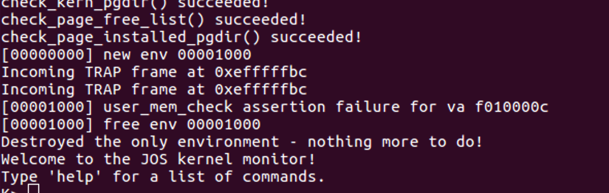
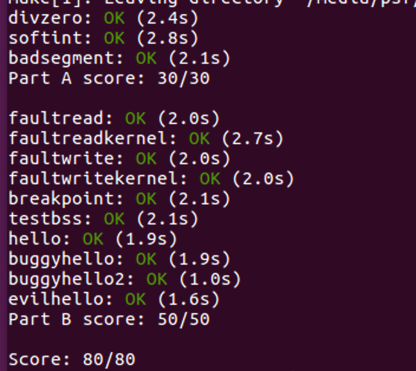

# Lab 3

## Introduction

在本实验中，您将实现运行受保护的用户模式环境（即“进程”）所需的基本内核工具。您将增强JOS内核以设置数据结构来跟踪用户环境，创建单个用户环境，将程序映像加载到其中，并开始运行。您还将使JOS内核能够处理用户环境所做的任何系统调用，并处理它导致的任何其他异常。

**注意：** 在本实验中，术语*环境*和*进程*是可互换的 - 两者都是指允许您运行程序的抽象。我们引入术语“环境”而不是传统术语“进程”，以强调JOS环境和UNIX进程提供不同接口的点，并且不提供相同的语义。

## User Environments and Exception Handling

* 新的include文件`inc / env.h` 包含JOS中用户环境的基本定义。内核使用`Env`数据结构来跟踪每个用户环境。

* 正如您在`kern / env.c中`看到的，内核维护了三个与环境相关的主要全局变量：

```c
struct Env * envs = NULL; //所有环境
struct Env * curenv = NULL; //当前的环境
static struct Env * env_free_list; //空闲环境列表
```

* 一旦JOS启动并运行，`envs`指针指向`Env`表示系统中所有环境的结构数组。在我们的设计中，JOS内核将支持最多`NENV` 个同时活动的环境，尽管在任何给定时间通常会有更少的运行环境。（`NENV`是`inc / env.h中`的常量 ）。一旦分配，该数组将包含每个可能环境的数据结构的单个实例。

* JOS内核保留了所有空闲的Env`结构，`env_free_list`。此设计允许轻松地分配和释放环境，因为它们只需添加到空闲列表或从空闲列表中删除。

* 内核使用该`curenv`符号在任何给定时间跟踪*当前正在执行的*环境。在启动期间，在第一个环境运行之前， `curenv`最初设置为`NULL`。

### Environment State

该`Env`结构在`inc / env.h中`定义如下：

```c
struct Env {
	struct Trapframe env_tf; //保存的寄存器
	struct Env * env_link; //下一个空闲环境
	envid_t env_id; //唯一的环境标识符
	envid_t env_parent_id; //这个env的父级的env_id
	enum envType env_type; //表示特殊系统环境
	unsigned env_status; //环境状况
	uint32_t env_runs; //环境运行的次数

	//地址空间
	pde_t * env_pgdir; //页面目录的内核虚拟地址
};
```

以下是这些`Env`字段的用途：

- **env_tf**：

  在`inc / trap.h中`定义的此结构在该环境*未*运行时保存环境的已保存寄存器值：例如，当内核或其他环境正在运行时。当从用户切换到内核模式时，内核会保存这些内容，以便以后可以从中断的环境恢复环境。

- **env_link**：

  这是 `env_free_list`上下一个`Env`的链接。 `env_free_list`指向列表中的第一个空闲环境。

- **env_id**：

  内核在此存储一个值，该值唯一标识当前使用此`Env`结构的环境。在用户环境终止后，内核可能会将相同的`Env`结构重新分配给不同的环境 - 但`env_id`即使新环境重新使用`envs`阵列中的相同插槽，新环境也会与旧环境不同。

- **env_parent_id**：

  内核在此存储创建此环境的环境`env_id`。通过这种方式，环境可以形成“家谱”，这对于做出关于允许哪些环境对谁做什么的安全决策是有用的。

- **env_type**：

  这用于区分特殊环境。对于大多数环境，它将是`ENV_TYPE_USER`。我们将在以后的实验中为特殊系统服务环境引入更多类型。

- **env_status**：

  此变量包含以下值之一：

  `ENV_FREE`：表示`Env`结构处于非活动状态，因此在`env_free_list`中。

  `ENV_RUNNABLE`：表示该`Env`结构表示等待在处理器上运行的环境。

  `ENV_RUNNING`：表示该`Env`结构表示当前正在运行的环境。

  `ENV_NOT_RUNNABLE`：表示该`Env`结构表示当前活动的环境，但它当前未准备好运行：例如，因为它正在等待来自其他环境的进程间通信（IPC）。

  `ENV_DYING`：表示该`Env`结构表示僵尸环境。僵尸环境将在下次陷入内核时被释放。实验4之前我们不会使用这个标志。

- **env_pgdir**：

  此变量保存 此环境的页面目录的内核*虚拟地址*。

像Unix进程一样，JOS环境耦合了“线程”和“地址空间”的概念。线程主要由保存的寄存器（`env_tf`字段）定义，地址空间由页面目录和指向的页面表`env_pgdir`定义 。为了运行环境，内核必须建立与CPU *都*保存的寄存器和相应的地址空间。

我们`struct Env`类似于xv6的`struct proc` 。两种结构都在结构中保存环境（即进程）的用户模式寄存器状态`Trapframe` 。在JOS中，各个环境没有像xv6中的进程那样拥有自己的内核堆栈。在一个时间点，只能有一个JOS环境中进行活动，所以JOS只需要一个 *单一的*内核堆栈。

### Allocating the Environments Array

#### Exercise 1

> Modify `mem_init()` in `kern/pmap.c` to allocate and map the `envs` array. This array consists of exactly `NENV` instances of the `Env` structure allocated much like how you allocated the `pages` array. Also like the `pages` array, the memory backing `envs` should also be mapped user read-only at `UENVS` (defined in `inc/memlayout.h`) so user processes can read from this array.
>
> You should run your code and make sure `check_kern_pgdir()` succeeds.

仿照上一个lab中分配页面的就行，几乎一样：

```c
	envs = (struct Env*) boot_alloc(NENV * sizeof(struct Env));
	memset(envs, 0, NENV * sizeof(struct Env));
	
	boot_map_region(kern_pgdir, UENVS, PTSIZE, PADDR(envs), PTE_U);
```

### Creating and Running Environments

* 因为我们还没有文件系统，所以我们将设置内核加载*嵌入在内核中*的静态二进制映像。JOS将此二进制文件作为ELF可执行映像嵌入内核中。

* `GNUmakefile`在`obj / user /`目录中生成很多二进制映像。链接器命令行选项`-b binary`将使这些文件作为“原始”未解释的二进制文件被链接，而不是作为常规的由编译器产生的`.o`文件。（就链接器而言，这些文件根本不必是ELF映像 - 它们可以是任何东西，例如文本文件或图片！）如果你看一下在构建内核之后的`obj / kern / kernel.sym`，您会注意到链接器“神奇地”产生了许多具有晦涩名称的有趣符号，如 `_binary_obj_user_hello_start`， `_binary_obj_user_hello_end`和 `_binary_obj_user_hello_size`。链接器通过修改二进制文件的文件名来生成这些符号名称; 这些符号为常规内核代码提供了引用嵌入式二进制文件的方法。

#### Exercise 2

> In the file `env.c`, finish coding the following functions:
>
> - `env_init()`
>
>   Initialize all of the `Env` structures in the `envs` array and add them to the `env_free_list`. Also calls `env_init_percpu`, which configures the segmentation hardware with separate segments for privilege level 0 (kernel) and privilege level 3 (user).
>
> - `env_setup_vm()`
>
>   Allocate a page directory for a new environment and initialize the kernel portion of the new environment's address space.
>
> - `region_alloc()`
>
>   Allocates and maps physical memory for an environment
>
> - `load_icode()`
>
>   You will need to parse an ELF binary image, much like the boot loader already does, and load its contents into the user address space of a new environment.
>
> - `env_create()`
>
>   Allocate an environment with `env_alloc` and call `load_icode` to load an ELF binary into it.
>
> - `env_run()`
>
>   Start a given environment running in user mode.
>
> As you write these functions, you might find the new cprintf verb `%e` useful -- it prints a description corresponding to an error code. For example,
>
> ```
> 	r = -E_NO_MEM;
> 	panic("env_alloc: %e", r);
> ```
>
> will panic with the message "env_alloc: out of memory".

因为这里是单链表，初始化顺序要注意反过来：

```c
void
env_init(void)
{
	// Set up envs array
	// LAB 3: Your code here.
    for (int i = NENV-1; i >= 0; i--) {
        struct Env *e = &envs[i];
        e->env_id = 0;
        e->env_status = ENV_FREE;
        e->env_link = env_free_list;
        env_free_list = e;
    }
	// Per-CPU part of the initialization
	env_init_percpu();
}
```

分配页目录和权限的代码已经写好了，我们只要设置好相应的链接就可以了。首先，要根据提示利用pmap.h中的page2kva()，将page转成虚拟地址，得到的地址就会被分配为环境的页目录。然后根据提示，每个环境的页目录内容都和kernel的一样，所以直接拷贝。接着对该页的引用加1：

```c
static int
env_setup_vm(struct Env *e)
{
	int i;
	struct PageInfo *p = NULL;

	// Allocate a page for the page directory
	if (!(p = page_alloc(ALLOC_ZERO)))
		return -E_NO_MEM;

	// LAB 3: Your code here.
	// turn page into virtual address and set
	p->pp_ref++;
	e->env_pgdir = (pte_t*) page2kva(p);
	memcpy(e->env_pgdir, kern_pgdir, PGSIZE);

	// UVPT maps the env's own page table read-only.
	// Permissions: kernel R, user R
	e->env_pgdir[PDX(UVPT)] = PADDR(e->env_pgdir) | PTE_P | PTE_U;

	return 0;
}
```

我们要为环境分配对应的物理页。首先，输入的va，len可能不对齐。所以我们要根据提示进行调整。然后我们根据大小，获取新的物理页，然后将其插入到上一步产生的页目录页中：

```c
static void
region_alloc(struct Env *e, void *va, size_t len)
{
	// LAB 3: Your code here.
	// (But only if you need it for load_icode.)
	//
	// Hint: It is easier to use region_alloc if the caller can pass
	//   'va' and 'len' values that are not page-aligned.
	//   You should round va down, and round (va + len) up.
	//   (Watch out for corner-cases!)
	void* begin = (void*) ROUNDDOWN(va, PGSIZE);
	void* end = (void*) ROUNDUP(va+len, PGSIZE);
	struct PageInfo* page;
	for (; begin < end; begin+=PGSIZE) {
		page = page_alloc(ALLOC_ZERO);
		if (!page)
			panic("alloc page failed!");
		page_insert(e->env_pgdir, page, begin, PTE_W|PTE_U);
	}
}
```

整个的过程与lab1中的bootmain()相似，都是读取内容，然后加载到程序头中。但是这个更加简单，直接从一个变量中读取就可以，不需要再访问磁盘。要注意的是CR3中保存的是当前的页目录，而此时CR3中是内核的页目录。所以在分配物理页面之前要换成用户环境的页目录：

```c
static void
load_icode(struct Env *e, uint8_t *binary)
{
	// LAB 3: Your code here.
	struct Elf *env_elf = (struct Elf*) binary;
	if (env_elf->e_magic != ELF_MAGIC)
		panic("load ELF header failed!");
	// turn to user virtual address space
	struct Proghdr *ph, *eph;
	ph = (struct Proghdr*)((uint8_t*)(env_elf) + env_elf->e_phoff);
	eph = ph + env_elf->e_phnum;
	lcr3(PADDR(e->env_pgdir));
	for (;ph < eph; ph++) {
		// load segments with ph->p_type == ELF_PROG_LOAD
		if (ph->p_type == ELF_PROG_LOAD) {
			region_alloc(e, (void*)ph->p_va, ph->p_memsz);
			// move data
			memcpy((void*)ph->p_va, binary+ph->p_offset, ph->p_filesz);
			// clear other parts
			memset((void*)(ph->p_va + ph->p_filesz), 0, ph->p_memsz - ph->p_filesz);
		}
	}
	// set progam's entry point
	e->env_tf.tf_eip = env_elf->e_entry;
	lcr3(PADDR(kern_pgdir));

	// Now map one page for the program's initial stack
	// at virtual address USTACKTOP - PGSIZE.

	// LAB 3: Your code here.
	region_alloc(e, (void*)(USTACKTOP - PGSIZE), PGSIZE);
}
```

首先，分配并初始化一个新环境，然后装载ELF信息进去，最后设置env_type：

```c
void
env_create(uint8_t *binary, enum EnvType type)
{
	// LAB 3: Your code here.
	struct Env* e;
	int result = env_alloc(&e, 0);
	if (result)
		panic("allocate enviornment failed!");
	e->env_type = type;
	load_icode(e, binary);
}
```

按照注释来，很简单：

```c
void
env_run(struct Env *e)
{
	if (curenv && curenv->env_status == ENV_RUNNING)
		curenv->env_status = ENV_RUNNABLE;
	curenv = e;
	e->env_status = ENV_RUNNING;
	e->env_runs++;
	lcr3(PADDR(e->env_pgdir));
	env_pop_tf(&curenv->env_tf);
}
```

* 下面是代码的调用图，直到调用用户代码为止。
  - start (kern/entry.S)
  - i386_init (kern/init.c)
    - cons_init
    - mem_init
    - env_init
    - trap_init (still incomplete at this point)
    - env_create
    - env_run
      - env_pop_tf
* 此时会出现问题，因为JOS尚未设置硬件以允许从用户空间到内核的任何类型的转换。当CPU发现它没有设置来处理这个系统调用中断时，它会产生一般保护异常，同时发现它无法处理，产生双故障异常，发现它无法处理，最后因为所谓的“三重错误”放弃。通常，您会看到CPU重置和系统重启。

### Handling Interrupts and Exceptions

#### Exercise 3

> Read [Chapter 9, Exceptions and Interrupts](https://pdos.csail.mit.edu/6.828/2018/readings/i386/c09.htm) in the [80386 Programmer's Manual](https://pdos.csail.mit.edu/6.828/2018/readings/i386/toc.htm) (or Chapter 5 of the [IA-32 Developer's Manual](https://pdos.csail.mit.edu/6.828/2018/readings/ia32/IA32-3A.pdf)), if you haven't already.

* 中断和异常是特殊类型的控制转移; 他们的工作方式有点像未编程的 CALL。它们会改变正常的程序流程来处理外部事件或报告错误或异常情况。中断和异常之间的区别在于中断用于处理处理器外部的异步事件，但异常处理处理器本身在执行指令过程中检测到的条件。

  外部中断和异常都有两个来源：

  1. 中断
     - 可屏蔽中断，通过INTR引脚发出信号。
     - 不可屏蔽的中断，通过NMI（不可屏蔽中断）引脚发出信号。
  2. 异常
     - 检测到处理器 这些进一步分类为故障，陷阱和中止。
     - 程序。INTO， INT 3， INT n和 BOUND指令 可以触发异常。这些指令通常称为“软件中断”，但处理器将它们作为例外处理。

#### Basics of Protected Control Transfer

异常和中断都是“受保护的控制传输”，它使处理器从用户切换到内核模式（CPL = 0），而不会给用户模式代码任何干扰内核或其他环境功能的机会。在英特尔的术语中，*中断*是受保护的控制传输，它由通常在处理器外部的异步事件引起，例如外部设备I / O活动的通知。一个*异常*，与此相反，是当前正在运行的代码同步地引起受保护的控制传输，例如由于通过零除法或一个无效的存储器访问。

为了确保这些受保护的控制传输实际*受到保护*，处理器的中断/异常机制被设计成，使得当发生中断或异常时，当前运行的代码 *无法随意选择内核的输入位置或方式*。相反，处理器确保只能在严格控制的条件下输入内核。在x86上，两种机制协同工作以提供此保护：

1. **中断描述符表。** 处理器确保中断和异常只能使内核进入*由内核本身确定*的几个特定的，定义明确的入口点 ，而不是在中断或异常时运行的代码。

   x86允许最多256个不同的中断或异常入口点进入内核，每个入口点都有不同的*中断向量*。向量是介于0和255之间的数字。中断的向量由中断源决定：不同的设备，错误条件和对内核的应用程序请求会产生具有不同向量的中断。CPU使用向量作为处理器*中断描述符表*（IDT）的索引，内核在内核专用的内存中设置，就像GDT（全局描述符表）一样。从此表中的相应条目处理器加载：

   - 要加载到指令指针（`EIP`）寄存器中的值，指向指定用于处理该类型异常的内核代码。
   - 要加载到代码段（`CS`）寄存器中的值，该寄存器包括在位0-1中运行异常处理程序的权限级别。（在JOS中，所有异常都在内核模式下处理，特权级别为0.）

2. **任务状态部分。** 处理器需要在中断或异常发生之前保存*旧*处理器状态的位置，例如 在处理器调用异常处理程序之前`EIP`和`CS`的原始值，以便异常处理程序可以从中断的代码恢复该旧状态并恢复中断。但是，旧处理器状态的这个保存区域又必须受到保护，以免受非特权用户模式代码的影响。否则，错误或恶意用户代码可能会破坏内核。

   因此，当x86处理器采用导致从用户到内核模式的权限级别更改的中断或陷阱时，它也会切换到内核内存中的堆栈。称为*任务状态段*（TSS）的结构指定该堆栈所在的段选择器和地址。处理器（在这个新堆栈上）推送 `SS`，`ESP`，`EFLAGS`，`CS`，`EIP`和可选的错误代码。然后它从中断描述符加载`CS`和`EIP`，并设置`ESP`和`SS`以引用新堆栈。

   尽管TSS很大并且可能用于各种目的，但是JOS仅使用它来定义处理器在从用户模式转换到内核模式时应切换到的内核堆栈。由于“内核模式”在JOS中特权级别是0，在进入内核模式时，处理器使用TSS的字段中的`ESP0`和`SS0`来定义内核栈。JOS不使用任何其他TSS字段。

### Types of Exceptions and Interrupts

x86处理器可以在内部生成的所有同步异常上都使用0到31之间的中断向量，因此映射到IDT条目0-31。例如，页面错误总是通过向量14引起异常。大于31的中断向量仅由*软件中断*使用， *软件中断*可由`int`指令生成，或异步*硬件中断*。

### An Example

假设处理器正在用户环境中执行代码并遇到试图除以零的除法指令。

1. 处理器将切换到由TSS字段 `SS0`和`ESP0`定义的堆栈，它们分别保存值 `GD_KD`和`KSTACKTOP`。

2. 处理器在内核堆栈上推送异常参数，从地址KSTACKTOP开始：

   ```
                     +--------------------+ KSTACKTOP             
                     | 0x00000 | old SS   |     " - 4
                     |      old ESP       |     " - 8
                     |     old EFLAGS     |     " - 12
                     | 0x00000 | old CS   |     " - 16
                     |      old EIP       |     " - 20 <---- ESP 
                     +--------------------+
   
   ```

3. 因为我们正在处理除法错误，即x86上的中断向量0，所以处理器读取IDT条目0并将 `CS：EIP设置`为指向条目描述的处理程序函数。

4. 处理程序函数接受控制并处理异常，例如通过终止用户环境。

对于某些类型的x86异常，除了上面的“标准”五个字之外，处理器还将包含*错误代码的*另一个字压入堆栈。当处理器推送错误代码时，从用户模式进入时，堆栈在异常处理程序的开头看起来如下所示：

```
    +--------------------+ KSTACKTOP             
    | 0x00000 | old SS   |     " - 4
    |      old ESP       |     " - 8
    |     old EFLAGS     |     " - 12
    | 0x00000 | old CS   |     " - 16
    |      old EIP       |     " - 20
    |     error code     |     " - 24 <---- ESP
    +--------------------+   
```

### Nested Exceptions and Interrupts

处理器可以从内核和用户模式中获取异常和中断。然而，只有当从用户模式进入内核时，x86处理器才会在将旧的寄存器状态推入堆栈并通过IDT调用相应的异常处理程序之前，自动切换堆栈。如果处理器在发生中断或异常时*已经*处于内核模式（`CS`寄存器的低2位已经为零），则CPU只会在同一内核堆栈上推送更多值。通过这种方式，内核可以优雅地处*理由* 内核本身内的代码引起的*嵌套异常*。

如果处理器已处于内核模式并采用嵌套异常，因为它不需要切换堆栈，它不会保存旧的`SS`或`ESP`寄存器。对于不推送错误代码的异常类型，内核堆栈因此在进入异常处理程序时看起来如下：

```
                     +--------------------+ <---- old ESP
                     |     old EFLAGS     |     " - 4
                     | 0x00000 | old CS   |     " - 8
                     |      old EIP       |     " - 12
                     +--------------------+       
```

对于推送错误代码的异常类型，处理器会像以前一样在旧`EIP`之后立即推送错误代码。

对于处理器的嵌套异常功能有一个重要的警告。如果处理器在已经处于内核模式时发生异常，并且由于任何原因（例如缺少堆栈空间）而*无法将其旧状态推送到内核堆栈上*，则处理器无法进行任何恢复，因此它只是自行重置。不用说，内核的设计应该不允许这样的情况发生。

### Setting Up the IDT

头文件`inc / trap.h`和`kern / trap.h` 包含中断和异常相关的重要定义。文件`kern / trap.h`包含对内核严格私有的定义，而`inc / trap.h` 包含对用户级程序和库也有用的定义。

注意：0-31范围内的某些例外情况由英特尔定义为保留。由于它们永远不会由处理器生成，因此处理它们并不重要。

您应该实现的整体控制流程如下所示：

```
      IDT                   trapentry.S         trap.c

+----------------+                        
|   &handler1    |---------> handler1:          trap (struct Trapframe *tf)
|                |             // do stuff      {
|                |             call trap          // handle the exception/interrupt
|                |             // ...           }
+----------------+
|   &handler2    |--------> handler2:
|                |            // do stuff
|                |            call trap
|                |            // ...
+----------------+
       .
       .
       .
+----------------+
|   &handlerX    |--------> handlerX:
|                |             // do stuff
|                |             call trap
|                |             // ...
+----------------+
```

每个异常或中断都应该在`trapentry.S中`有自己的处理程序， 并且`trap_init()`应该使用这些处理程序的地址来初始化IDT。每个处理程序都应该在堆栈上构建一个`struct Trapframe` （参见`inc / trap.h`）并使用指向Trapframe的指针调用 `trap()`（在`trap.c中`）。 `trap()`然后处理异常/中断或调度到特定的处理函数。

#### Exercise 4

> Edit `trapentry.S` and `trap.c` and implement the features described above. The macros `TRAPHANDLER` and `TRAPHANDLER_NOEC` in `trapentry.S` should help you, as well as the T_* defines in `inc/trap.h`. You will need to add an entry point in `trapentry.S` (using those macros) for each trap defined in `inc/trap.h`, and you'll have to provide `_alltraps` which the `TRAPHANDLER` macros refer to. You will also need to modify `trap_init()` to initialize the `idt` to point to each of these entry points defined in `trapentry.S`; the `SETGATE` macro will be helpful here.
>
> Your `_alltraps` should:
>
> 1. push values to make the stack look like a struct Trapframe
> 2. load `GD_KD` into `%ds` and `%es`
> 3. `pushl %esp` to pass a pointer to the Trapframe as an argument to trap()
> 4. `call trap` (can `trap` ever return?)
>
> Consider using the `pushal` instruction; it fits nicely with the layout of the `struct Trapframe`.
>
> Test your trap handling code using some of the test programs in the `user` directory that cause exceptions before making any system calls, such as `user/divzero`. You should be able to get make grade to succeed on the `divzero`, `softint`, and `badsegment` tests at this point.

首先，我们要通过这个错误码表来判断，是选择`TRAPHANDLER` 还是 `TRAPHANDLER_NOEC` 。

```
Description                       Interrupt     Error Code
Number

Divide error                       0            No
Debug exceptions                   1            No
Breakpoint                         3            No
Overflow                           4            No
Bounds check                       5            No
Invalid opcode                     6            No
Coprocessor not available          7            No
System error                       8            Yes (always 0)
Coprocessor Segment Overrun        9            No
Invalid TSS                       10            Yes
Segment not present               11            Yes
Stack exception                   12            Yes
General protection fault          13            Yes
Page fault                        14            Yes
Coprocessor error                 16            No
Two-byte SW interrupt             0-255         No
```

选择完后，直接调用就可以了。注意第一个参数name，是可以随意起的，只是作为函数名：

```
TRAPHANDLER_NOEC(t_divide, T_DIVIDE)
TRAPHANDLER_NOEC(t_debug, T_DEBUG)
TRAPHANDLER_NOEC(t_nmi, T_NMI)
TRAPHANDLER_NOEC(t_brkpt, T_BRKPT)
TRAPHANDLER_NOEC(t_oflow, T_OFLOW)
TRAPHANDLER_NOEC(t_bound, T_BOUND)
TRAPHANDLER_NOEC(t_illop, T_ILLOP)
TRAPHANDLER(t_device, T_DEVICE)
TRAPHANDLER_NOEC(t_dblflt, T_DBLFLT)
TRAPHANDLER(t_tss, T_TSS)
TRAPHANDLER(t_segnp, T_SEGNP)
TRAPHANDLER(t_stack, T_STACK)
TRAPHANDLER(t_gpflt, T_GPFLT)
TRAPHANDLER(t_pgflt, T_PGFLT)
TRAPHANDLER_NOEC(t_fperr, T_FPERR)
```

我们可以先看一下Trapframe的结构：

```
低地址                                                       高地址
 +---------------------------------------------------------------+             
 |regs | es | ds | trapno | errno | eip | cs | eflags | esp | ss |
 +---------------------------------------------------------------+
```

由用户模式发生中断进入内核时，CPU会切换到内核栈，并压入旧的 SS, ESP, EFLAGS, CS, EIP寄存器的值。所以我们只要压入errno之后的就可以了。首先按顺序压入da、es和通用寄存器的值。由于段寄存器ds，es在mov指令中不支持立即数，所以用到ax寄存器中转下数据。在Trapframe用来了tf_padding这样的成员来对齐，所以在汇编中将数值传给%eax之后，取%ax就可以了。最后，再把此时的esp压入内核栈，作为trap的参数：

```assembly
_alltraps:
        pushl %ds 
        pushl %es 
        pushal
        movw $GD_KD, %ax
        movw %ax, %ds 
        movw %ax, %es 
        pushl %esp
        call trap
```

然后，在trap_init()里设置中断描述符，建立IDT。

```c
	void t_divide();
    	void t_debug();
	void t_nmi();
    	void t_brkpt();
    	void t_oflow();
    	void t_bound();
    	void t_illop();
    	void t_device();
    	void t_dblflt();
    	void t_tss();
    	void t_segnp();
    	void t_stack();
    	void t_gpflt();
    	void t_pgflt();
    	void t_fperr();

    	SETGATE(idt[T_DIVIDE], 0, GD_KT, t_divide, 0);
    	SETGATE(idt[T_DEBUG], 0, GD_KT, t_debug, 0);
    	SETGATE(idt[T_NMI], 0, GD_KT, t_nmi, 0);
    	SETGATE(idt[T_BRKPT], 0, GD_KT, t_brkpt, 3);
    	SETGATE(idt[T_OFLOW], 0, GD_KT, t_oflow, 0);
    	SETGATE(idt[T_BOUND], 0, GD_KT, t_bound, 0);
    	SETGATE(idt[T_ILLOP], 0, GD_KT, t_illop, 0);
    	SETGATE(idt[T_DEVICE], 0, GD_KT, t_device, 0);
    	SETGATE(idt[T_DBLFLT], 0, GD_KT, t_dblflt, 0);
    	SETGATE(idt[T_TSS], 0, GD_KT, t_tss, 0);
    	SETGATE(idt[T_SEGNP], 0, GD_KT, t_segnp, 0);
    	SETGATE(idt[T_STACK], 0, GD_KT, t_stack, 0);
    	SETGATE(idt[T_GPFLT], 0, GD_KT, t_gpflt, 0);
    	SETGATE(idt[T_PGFLT], 0, GD_KT, t_pgflt, 0);
    	SETGATE(idt[T_FPERR], 0, GD_KT, t_fperr, 0);
```

> **Questions**
>
> Answer the following questions in your `answers-lab3.txt`:
>
> 1. What is the purpose of having an individual handler function for each exception/interrupt? (i.e., if all exceptions/interrupts were delivered to the same handler, what feature that exists in the current implementation could not be provided?)
> 2. Did you have to do anything to make the `user/softint` program behave correctly? The grade script expects it to produce a general protection fault (trap 13), but `softint`'s code says `int $14`. *Why*should this produce interrupt vector 13? What happens if the kernel actually allows `softint`'s `int $14` instruction to invoke the kernel's page fault handler (which is interrupt vector 14)?

1. 这样可以对不同的中断/异常做出不同的处理、
2. 13异常时General protection fault。实际上，14的DPL为0，异常只能由内核抛出，而此时用户程序CPL为3，所以抛出了保护错误。

## Page Faults, Breakpoints Exceptions, and System Calls

### Handling Page Faults

页面异常，中断向量14（`T_PGFLT`），是一个特别重要的例子。当处理器发生页面错误时，它会将导致故障的线性（即虚拟）地址存储在特殊处理器控制寄存器`CR2中`。在`trap.c中，` 我们提供了一个特殊函数的开头`page_fault_handler()`，用于处理页面错误异常。

#### Exercise 5

> Modify `trap_dispatch()` to dispatch page fault exceptions to `page_fault_handler()`. You should now be able to get make grade to succeed on the `faultread`, `faultreadkernel`, `faultwrite`, and `faultwritekernel` tests. If any of them don't work, figure out why and fix them. Remember that you can boot JOS into a particular user program using make run-*x* or make run-*x*-nox. For instance, make run-hello-nox runs the *hello* user program.

很简单，只要判断是否为页面错误，然后调用函数就可以了：

```c
	if (tf->tf_tf_trapno == T_PGFLT) {
		page_fault_handler(tf);
		return;
	}
```

### The Breakpoint Exception

断点异常（中断向量3（`T_BRKPT`））通常用于允许调试器，通过使用特殊的1字节软件中断指令`int3`，临时替换相关的程序指令，在程序代码中插入断点。在JOS中，我们将稍微滥用此异常，将其转换为任何用户环境都可用来调用JOS内核监视器的原始伪系统调用。如果我们将JOS内核监视器视为原始调试器，这种用法实际上是合适的。

#### Exercise 6

> Modify `trap_dispatch()` to make breakpoint exceptions invoke the kernel monitor. You should now be able to get make grade to succeed on the `breakpoint` test.

和上一个一样：

```c
	if (tf->tf_trapno == T_BRKPT) {
		monitor(tf);
		return;
	}
```

> Challenge! Modify the JOS kernel monitor so that you can 'continue' execution from the current location (e.g., after the `int3`, if the kernel monitor was invoked via the breakpoint exception), and so that you can single-step one instruction at a time. You will need to understand certain bits of the `EFLAGS`register in order to implement single-stepping.
>
> Optional: If you're feeling really adventurous, find some x86 disassembler source code - e.g., by ripping it out of QEMU, or out of GNU binutils, or just write it yourself - and extend the JOS kernel monitor to be able to disassemble and display instructions as you are stepping through them. Combined with the symbol table loading from lab 1, this is the stuff of which real kernel debuggers are made.

查看了相关资料，发现只要将eflags的trap位置为1，cpu就能进入单步调试模式。这里可以利用mmu.h中的FL_TF：

```c
int
mon_onestep(int argc, char **argv, struct Trapframe *tf) {
	if (argc != 1) {
		cprintf("Usage: onestep\n");
		return 0;
	}
	if (tf == NULL) {
		cprintf("step error\n");
		return 0;
	}
	tf->tf_eflags |= FL_TF;
	cprintf("now: %08x\n", tf->tf_eip);
	env_run(curenv);
	return 0;
}
```

要注意用到了环境相关的内容，所以要添加env.h头文件。

> Questions
>
> 3. The break point test case will either generate a break point exception or a general protection fault depending on how you initialized the break point entry in the IDT (i.e., your call to `SETGATE` from `trap_init`). Why? How do you need to set it up in order to get the breakpoint exception to work as specified above and what incorrect setup would cause it to trigger a general protection fault?
>
> 4. What do you think is the point of these mechanisms, particularly in light of what the `user/softint` test program does?

把DPL设为3，用户态可用就可以了：

```c
SETGATE(idt[i], 0, GD_KT, funs[i], 3);
```

如果DPL设成0，那么将引起保护错误。

这样加强了权限的控制，既会报错，终止程序，又不会基于用户态太多权限。

### System calls

用户进程要求内核通过调用系统调用为它们服务。当用户进程调用系统调用时，处理器进入内核模式，处理器和内核协同保存用户进程的状态，内核执行适当的代码以执行系统调用，然后恢复用户进程。用户进程如何获得内核注意的确切细节以及它如何指定它想要执行的调用因系统而异。

在JOS内核中，我们将使用`int` 指令来触发处理器中断。特别是，我们将使用`int $0x30` 系统调用中断。我们已经`T_SYSCALL`为您定义了常量 48（0x30）。您必须设置中断描述符以允许用户进程触发该中断。请注意，硬件不能生成中断0x30，因此允许用户代码生成中断不会导致任何歧义。

应用程序将在寄存器中传递系统调用号和系统调用参数。这样，内核就不需要在用户环境的堆栈或指令流中进行grub。系统调用号在`%eax`中，参数（其中最多5个）分别在`%edx`， `%ecx`，`%ebx`，`%edi`，和`%esi`。内核将返回值传回`%eax`。

#### Exercise 7

> Add a handler in the kernel for interrupt vector `T_SYSCALL`. You will have to edit `kern/trapentry.S` and `kern/trap.c`'s `trap_init()`. You also need to change `trap_dispatch()` to handle the system call interrupt by calling `syscall()` (defined in `kern/syscall.c`) with the appropriate arguments, and then arranging for the return value to be passed back to the user process in `%eax`. Finally, you need to implement `syscall()` in `kern/syscall.c`. Make sure `syscall()` returns `-E_INVAL` if the system call number is invalid. You should read and understand `lib/syscall.c` (especially the inline assembly routine) in order to confirm your understanding of the system call interface. Handle all the system calls listed in `inc/syscall.h` by invoking the corresponding kernel function for each call.
>
> Run the `user/hello` program under your kernel (make run-hello). It should print "`hello, world`" on the console and then cause a page fault in user mode. If this does not happen, it probably means your system call handler isn't quite right. You should also now be able to get make grade to succeed on the `testbss` test.

与之前设置前16个中断向量一样：

trapentry.S

```
TRAPHANDLER_NOEC(t_syscall, T_SYSCALL)
```

trap_init()

```c
void t_syscall();
SETGATE(idt[T_SYSCALL], 0, GD_KT,t_syscall, 3);
```

trap_dispatch()

```c
	switch (tf->tf_trapno) {
		case T_PGFLT:
			page_fault_handler(tf);
			return;
		case T_BRKPT:
			monitor(tf);
			return;
        	case T_SYSCALL:
                	tf->tf_regs.reg_eax = syscall(
                    	tf->tf_regs.reg_eax, 
                    	tf->tf_regs.reg_edx,
                    	tf->tf_regs.reg_ecx,
                    	tf->tf_regs.reg_ebx,
                    	tf->tf_regs.reg_edi,
                    	tf->tf_regs.reg_esi
                	);
                	return;
	}
```

然后，我们要对syscall.h中的枚举类型中的所有调用号进行调用，其中NSYSCALLS就直接当做default处理了：

```c
int32_t
syscall(uint32_t syscallno, uint32_t a1, uint32_t a2, uint32_t a3, uint32_t a4, uint32_t a5)
{
	// Call the function corresponding to the 'syscallno' parameter.
	// Return any appropriate return value.
	// LAB 3: Your code here.

	switch (syscallno) {
		case SYS_cputs:
			sys_cputs((char *)a1, a2);
			return 0;
		case SYS_cgetc:
			return sys_cgetc();
		case SYS_getenvid:
			return sys_getenvid();
		case SYS_env_destroy:
			return sys_env_destroy(a1);
		default:
			return -E_INVAL;
    }
}
```

### User-mode startup

用户程序开始在`lib / entry.S`的顶部运行 。要经过一些设置，这些代码在`lib / libmain.c`中的`libmain()`。您应该修改`libmain（）`来初始化全局指针 `thisenv`指向数组 `envs[]`中的`struct Env`。（请注意，`lib / entry.S`已经定义`envs` 为指向`UENVS`。）提示：查看`inc / env.h`并使用 `sys_getenvid`。

在hello程序的情况下，`libmain()`然后在 `user / hello.c`中调用`umain`。请注意，在打印“ `hello，world` ”之后，它会尝试访问 `thisenv->env_id`。这就是它之前出现故障的原因。既然你已经正确初始化了`thisenv`，它应该没有错。如果它仍然出现故障，您可能没有映射`UENVS` 区域用户可读。

#### Exercise 8

> Add the required code to the user library, then boot your kernel. You should see `user/hello` print "`hello, world`" and then print "`i am environment 00001000`". `user/hello` then attempts to "exit" by calling `sys_env_destroy()` (see `lib/libmain.c` and `lib/exit.c`). Since the kernel currently only supports one user environment, it should report that it has destroyed the only environment and then drop into the kernel monitor. You should be able to get make grade to succeed on the `hello` test.

我们只需要将此时thisenv指向的UENV改为正在运行的进程就可以了。这里要注意，要使用ENVX对进程号取低10位，这样防止进程号超过了进程数组的边界NENV：

```c
void
libmain(int argc, char **argv)
{
	// set thisenv to point at our Env structure in envs[].
	// LAB 3: Your code here.
	thisenv = &envs[ENVX(sys_getenvid())];

	// save the name of the program so that panic() can use it
	if (argc > 0)
		binaryname = argv[0];

	// call user main routine
	umain(argc, argv);

	// exit gracefully
	exit();
}
```

### Page faults and memory protection

内存保护是操作系统的一个重要特性，可确保一个程序中的错误不会破坏其他程序或破坏操作系统本身。

操作系统通常依靠硬件支持来实现内存保护。操作系统会通知硬件哪些虚拟地址有效，哪些虚拟地址无效。当程序试图访问无效地址或无权地址时，处理器会在导致故障的指令处停止程序，然后使用有关尝试操作的信息陷入内核。如果故障是可修复的，内核可以修复它并让程序继续运行。如果故障不可修复，则程序无法继续，因为它永远不会超过导致故障的指令。

作为可修复故障的示例，请考虑自动扩展堆栈。在许多系统中，内核最初分配单个堆栈页面，然后如果程序错误地访问堆栈中的页面，内核将自动分配这些页面并让程序继续。通过这样做，内核只分配与程序需要一样多的堆栈内存，但是程序可以在它具有任意大堆栈的错觉下工作。

系统调用为内存保护提出了一个有趣的问题。大多数系统调用接口允许用户程序传递指向内核的指针。这些指针指向要读取或写入的用户缓冲区。然后内核在执行系统调用时解除引用这些指针。这有两个问题：

1. 内核中的页面错误可能比用户程序中的页面错误严重得多。如果内核页面在操作自己的数据结构时出错，那就是内核错误，而错误处理程序应该让内核（以及整个系统）感到恐慌。但是当内核取消引用用户程序给它的指针时，它需要一种方法来记住这些解引用导致的任何页面错误实际上是代表用户程序。
2. 内核通常具有比用户程序更多的内存权限。用户程序可能会传递一个指向系统调用的指针，该系统调用指向内核可以读取或写入但用户程序不能读取的内存。内核必须小心，不要被欺骗去解除引用这样的指针，因为这可能会泄露私人信息或破坏内核的完整性。

出于这两个原因，内核在处理用户程序提供的指针时必须非常小心。

现在，您将使用一种机制来解决这两个问题，该机制会仔细检查从用户空间传递到内核的所有指针。当程序向内核传递指针时，内核将检查该地址是否在地址空间的用户部分中，页表是否允许内存操作。

因此，内核将永远不会因为取消引用用户提供的指针遭受页面错误。如果内核发生页面错误，它应该发生恐慌并终止。

#### Exercise 9

> Change `kern/trap.c` to panic if a page fault happens in kernel mode.
>
> Hint: to determine whether a fault happened in user mode or in kernel mode, check the low bits of the `tf_cs`.
>
> Read `user_mem_assert` in `kern/pmap.c` and implement `user_mem_check` in that same file.
>
> Change `kern/syscall.c` to sanity check arguments to system calls.
>
> Boot your kernel, running `user/buggyhello`. The environment should be destroyed, and the kernel should *not* panic. You should see:
>
> ```
> 	[00001000] user_mem_check assertion failure for va 00000001
> 	[00001000] free env 00001000
> 	Destroyed the only environment - nothing more to do!
> 	
> ```
>
> Finally, change `debuginfo_eip` in `kern/kdebug.c` to call `user_mem_check` on `usd`, `stabs`, and `stabstr`. If you now run `user/breakpoint`, you should be able to run backtrace from the kernel monitor and see the backtrace traverse into `lib/libmain.c` before the kernel panics with a page fault. What causes this page fault? You don't need to fix it, but you should understand why it happens.

通过CS段寄存器的低2位，可以判断是否是内核态。如是0，则是：

```c
	if ((tf->tf_cs & 3) == 0) {
		panic("kernel page fault in kernel mode!\n");
	}  
```

首先，我们根据注释提示，找到所有占用到的页面，要对下界向下取对齐，对上界向上取对齐。然后根据三种情况，将user_mem_check_addr设为出错的第一个虚拟页面：

```c
int
user_mem_check(struct Env *env, const void *va, size_t len, int perm)
{
	// LAB 3: Your code here.
	uint32_t begin = (uint32_t) ROUNDDOWN(va, PGSIZE);
	uint32_t end = (uint32_t) ROUNDUP(va+len, PGSIZE);
	perm = perm | PTE_P;
	for (; begin < end; begin+=PGSIZE) {
		pte_t* pte = pgdir_walk(env->env_pgdir, (void*)begin, 0);
		// situation abandoned
		if (!pte || begin >= ULIM || (*pte & perm) != perm) {
			if (begin == (uint32_t) ROUNDDOWN(va, PGSIZE))
				user_mem_check_addr = (uintptr_t)va;
			else
				user_mem_check_addr = (uintptr_t)begin;
			return -E_FAULT;
		}
	}
	return 0;
}
```

直接调用已经写好的user_mem_assert就可以了：

```c
static void
sys_cputs(const char *s, size_t len)
{
	// Check that the user has permission to read memory [s, s+len).
	// Destroy the environment if not.

	// LAB 3: Your code here.
	user_mem_assert(curenv, s, len, 0);
	// Print the string supplied by the user.
	cprintf("%.*s", len, s);
}
```

根据要求，分别检查三个：

````c
		// Make sure this memory is valid.
		// Return -1 if it is not.  Hint: Call user_mem_check.
		// LAB 3: Your code here.

		if (user_mem_check(curenv, usd, sizeof(struct UserStabData), PTE_U))
    			return -1; 

		stabs = usd->stabs;
		stab_end = usd->stab_end;
		stabstr = usd->stabstr;
		stabstr_end = usd->stabstr_end;

		// Make sure the STABS and string table memory is valid.
		// LAB 3: Your code here.

		if (user_mem_check(curenv, stabs, stab_end - stabs, PTE_U))
			return -1;

		if (user_mem_check(curenv, stabstr, stabstr_end - stabstr, PTE_U))
			return -1;
````

#### Exercise 10

> Boot your kernel, running `user/evilhello`. The environment should be destroyed, and the kernel should not panic. You should see:
>
> ```
> 	[00000000] new env 00001000
> 	...
> 	[00001000] user_mem_check assertion failure for va f010000c
> 	[00001000] free env 00001000
> ```






