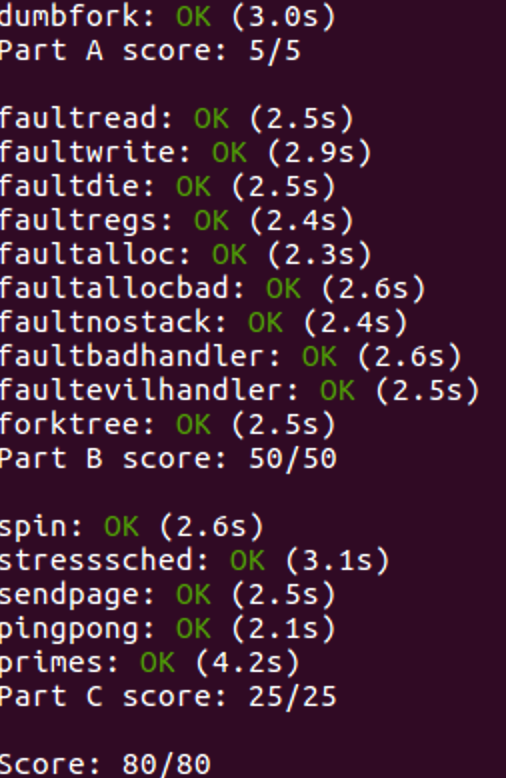

# Lab 4

## Multiprocessor Support and Cooperative Multitasking

### Multiprocessor Support

我们将使JOS支持对称多处理器(SMP)，一种多处理器架构，所有的CPU对等地访问系统资源。在SMP中所有CPU的功能是相同的，但是在启动过程中会被分为2类：引导处理器(BSP)负责初始化系统来启动操作系统，当操作系统被启动后，应用处理器(APs)被引导处理器激活。引导处理器是由硬件和BIOS决定的，我们目前所有的代码都是运行在BSP上。 在1个SMP系统中，每个CPU有1个附属的Local APIC单元。LAPIC单元负责处理系统中的中断，同时为它关联的CPU提供独一无二的标识符。在这次实验中，我们将使用LAPIC单元中的基本功能(在/kern/lapic.c中)：

- 读取LAPIC的标识符(ID)来告诉我们正在哪个CPU上运行代码(cpunum()).
- 从BSP发送STARTUP的处理器间中断(IPI) 到APs来唤醒其它CPU(lapic_startup()).
- 在Part C部分，我们将编程LAPIC内置的计时器来触发时钟中断来支持多任务抢占(apic_init).

处理器通过内存映射IO(MMIO)的方式访问它的LAPIC。在MMIO中，一部分物理地址被硬连接到一些IO设备的寄存器，导致操作内存的指令load/store可以直接操作设备的寄存器。我们已经看到过1个IO hole在物理地址0xA0000(我们用这来写入VGA显示缓存)。LAPIC的空洞开始于物理地址0xFE000000(4GB之下地32MB)，但是这地址太高我们无法通过过去的直接映射访问(虚拟地址0xF0000000映射0x0，即只有256MB)。但是JOS虚拟地址映射预留了4MB空间在MMIOBASE处，我们需要分配映射空间。

#### Exercise 1

> Implement `mmio_map_region` in `kern/pmap.c`. To see how this is used, look at the beginning of `lapic_init` in `kern/lapic.c`. You'll have to do the next exercise, too, before the tests for `mmio_map_region` will run.

首先，我们要对size进行对齐，因为注释里有提到。然后如果超出边界，直接panic。接着进行分配空间，最后把可分配的基址向后移动：

```c
	size = ROUNDUP(size, PGSIZE);
	if (base + size > MMIOLIM)
		panic("MMIO overflow\n");
	boot_map_region(kern_pgdir, base, size, pa, PTE_PCD|PTE_PWT|PTE_W);
	uintptr_t result = base;
	base += size;
	return (void*) result;
```

### Application Processor Bootstrap

在启动APs之前，BSP应该先收集关于多处理器系统的配置信息，比如CPU总数，CPUs的APIC ID，LAPIC单元的MMIO地址等。在kern/mpconfig文件中的mp_init()函数通过读BIOS设定的MP配置表获取这些信息。 　　

boot_aps(kern/init.c)函数驱使AP引导程序。APs开始于实模式，跟BSP的开始相同，故此boot_aps函数拷贝AP入口代码(kern/mpentry.S)到实模式下的内存寻址空间。但是跟BSP不一样的是，当AP开始执行时，我们需要有一些控制。我们将拷贝入口代码到0x7000(MPENTRY_PADDR)。 　　

之后，boot_aps函数通过发送STARTUP的IPI(处理器间中断)信号到AP的LAPIC单元来一个个地激活AP。在kern/mpentry.S中的入口代码跟boot/boot.S中的代码类似。在一些简短的配置后，它使AP进入开启分页机制的保护模式，调用C语言的setup函数mp_main。 boot_aps()等待AP在 `struct CpuInfo` 中的 `cpu_status` 返回`CPU_STARTED`之后，才会继续唤醒下一个。

#### Exercise 2

> Read `boot_aps()` and `mp_main()` in `kern/init.c`, and the assembly code in `kern/mpentry.S`. Make sure you understand the control flow transfer during the bootstrap of APs. Then modify your implementation of `page_init()` in `kern/pmap.c` to avoid adding the page at `MPENTRY_PADDR` to the free list, so that we can safely copy and run AP bootstrap code at that physical address. Your code should pass the updated `check_page_free_list()` test (but might fail the updated `check_kern_pgdir()` test, which we will fix soon).

分配空间的时候排除MPENTRY_PADDR即可：

```c
	size_t mp_num = PGNUM(MPENTRY_PADDR);
	for (i = 1; i < npages_basemem; i++) {
		if (i == mp_num)
			continue;
		pages[i].pp_ref = 0;
		pages[i].pp_link = page_free_list;
		page_free_list = &pages[i];
	}
```

> **Question**
>
> 1. Compare `kern/mpentry.S` side by side with `boot/boot.S`. Bearing in mind that `kern/mpentry.S` is compiled and linked to run above `KERNBASE` just like everything else in the kernel, what is the purpose of macro `MPBOOTPHYS`? Why is it necessary in `kern/mpentry.S` but not in `boot/boot.S`? In other words, what could go wrong if it were omitted in `kern/mpentry.S`? 
>    Hint: recall the differences between the link address and the load address that we have discussed in Lab 1.

因为merntry.S所需要的mpentry_start, mpentry_end都在KERNBASE之上，实模式无法访问，所以需要进行转换。而到MPBOOTPHYS计算物理地址时，已经开启了保护模式。而boot.S所需要的地址都是实模式可寻址的。

### Per-CPU State and Initialization

在编写多处理器OS时，重要的是要区分每个处理器专用的每个CPU状态和整个系统共享的全局状态。 kern / cpu.h定义了大多数每个CPU状态，包括struct CpuInfo，它存储每个CPU的变量。 cpunum（）总是返回调用它的CPU的ID，它可以用作cpus等数组的索引。或者，宏thiscpu是当前CPU的struct CpuInfo的简写。

以下是您应该了解的每个CPU的状态：

- 每个CPU的内核堆栈。

  - 由于多个CPU可以同时陷入内核，因此我们需要为每个处理器分别使用一个内核堆栈，以防止它们干扰彼此的执行。数组`percpu_kstacks [NCPU][KSTKSIZE]`为NCPU的内核堆栈保留了空间。
  - 在实验2中，您将bootstack引用的物理内存映射为KSTACKTOP下方的BSP内核堆栈。同样，在本实验中，您将每个CPU的内核堆栈映射到此区域，其中防护页面充当它们之间的缓冲区。 CPU 0的堆栈仍将从KSTACKTOP增长; CPU 1的堆栈将从低于CPU 0堆栈底部的KSTKGAP字节开始，依此类推。 inc / memlayout.h显示了映射布局。

  ```c
  /*
   * Virtual memory map:                                Permissions
   *                                                    kernel/user
   *
   *    4 Gig -------->  +------------------------------+
   *                     |                              | RW/--
   *                     ~~~~~~~~~~~~~~~~~~~~~~~~~~~~~~~~
   *                     :              .               :
   *                     :              .               :
   *                     :              .               :
   *                     |~~~~~~~~~~~~~~~~~~~~~~~~~~~~~~| RW/--
   *                     |                              | RW/--
   *                     |   Remapped Physical Memory   | RW/--
   *                     |                              | RW/--
   *    KERNBASE, ---->  +------------------------------+ 0xf0000000      --+
   *    KSTACKTOP        |     CPU0's Kernel Stack      | RW/--  KSTKSIZE   |
   *                     | - - - - - - - - - - - - - - -|                   |
   *                     |      Invalid Memory (*)      | --/--  KSTKGAP    |
   *                     +------------------------------+                   |
   *                     |     CPU1's Kernel Stack      | RW/--  KSTKSIZE   |
   *                     | - - - - - - - - - - - - - - -|                 PTSIZE
   *                     |      Invalid Memory (*)      | --/--  KSTKGAP    |
   *                     +------------------------------+                   |
   *                     :              .               :                   |
   *                     :              .               :                   |
   *    MMIOLIM ------>  +------------------------------+ 0xefc00000      --+
   *                     |       Memory-mapped I/O      | RW/--  PTSIZE
   * ULIM, MMIOBASE -->  +------------------------------+ 0xef800000
   *                     |  Cur. Page Table (User R-)   | R-/R-  PTSIZE
   *    UVPT      ---->  +------------------------------+ 0xef400000
   *                     |          RO PAGES            | R-/R-  PTSIZE
   *    UPAGES    ---->  +------------------------------+ 0xef000000
   *                     |           RO ENVS            | R-/R-  PTSIZE
   * UTOP,UENVS ------>  +------------------------------+ 0xeec00000
   * UXSTACKTOP -/       |     User Exception Stack     | RW/RW  PGSIZE
   *                     +------------------------------+ 0xeebff000
   *                     |       Empty Memory (*)       | --/--  PGSIZE
   *    USTACKTOP  --->  +------------------------------+ 0xeebfe000
   *                     |      Normal User Stack       | RW/RW  PGSIZE
   *                     +------------------------------+ 0xeebfd000
   *                     |                              |
   *                     |                              |
   *                     ~~~~~~~~~~~~~~~~~~~~~~~~~~~~~~~~
   *                     .                              .
   *                     .                              .
   *                     .                              .
   *                     |~~~~~~~~~~~~~~~~~~~~~~~~~~~~~~|
   *                     |     Program Data & Heap      |
   *    UTEXT -------->  +------------------------------+ 0x00800000
   *    PFTEMP ------->  |       Empty Memory (*)       |        PTSIZE
   *                     |                              |
   *    UTEMP -------->  +------------------------------+ 0x00400000      --+
   *                     |       Empty Memory (*)       |                   |
   *                     | - - - - - - - - - - - - - - -|                   |
   *                     |  User STAB Data (optional)   |                 PTSIZE
   *    USTABDATA ---->  +------------------------------+ 0x00200000        |
   *                     |       Empty Memory (*)       |                   |
   *    0 ------------>  +------------------------------+                 --+
   *
   * (*) Note: The kernel ensures that "Invalid Memory" is *never* mapped.
   *     "Empty Memory" is normally unmapped, but user programs may map pages
   *     there if desired.  JOS user programs map pages temporarily at UTEMP.
   */
  ```

- 每个CPU TSS和TSS描述符。

  - 还需要每个CPU的任务状态段（TSS）来指定每个CPU的内核堆栈所在的位置。 CPU i的TSS存储在cpus [i] .cpu_ts中，相应的TSS描述符在GDT条目gdt [（GD_TSS0 >> 3）+ i]中定义。
  - kern / trap.c中定义的全局ts变量将不再有用。

- 每个CPU当前环境指针。

  - 由于每个CPU可以同时运行不同的用户进程，我们重新定义了符号curenv以引用cpus [cpunum（）].cpu_env（或thiscpu-> cpu_env），它指向当前在当前CPU（其上的CPU）上执行的环境。）。

- 每个CPU系统的寄存器。

  - 所有寄存器（包括系统寄存器）都是CPU专用的。因此，初始化这些寄存器的指令，例如lcr3（），ltr（），lgdt（），lidt（）等，必须在每个CPU上执行一次。函数env_init_percpu（）和trap_init_percpu（）是为此目的而定义的。

#### Exercise 3

> Modify `mem_init_mp()` (in `kern/pmap.c`) to map per-CPU stacks starting at `KSTACKTOP`, as shown in`inc/memlayout.h`. The size of each stack is `KSTKSIZE` bytes plus `KSTKGAP` bytes of unmapped guard pages. Your code should pass the new check in `check_kern_pgdir()`.

刚开始，我还考虑是否一个CPU就要分两次分配，但注释里很明确地写明了guard page的作用，是为了防止溢出覆盖。所以没有必要严格地区分开这两者。这里刚开始犯了个错，注意boot_map_region的参数是低地址，所以kstacktop_i不能直接复制注释里的，而要再减去一个KSTSIZE：

```c
	for (int i = 0; i < NCPU; i++) {
		int kstacktop_i = KSTACKTOP - KSTKSIZE - i * (KSTKSIZE + KSTKGAP);
		boot_map_region(kern_pgdir, kstacktop_i, KSTKSIZE, PADDR(percpu_kstacks[i]), PTE_W);
	}
```

#### Exercise 4

> The code in `trap_init_percpu()` (`kern/trap.c`) initializes the TSS and TSS descriptor for the BSP. It worked in Lab 3, but is incorrect when running on other CPUs. Change the code so that it can work on all CPUs. (Note: your new code should not use the global `ts` variable any more.)

首先，我们要对ts进行替换，换成thiscpu->cpu_ts。接着我们要替换esp，因为原来的始终指向栈顶，而多个CPU后，每个CPU自己的栈顶地址是会向下减少。然后，根据注释设置TSS描述符：

```c
	// LAB 4: Your code here:
	struct Taskstate* thists = &thiscpu->cpu_ts;
	int cpu_id = thiscpu->cpu_id;
	// Setup a TSS so that we get the right stack
	// when we trap to the kernel.
	ts.ts_esp0 = KSTACKTOP - cpu_id * (KSTKSIZE + KSTKGAP);
	ts.ts_ss0 = GD_KD;
	ts.ts_iomb = sizeof(struct Taskstate);

	// Initialize the TSS slot of the gdt.
	gdt[(GD_TSS0 >> 3) + cpu_id] = SEG16(STS_T32A, (uint32_t) (thists),
					sizeof(struct Taskstate) - 1, 0);
	gdt[(GD_TSS0 >> 3) + cpu_id].sd_s = 0;

	// Load the TSS selector (like other segment selectors, the
	// bottom three bits are special; we leave them 0)
	ltr(GD_TSS0 + (cpu_id<<3));

	// Load the IDT
	lidt(&idt_pd);
```

### Locking

我们当前的代码在初始化AP之后就会进入自旋。在让AP进一步运行之前，我们需要首先解决当多个CPU同时运行内核代码时的竞争条件。实现此目的的最简单方法是使用*大内核锁*。大内核锁是一个全局锁，它在环境进入内核模式时保持，并在环境返回用户模式时释放。在此模型中，用户模式下的环境可以在任何可用的CPU上并发运行，但在内核模式下只能运行一个环境; 尝试进入内核模式的任何其他环境都被迫等待。

`kern / spinlock.h`声明了大内核锁，即 `kernel_lock`。它还提供了`lock_kernel()` 和`unlock_kernel()`的快捷方式来获取和释放锁。您应该在四个位置应用大内核锁：

- 在`i386_init()`中BSP唤醒其他CPU之前获取锁。
- 在`mp_main()`中，初始化AP后获取锁定，然后调用`sched_yield()`以启动此AP上的运行环境。
- 在`trap()`中，从用户模式中捕获时获取锁定。要确定中断是在用户模式还是在内核模式下发生，请检查中断的低位`tf_cs`。
- 在`env_run()`中， 切换到用户模式*之前*释放锁定。

#### Exercise 5

> Apply the big kernel lock as described above, by calling `lock_kernel()` and `unlock_kernel()` at the proper locations.

就像操作系统里的P/V操作一样，在指明的地方加锁，解锁就可以了。而且注释都表明了在函数的那个位置加锁了。。。就最后解锁的时候要记住，恢复环境即切换回用户状态。

> **Question**
>
> 2. It seems that using the big kernel lock guarantees that only one CPU can run the kernel code at a time. Why do we still need separate kernel stacks for each CPU? Describe a scenario in which using a shared kernel stack will go wrong, even with the protection of the big kernel lock.

在用户态切换到内核态加锁之前，CPU会自动的将旧的信息，例如 tf_err、tf_eip、tf_cs等，压入栈中了。如果此时有另一个CPU抢先进入内核态，就会发生混乱。

### Round-Robin Scheduling

JOS中的循环调度工作原理如下：

- `sched_yield()`在`kern/ sched.c`中选择一个新的环境中运行。它以循环方式顺序搜索数组`envs[]`，从先前运行的环境开始（或者如果没有先前运行的环境，则在数组的开头），选择它找到的状态为`ENV_RUNNABLE`的第一个环境 （参见`inc / env。 h`），并调用`env_run()`跳入该环境。
- `sched_yield()`绝不能同时在两个CPU上运行相同的环境。它可以告诉某个环境当前正在某个CPU（可能是当前的CPU）上运行，因为该环境的状态将是`ENV_RUNNING`。
- 我们已经为您实现了一个新的系统调用 `sys_yield()`，用户环境可以调用它来调用内核的`sched_yield()`功能，从而自愿地将CPU放弃到不同的环境中。

#### Exercise 6

> Implement round-robin scheduling in `sched_yield()` as described above. Don't forget to modify`syscall()` to dispatch `sys_yield()`.
>
> Make sure to invoke `sched_yield()` in `mp_main`.
>
> Modify `kern/init.c` to create three (or more!) environments that all run the program `user/yield.c`.
>
> Run make qemu. You should see the environments switch back and forth between each other five times before terminating, like below.
>
> Test also with several CPUS: make qemu CPUS=2.
>
> ```
> ...
> Hello, I am environment 00001000.
> Hello, I am environment 00001001.
> Hello, I am environment 00001002.
> Back in environment 00001000, iteration 0.
> Back in environment 00001001, iteration 0.
> Back in environment 00001002, iteration 0.
> Back in environment 00001000, iteration 1.
> Back in environment 00001001, iteration 1.
> Back in environment 00001002, iteration 1.
> ...
> ```
>
> After the `yield` programs exit, there will be no runnable environment in the system, the scheduler should invoke the JOS kernel monitor. If any of this does not happen, then fix your code before proceeding.

首先获取当前的环境，如果当前没有环境在运行的话，就从0开始，否则向后取一个。然后在数组里取余寻找可以运行的环境。最后如果没有可以运行的，而当前的环境还在运行，那么让当前环境继续运行。如果一个可以运行的环境都没有的话，那么就让CPU闲置：

```c
	// LAB 4: Your code here.
	idle = curenv;
	// if no enviornment running
	int start_id = 0;
	if (!idle)
		start_id = ENVX(idle->env_id)+1;
	for (int i = 0; i < NENV; i++) {
		int cand_id = (start_id+i) % NENV;
		if (envs[cand_id].env_status == ENV_RUNNABLE) {
			env_run(&envs[cand_id]);
		}
	}
	// no envs are runnable
	if (idle && idle->env_status == ENV_RUNNING)
		env_run(idle);

	// sched_halt never returns
	sched_halt();
```

相应的系统调用：

```c
		case SYS_yield:
			sys_yield();
			return 0;
```

> **Question**
>
> 3. In your implementation of `env_run()` you should have called `lcr3()`. Before and after the call to `lcr3()`, your code makes references (at least it should) to the variable `e`, the argument to `env_run`. Upon loading the `%cr3` register, the addressing context used by the MMU is instantly changed. But a virtual address (namely `e`) has meaning relative to a given address context--the address context specifies the physical address to which the virtual address maps. Why can the pointer `e` be dereferenced both before and after the addressing switch?
>
> 4. Whenever the kernel switches from one environment to another, it must ensure the old environment's registers are saved so they can be restored properly later. Why? Where does this happen?

3. Lab3中就曾有讲到，所有env_pgdir向高地址映射都与kern_pgdir一样。
4. 如果不保存的话，当完成系统调用后，CPU将不知道下一条执行哪一条指令。指令curenv->env_tf = *tf保存状态。

> *Challenge!* Add a less trivial scheduling policy to the kernel, such as a fixed-priority scheduler that allows each environment to be assigned a priority and ensures that higher-priority environments are always chosen in preference to lower-priority environments. If you're feeling really adventurous, try implementing a Unix-style adjustable-priority scheduler or even a lottery or stride scheduler. (Look up "lottery scheduling" and "stride scheduling" in Google.)
>
> Write a test program or two that verifies that your scheduling algorithm is working correctly (i.e., the right environments get run in the right order). It may be easier to write these test programs once you have implemented `fork()` and IPC in parts B and C of this lab.

首先，先在env.h中定义四个优先级，以及在Env中添加优先级属性：

```c
#define ENV_PRIOR_SUPER 0
#define ENV_PRIOR_HIGH 10
#define ENV_PRIOR_NORMAL 100
#define ENV_PRIOR_LOW 10000

int env_priority;
```

对应修改调度算法：

```c
	idle = curenv;
	struct Env* runenv = curenv;
	// if no enviornment running
	int start_id = 0;
	if (idle)
		start_id = ENVX(idle->env_id)+1;
	for (int i = 0; i < NENV; i++) {
		int cand_id = (start_id+i) % NENV;
		if (envs[cand_id].env_status == ENV_RUNNABLE) {
			if (envs[cand_id].env_priority < runenv->env_priority)
				runenv = &envs[cand_id];
		}
	}
	// no envs are runnable
	if ((idle && idle->env_status == ENV_RUNNING) && (runenv == idle))
		env_run(idle);
	else
		env_run(runenv);
```

然后对应地在syscall.c中添加系统调用：

```c
static int
sys_env_set_priority(envid_t envid, int priority) {
	int ret;
    struct Env *env;
	if ((ret = envid2env(envid, &env, 1)) < 0)
            return ret;
    env->env_priority = priority;
    return 0;
}
```

### System Calls for Environment Creation

虽然您的内核现在能够在多个用户级环境之间运行和切换，但它仍然限于运行*内核*最初设置的环境。您现在将实现必要的JOS系统调用，以允许*用户*环境创建和启动其他新用户环境。

Unix提供`fork()`系统调用作为其进程创建原语。Unix `fork()`复制调用进程（父进程）的整个地址空间以创建一个新进程（子进程）。两个用户空间之间的唯一区别是它们的进程ID和父进程ID（由`getpid`和返回`getppid`）。在父级中， `fork()`返回子级的进程ID，而在子级中，`fork()`返回0。默认情况下，每个进程都有自己的私有地址空间，并且进程对内存的修改对另一个进程都不可见。

您将提供一组不同的，更原始的JOS系统调用来创建新的用户模式环境。通过这些系统调用，除了其他样式的环境创建之外，您还可以在用户空间中实现类Unix `fork()`。您将为JOS写的新系统调用如下：

- `sys_exofork`：

  此系统调用创建一个几乎空白的新环境：没有任何内容映射到其地址空间的用户部分，并且它不可运行。新环境将具有与`sys_exofork`调用时父环境相同的寄存器状态。在父级中，`sys_exofork` 将返回`envid_t`新创建的环境（如果环境分配失败，则返回否定错误代码）。然而，在子进程中，它将返回0.（因为子进程开始标记为不可运行，`sys_exofork`直到父母通过标记子进程可运行来明确允许这一点， 才会真正返回子进程）

- `sys_env_set_status`：

  将指定环境的状态设置为`ENV_RUNNABLE`或`ENV_NOT_RUNNABLE`。一旦其地址空间和寄存器状态已完全初始化，此系统调用通常用于标记准备运行的新环境。

- `sys_page_alloc`：

  分配一页物理内存并将其映射到给定环境的地址空间中的给定虚拟地址。

- `sys_page_map`：

  将页面映射（*不是*页面的内容！）从一个环境的地址空间复制到另一个环境，留下内存共享安排，以便新旧映射都指向物理内存的同一页面。

- `sys_page_unmap`：

  取消映射到给定环境中给定虚拟地址的页面。

对于接受环境ID的上述所有系统调用，JOS内核支持值为0表示“当前环境”的约定。本公约由`envid2env()` 在`kern/ env.c`实现。

我们 在测试程序`user / dumbfork.c中`提供了类似Unix`fork()`的非常原始的实现。此测试程序使用上述系统调用来创建和运行具有其自己的地址空间副本的子环境。然后使用 前一个练习中的`sys_yield`来回切换两个环境。父母在10次迭代后退出，而孩子在20次退出后退出。

#### Exercise 7

> Implement the system calls described above in `kern/syscall.c` and make sure `syscall()` calls them. You will need to use various functions in `kern/pmap.c` and `kern/env.c`, particularly `envid2env()`. For now, whenever you call `envid2env()`, pass 1 in the `checkperm` parameter. Be sure you check for any invalid system call arguments, returning `-E_INVAL` in that case. Test your JOS kernel with `user/dumbfork` and make sure it works before proceeding.

首先，分配环境，然后将新环境的状态设成不可运行，然后拷贝寄存器，最后还要把新环境的reg_eax设为0，因为新环境不可用：

```c
static envid_t
sys_exofork(void)
{
	// LAB 4: Your code here.
	struct Env* e;
	int result = env_alloc(&e, curenv->env_id);
	if (result < 0)
		return result;
	e-> env_status = ENV_NOT_RUNNABLE;
	e->env_tf = curenv->env_tf;
	e->env_tf.tf_regs.reg_eax = 0;
	return e->env_id;
}
```

首先，找到环境。这里要注意只能设置两种状态，所以其他的状态要返回无效，最后设置一下状态就行了：

```c
static int
sys_env_set_status(envid_t envid, int status)
{
	// LAB 4: Your code here.
	struct Env* e;
	if (envid2env(envid, &e, 1) < 0)
		return -E_BAD_ENV;
	if (status != ENV_NOT_RUNNABLE && status != ENV_RUNNABLE)
		return -E_INVAL;
	e->env_status = status;
	return 0;
}
```

首先，找到环境。这里检测条件很多，要根据注释进行排除。然后分配一个页面，把该页面加入到环境的页目录中，完成映射。最后，如果映射失败，那么要释放分配的页面：

```c
static int
sys_page_alloc(envid_t envid, void *va, int perm)
{
	// LAB 4: Your code here.
	struct Env* e;
	if (envid2env(envid, &e, 1) < 0)
		return -E_BAD_ENV;
	if (va >= (void*) UTOP || PGOFF(va))
		return -E_INVAL;
	if ((perm & (PTE_U | PTE_P)) != (PTE_U | PTE_P))
		return -E_INVAL;
	struct PageInfo* p = page_alloc(1);
	if (!p)
		return -E_NO_MEM;
	int result = page_insert(e->env_pgdir, p, va, perm);
	if (result)
		page_free(p);
	return result;
}
```

首先，检测两个进程和其地址空间的虚拟地址是否有效。然后，在源环境的页表中找到页面，然后检测是否可以访问等注释提到的条件。然后将这个物理页面插入到目的环境的页表中相应的位置：

```c
static int
sys_page_map(envid_t srcenvid, void *srcva,
	     envid_t dstenvid, void *dstva, int perm)
{
	// LAB 4: Your code here.
	struct Env *srcenv, *dstenv;
    if (envid2env(srcenvid, &srcenv, 1) || envid2env(dstenvid, &dstenv, 1)) {
        return -E_BAD_ENV;
    }
    if (srcva >= (void *)UTOP || dstva >= (void *)UTOP || PGOFF(srcva) || PGOFF(dstva)) {
        return -E_INVAL;
    }
    pte_t *pte;
    struct PageInfo *p = page_lookup(srcenv->env_pgdir, srcva, &pte);
    if (!p) 
		return -E_INVAL;
    int valid_perm = (PTE_U|PTE_P);
    if ((perm&valid_perm) != valid_perm)
		return -E_INVAL;
    if ((perm & PTE_W) && !(*pte & PTE_W))
		return -E_INVAL;
    if (page_insert(dstenv->env_pgdir, p, dstva, perm) < 0)
		return -E_NO_MEM;
    return 0;
}
```

首先，还是找到这个环境，然后判断注释所说的两个条件是否满足，最后根据虚拟地址移除就可以了：

```c
static int
sys_page_unmap(envid_t envid, void *va)
{
	// LAB 4: Your code here.
	struct Env *e;
	if (envid2env(envid, &e, 1) < 0)
			return -E_BAD_ENV;
	if (va >= (void*) UTOP || PGOFF(va))
			return -E_INVAL;
	page_remove(e->env_pgdir, va);
	return 0;
}
```

相应地添加系统调用：

```c
		case SYS_exofork:
			return sys_exofork();
		case SYS_env_set_status:
			return sys_env_set_status(a1, a2);
		case SYS_page_alloc:
			return sys_page_alloc(a1, (void *)a2, a3);
		case SYS_page_map:
			return sys_page_map(a1, (void*)a2, a3, (void*)a4, a5);
		case SYS_page_unmap:
			return sys_page_unmap(a1, (void *)a2);
```

## Copy-on-Write Fork

如前所述，Unix提供`fork()`系统调用作为其主要进程创建原语。该`fork()`系统调用将调用进程的地址空间（父）创建一个新的进程（孩子）。

xv6 Unix `fork()`通过将父页面中的所有数据复制到为子节点分配的新页面来实现。这基本上与`dumbfork()`采用的方法相同。将父母的地址空间复制到孩子中是`fork()`操作中耗费最大的部分。

然而，`fork()` 后面几乎立即跟随着`exec()`对子进程的调用，该进程要用新程序替换子进程的内存。例如，这就是shell通常所做的事情。在这种情况下，复制父地址空间所花费的时间在很大程度上被浪费了，因为子进程在调用`exec()`之前将使用很少的内存。

出于这个原因，Unix的更高版本利用虚拟内存硬件来允许父和子*共享* 映射到其各自地址空间的内存，直到其中一个进程实际修改它。这种技术称为*写时复制*。为此，在`fork()`内核上将复制地址空间的*映射* 从父级到子级而不是映射页面的内容，同时将现在共享的页面标记为只读。当其中一个进程尝试写入其中一个共享页面时，该进程会发生页面错误。此时，Unix内核意识到该页面实际上是一个“虚拟”或“写时复制”副本，因此它为错误进程创建了一个新的，私有的，可写的页面副本。这样，在实际写入之前，实际上不会复制各个页面的内容。这种优化使得`fork()`后面的孩子方便得多：孩子可能只需要在调用`exec()`之前复制一个页面（其堆栈的当前页面）。

`fork()`在用户空间中实现和支持写时复制的好处是内核更简单，因此更可能是正确的。它还允许单个用户模式程序为其定义自己的语义`fork()`。

### User-level page fault handling

用户级写时复制`fork()`需要知道写保护页面上的页面错误，因此这是您首先要实现的。写时复制只是用户级页面错误处理的许多可能用途之一。

设置地址空间是很常见的，以便页面错误指示何时需要执行某些操作。例如，大多数Unix内核最初只在新进程的堆栈区域中映射单个页面，并在随后“按需”分配和映射其他堆栈页面，通过进程的堆栈消耗增加并导致尚未映射的堆栈地址上的页面错误来实现。典型的Unix内核必须跟踪在进程空间的每个区域中发生页面错误时要采取的操作。例如，堆栈区域中的故障通常将分配和映射物理存储器的新页面。在具有按需分页可执行文件的系统中，程序的BSS区域中的错误通常会分配一个新页面，用零填充并映射它。

内核要跟踪大量信息。您将决定如何处理用户空间中的每个页面错误，而不是采用传统的Unix方法，其中错误的破坏性较小。这种设计的另一个好处是允许程序在定义内存区域时具有很大的灵活性; 稍后您将使用用户级页面错误处理来映射和访问基于磁盘的文件系统上的文件。

### Setting the Page Fault Handler

为了处理自己的页面错误，用户环境需要使用JOS内核注册一个*页面错误处理程序入口点*。用户环境通过新的`sys_env_set_pgfault_upcall`系统调用注册其页面错误入口点。我们在`Env`结构中 添加了一个新成员`env_pgfault_upcall`，以记录此信息。

#### Exercise 8

> Implement the `sys_env_set_pgfault_upcall` system call. Be sure to enable permission checking when looking up the environment ID of the target environment, since this is a "dangerous" system call.

首先，找到环境，然后将处理程序的入口填入相应的变量中：

```
static int
sys_env_set_pgfault_upcall(envid_t envid, void *func)
{
	// LAB 4: Your code here.
	struct Env* e;
	if (envid2env(envid, &e, 1) < 0)
		return -E_BAD_ENV;
	e->env_pgfault_upcall = func;
	return 0;
}
```

### Normal and Exception Stacks in User Environments

在正常执行期间，JOS中的用户环境将在*普通*用户堆栈上运行：其`ESP`寄存器开始指向`USTACKTOP`，并且它推送的堆栈数据驻留在页面`USTACKTOP-PGSIZE`和`USTACKTOP-1`之间。但是，当在用户模式下发生页面错误时，内核将在不同堆栈（即*用户异常*堆栈）上重新启动运行指定用户级页面错误处理程序的用户环境。本质上，我们将使JOS内核代表用户环境实现自动“堆栈切换”，就像x86 *处理器* 在从用户模式转换到内核模式时代表JOS实现堆栈切换一样！

JOS用户异常堆栈的大小也是一页，它的顶部被定义为在虚拟地址`UXSTACKTOP`，所以用户异常堆栈的有效字节是从`UXSTACKTOP-PGSIZE`到`UXSTACKTOP-1`。在此异常堆栈上运行时，用户级页面错误处理程序可以使用JOS的常规系统调用来映射新页面或调整映射，以便修复最初导致页面错误的任何问题。然后，用户级页面错误处理程序通过汇编语言返回到原始堆栈上的错误代码。

希望支持用户级页面错误处理的每个用户环境都需要使用`sys_page_alloc()`为自己的异常堆栈分配内存。

### Invoking the User Page Fault Handler

您现在需要更改`kern / trap.c中`的页面错误处理代码， 以便从用户模式处理页面错误，如下所示。我们将在故障时调用用户环境的状态为*陷阱时*状态。

如果没有注册页面错误处理程序，则JOS内核会像以前一样使用消息破坏用户环境。否则，内核在异常堆栈上设置一个看起来像是`struct UTrapframe`(`inc / trap.h`）的陷阱帧：

```
                    <-- UXSTACKTOP
trap-time esp
trap-time eflags
trap-time eip
trap-time eax       start of struct PushRegs
trap-time ecx
trap-time edx
trap-time ebx
trap-time esp
trap-time ebp
trap-time esi
trap-time edi       end of struct PushRegs
tf_err (error code)
fault_va            <-- %esp when handler is run
```

然后内核安排用户环境恢复执行，该错误处理程序在具有此堆栈帧的异常堆栈上运行; 你必须弄清楚如何实现这一目标。`fault_va`是导致页面错误的虚拟地址。

如果发生异常时用户环境*已*在用户异常堆栈上运行，则页面错误处理程序本身已出现故障。在这种情况下，您应该在当前`tf->tf_esp`而不是 `UXSTACKTOP`启动新的堆栈帧。你应该首先压入一个空的32位字，然后是a `struct UTrapframe`。

为了测试是否`tf->tf_esp`已经是用户异常堆栈上，可以检查它是否在范围`UXSTACKTOP-PGSIZE`和`UXSTACKTOP-1`之间。

#### Exercise 9

> Implement the code in `page_fault_handler` in `kern/trap.c` required to dispatch page faults to the user-mode handler. Be sure to take appropriate precautions when writing into the exception stack. (What happens if the user environment runs out of space on the exception stack?)

环境有中断处理程序的入口是前提，所以在最开始就要开始判断。注释里提到了要注意嵌套中断的情况，那么如何判断嵌套中断呢？如果当前中断的esp已经在异常堆栈上，那么就发生了嵌套。嵌套中断要保留4个字节保存eip。然后按照lab3中一样的，把寄存器值压入栈，最后设置eip和esp，运行新的环境就可以了：

```c
    if (curenv->env_pgfault_upcall) {
        struct UTrapframe *utf;
        if (tf->tf_esp >= UXSTACKTOP-PGSIZE && tf->tf_esp <= UXSTACKTOP-1) {
            utf = (struct UTrapframe *)(tf->tf_esp - sizeof(struct UTrapframe) - 4); 
        } else {
            utf = (struct UTrapframe *)(UXSTACKTOP - sizeof(struct UTrapframe));
        }
        user_mem_assert(curenv, (void*)utf, 1, PTE_W);
        utf->utf_fault_va = fault_va;
        utf->utf_err = tf->tf_err;
        utf->utf_regs = tf->tf_regs;
        utf->utf_eip = tf->tf_eip;
        utf->utf_eflags = tf->tf_eflags;
        utf->utf_esp = tf->tf_esp;
        curenv->env_tf.tf_eip = (uintptr_t)curenv->env_pgfault_upcall;
        curenv->env_tf.tf_esp = (uintptr_t)utf;
        env_run(curenv);
    }
```

### User-mode Page Fault Entrypoint

#### Exercise 10

> Implement the `_pgfault_upcall` routine in `lib/pfentry.S`. The interesting part is returning to the original point in the user code that caused the page fault. You'll return directly there, without going back through the kernel. The hard part is simultaneously switching stacks and re-loading the EIP.

这里要做的就是从异常栈切换回用户栈，重新设置EIP。首先，我们要把出错时的EIP压入用户栈中，这样恢复以后可以从原来的位置继续执行。所要做的就是将用户栈的ESP减去4，即拓展4个字节，用来储存EIP。然后恢复异常栈中的储存的寄存器。然后从异常栈中恢复ESP寄存器。此时栈顶就是原来环境出错的地址了，最后返回并将EIP设为出错地址，继续执行即可：

```assembly
// LAB 4: Your code here.
    movl 0x28(%esp), %ebx
    subl $0x4, 0x30(%esp)
    movl 0x30(%esp), %eax
    movl %ebx, (%eax)
    addl $0x8, %esp
	// Restore the trap-time registers.  After you do this, you
	// can no longer modify any general-purpose registers.
	// LAB 4: Your code here.
	popal
	// Restore eflags from the stack.  After you do this, you can
	// no longer use arithmetic operations or anything else that
	// modifies eflags.
	// LAB 4: Your code here.
	addl $0x4, %esp
	popfl
	// Switch back to the adjusted trap-time stack.
	// LAB 4: Your code here.
	popl %esp
	// Return to re-execute the instruction that faulted.
	// LAB 4: Your code here.
	ret
```

#### Exercise 11

> Finish `set_pgfault_handler()` in `lib/pgfault.c`.

进程在运行之前要注册自己的页错误处理程序，首先要申请异常栈空间，然后设置处理程序的入口：

```c
		if (sys_page_alloc(0, (void *)(UXSTACKTOP - PGSIZE), PTE_W|PTE_U|PTE_P)) {
            panic("set_pgfault_handler failed");
        }
        if (sys_env_set_pgfault_upcall(0, _pgfault_upcall)) {
            panic("set_pgfault_handler failed");
        }
```

### Implementing Copy-on-Write Fork

我们在`lib / fork.c`中为`fork()` 提供了一个框架。比如`dumbfork()`， `fork()`应该创建一个新环境，然后扫描父环境的整个地址空间并在子项中设置相应的页面映射。关键的区别在于，`dumbfork()`复制*页面时*， `fork()`最初只会复制页面*映射*。 `fork()`仅在其中一个环境尝试编写时才会复制每个页面。

`fork()`基本控制流程如下：

1. 父级使用`pgfault()` 作为C页面错误处理程序，使用在上面实现的功能`set_pgfault_handler()`。

2. 父级调用`sys_exofork()`创建子环境。

3. 对于UTOP下面地址空间中的每个可写或写时复制页面，父调用`duppage`来将页面写入时复制映射到子节点的地址空间，然后*重新映射*页面上的写入时复制到自己的地址空间。[注意：这里的顺序（即，在父标记页面之前，将子页面标记为COW）] `duppage`设置两个PTE，使页面是不可写的，且在“avail”字段包含`PTE_COW`来区分真正只读页面写入时复制页面。

   但是，异常堆栈*不会以*这种方式重新映射。相反，您需要在子代中为异常堆栈分配一个新页面。由于页面错误处理程序将执行实际复制并且页面错误处理程序在异常堆栈上运行，因此异常堆栈无法进行写入时复制。

   `fork()` 还需要处理存在的页面，但不能写入或写入时复制。

4. 父级将子级的用户页面错误入口点设置为自己的。

5. 孩子现在已准备好运行，因此父母将其标记为可运行。

每当其中一个环境写入尚未写入的写时复制页面时，就会出现页面错误。这是用户页面错误处理程序的控制流程：

1. 内核将页面错误传播到`_pgfault_upcall`，调用`fork()`的是`pgfault()`处理程序。
2. `pgfault()`检查故障是否为写入（检查在错误代码中`FEC_WR`）并且并检查页面的PTE是否标记为PTE_COW。如果没有，恐慌。
3. `pgfault()`分配映射到临时位置的新页面，并将错误页面的内容复制到其中。然后，故障处理程序将新页面映射到具有读/写权限的适当地址，而不是旧的只读映射。

用户级`lib / fork.c`代码必须参考上面几个操作的环境页面表（例如，标记页面的PTE `PTE_COW`）。为了这个目的，内核在UVPT上映射环境的页面表。它使用巧妙的映射技巧使其易于查找用户代码的PTE。 lib / entry.S设置了uvpt和uvpd，以便您可以在lib / fork.c中轻松查找页表信息。

#### Exercise 12

> Implement `fork`, `duppage` and `pgfault` in `lib/fork.c`.
>
> Test your code with the `forktree` program. It should produce the following messages, with interspersed 'new env', 'free env', and 'exiting gracefully' messages. The messages may not appear in this order, and the environment IDs may be different.
>
> ```
> 	1000: I am ''
> 	1001: I am '0'
> 	2000: I am '00'
> 	2001: I am '000'
> 	1002: I am '1'
> 	3000: I am '11'
> 	3001: I am '10'
> 	4000: I am '100'
> 	1003: I am '01'
> 	5000: I am '010'
> 	4001: I am '011'
> 	2002: I am '110'
> 	1004: I am '001'
> 	1005: I am '111'
> 	1006: I am '101'
> ```

首先，判断错误是否是欣慰写时拷贝引起的。然后借用临时的PFTEMP，保存之前保存的映射关系。然后解除映射到原来保存的映射关系，然后映射到PFTEMP指向的页面，最后解除PFTEMP在该环境下的映射：

```c
static void
pgfault(struct UTrapframe *utf)
{
	void *addr = (void *) utf->utf_fault_va;
	uint32_t err = utf->utf_err;
	int r;
	// LAB 4: Your code here.
	if ((err & FEC_WR) == 0 || (uvpt[PGNUM(addr)] & PTE_COW) == 0)
    	panic("pgfault: not writable or a non-cow page!");
	// LAB 4: Your code here.
	envid_t envid = sys_getenvid();
	if (sys_page_alloc(envid, (void *)PFTEMP, PTE_P | PTE_W | PTE_U) < 0)
		panic("pgfault: page allocation failed");
	addr = ROUNDDOWN(addr, PGSIZE);
	memmove(PFTEMP, addr, PGSIZE);
	if (sys_page_unmap(envid, addr) < 0)
		panic("pgfault: page unmap failed");
	if (sys_page_map(envid, PFTEMP, envid, addr, PTE_P | PTE_W |PTE_U) < 0)
		panic("pgfault: page map failed");
	if (sys_page_unmap(envid, PFTEMP) < 0)
		panic("pgfault: page unmap failed");
}
```

我们要将一个进程的第pn页映射到另个一个的第pn页里。首先，我们要判断是否将映射到的页面也标为写时复制。然后根据lab中所说的，现将页面映射到另一个进程中，然后如果是写时复制，那么父进程本身的页面也要重新映射，将页面权限设为COW：

```c
static int
duppage(envid_t envid, unsigned pn)
{
	int r;

	// LAB 4: Your code here.
	void *addr;
	pte_t pte;
	int perm;
	addr = (void *)((uint32_t)pn * PGSIZE);
	pte = uvpt[pn];
	perm = PTE_P | PTE_U;
	if ((pte & PTE_W) || (pte & PTE_COW))
		perm |= PTE_COW;
	if (sys_page_map(thisenv->env_id, addr, envid, addr, perm) < 0) {
		panic("duppage: page remapping failed");
		return r;
	}
	if (perm & PTE_COW) {
		if (sys_page_map(thisenv->env_id, addr, thisenv->env_id, addr, perm) < 0) {
			panic("duppage: page remapping failed");
			return r;
		}
	}
	return 0;
}
```

前面已经讲得很清楚了。首先，设置中断处理程序，然后创建不可运行的新进程。如果此时嵌套进程级数已经到顶了，那么继续运行当前的进程。如果没有，接着父进程要将所有标为PTE_P的页面的映射拷入子进程中。然后要申请一个页面作为异常栈。最后，父进程把子进程的页错误处理程序设置成自己的，并将其状态置为可运行：

```c
envid_t
fork(void)
{
	// LAB 4: Your code here.	
	set_pgfault_handler(pgfault);
  	envid_t envid;
  	uint32_t addr;
	envid = sys_exofork();
	if (envid == 0) {
		thisenv = &envs[ENVX(sys_getenvid())];
		return 0;
	}
	if (envid < 0)
		panic("sys_exofork: %e", envid);

	for (addr = 0; addr < USTACKTOP; addr += PGSIZE)
		if ((uvpd[PDX(addr)] & PTE_P) && (uvpt[PGNUM(addr)] & PTE_P)
			&& (uvpt[PGNUM(addr)] & PTE_U)) {
			duppage(envid, PGNUM(addr));
		}
	if (sys_page_alloc(envid, (void *)(UXSTACKTOP-PGSIZE), PTE_U|PTE_W|PTE_P) < 0)
		panic("In fork: page alloc failed");
	extern void _pgfault_upcall();
	sys_env_set_pgfault_upcall(envid, _pgfault_upcall);
	if (sys_env_set_status(envid, ENV_RUNNABLE) < 0)
		panic("sys_env_set_status failed");
	return envid;
}
```

## Preemptive Multitasking and Inter-Process communication (IPC)

### Clock Interrupts and Preemption

运行user/spin测试程序。这个测试程序会分离一个子环境，一旦接收到CPU的控制权，它就会在一个紧密的循环中永远旋转。父环境和内核都不会重新获得CPU。就保护系统免受用户模式环境中的错误或恶意代码而言，这显然不是一个理想的情况，因为任何用户模式环境都可以简单地通过进入无限循环而永远不会回馈整个系统。中央处理器。为了允许内核抢占运行环境，强行重新控制CPU，我们必须扩展JOS内核以支持来自时钟硬件的外部硬件中断。

### Interrupt discipline

外部中断（即设备中断）称为IRQ。有16个可能的IRQ，编号为0到15.从IRQ编号到IDT条目的映射不固定。 picirq.c中的pic_init将IRQ 0-15映射到IDT条目IRQ_OFFSET到IRQ_OFFSET + 15。

在inc / trap.h中，IRQ_OFFSET被定义为十进制32.因此IDT条目32-47对应于IRQ 0-15。例如，时钟中断是IRQ 0.因此，IDT [IRQ_OFFSET + 0]（即IDT [32]）包含内核中时钟的中断处理程序例程的地址。选择此IRQ_OFFSET以使设备中断不与处理器异常重叠，这显然会引起混淆。 （事实上，在运行MS-DOS的PC的早期，IRQ_OFFSET实际上是零，这确实导致处理硬件中断和处理处理器异常之间的大量混淆！）

在JOS中，与xv6 Unix相比，我们进行了关键的简化。在内核中时，外部设备中断总是被禁用（和xv6一样，在用户空间时启用）。外部中断由％eflags寄存器的FL_IF标志位控制（参见inc / mmu.h）。该位置1时，允许外部中断。虽然可以通过多种方式修改该位，但由于我们的简化，我们将仅在进入和退出用户模式时通过保存和恢复％eflags寄存器的过程来处理它。

您必须确保在用户环境中设置FL_IF标志，以便在中断到达时，它会被传递到处理器并由中断代码处理。否则，中断被屏蔽或被忽略，直到重新启用中断为止。我们用引导加载程序的第一条指令屏蔽了中断，到目前为止我们还没有重新启用它们。

#### Exercise 13

>  Modify `kern/trapentry.S` and `kern/trap.c` to initialize the appropriate entries in the IDT and provide handlers for IRQs 0 through 15. Then modify the code in `env_alloc()` in `kern/env.c` to ensure that user environments are always run with interrupts enabled.
>
> Also uncomment the `sti` instruction in `sched_halt()` so that idle CPUs unmask interrupts.
>
> The processor never pushes an error code when invoking a hardware interrupt handler. You might want to re-read section 9.2 of the [80386 Reference Manual](https://pdos.csail.mit.edu/6.828/2018/readings/i386/toc.htm), or section 5.8 of the [IA-32 Intel Architecture Software Developer's Manual, Volume 3](https://pdos.csail.mit.edu/6.828/2018/readings/ia32/IA32-3A.pdf), at this time.
>
> After doing this exercise, if you run your kernel with any test program that runs for a non-trivial length of time (e.g., `spin`), you should see the kernel print trap frames for hardware interrupts. While interrupts are now enabled in the processor, JOS isn't yet handling them, so you should see it misattribute each interrupt to the currently running user environment and destroy it. Eventually it should run out of environments to destroy and drop into the monitor.

和之前添加的系统调用一样：

```assembly
TRAPHANDLER_NOEC(handler32, IRQ_OFFSET + IRQ_TIMER)
TRAPHANDLER_NOEC(handler33, IRQ_OFFSET + IRQ_KBD)
TRAPHANDLER_NOEC(handler36, IRQ_OFFSET + IRQ_SERIAL)
TRAPHANDLER_NOEC(handler39, IRQ_OFFSET + IRQ_SPURIOUS)
TRAPHANDLER_NOEC(handler46, IRQ_OFFSET + IRQ_IDE)
TRAPHANDLER_NOEC(handler51, IRQ_OFFSET + IRQ_ERROR)
```

```c
SETGATE(idt[IRQ_OFFSET+IRQ_TIMER], 0, GD_KT, handler32, 0);
SETGATE(idt[IRQ_OFFSET+IRQ_KBD], 0, GD_KT, handler33, 0);
SETGATE(idt[IRQ_OFFSET+IRQ_SERIAL], 0, GD_KT, handler36, 0);
SETGATE(idt[IRQ_OFFSET+IRQ_SPURIOUS], 0, GD_KT, handler39, 0);
SETGATE(idt[IRQ_OFFSET+IRQ_IDE], 0, GD_KT, handler46, 0);
SETGATE(idt[IRQ_OFFSET+IRQ_ERROR], 0, GD_KT, handler51, 0);
```

千万别忘了，打开中断。。。

```c
e->env_tf.tf_eflags |= FL_IF;
```

### Handling Clock Interrupts

现在虽然中断使能已经打开，在用户态进程运行的时候，外部中断会产生并进入内核，但是现在还没有能处理这类中断。所以需要修改trap_dispatch，在发生外部定时中断的时候，调用调度器，调度另外一个可运行的进程。

#### Exercise 14

> Modify the kernel's `trap_dispatch()` function so that it calls `sched_yield()` to find and run a different environment whenever a clock interrupt takes place.
>
> You should now be able to get the `user/spin` test to work: the parent environment should fork off the child,`sys_yield()` to it a couple times but in each case regain control of the CPU after one time slice, and finally kill the child environment and terminate gracefully.

```c
if (tf->tf_trapno == IRQ_OFFSET + IRQ_TIMER) {
       lapic_eoi();
       sched_yield();
       return;
}
```

### Inter-Process communication (IPC)

从技术上来说，这是“环境间通信”或“IEC”，但其他人都称之为IPC，所以我们将使用标准术语。）

我们一直专注于操作系统的隔离方面，它提供了每个程序都拥有一台机器的错觉。操作系统的另一项重要服务是允许程序在需要时彼此通信。让程序与其他程序交互可能非常强大。Unix管道模型是规范的例子。

进程间通信有很多模型。即使在今天，仍然存在关于哪种型号最佳的争论。我们不会进入那场辩论。相反，我们将实现一个简单的IPC机制，然后尝试一下。

### IPC in JOS

您将实现一些额外的JOS内核系统调用，这些调用共同提供简单的进程间通信机制。您将实现两个系统调用，`sys_ipc_recv`和`sys_ipc_try_send`。然后你将实现两个库包装器 `ipc_recv`和`ipc_send`。

用户环境可以使用JOS的IPC机制相互发送的“消息”包含两个组件：单个32位值，以及可选的单个页面映射。允许环境在消息中传递页面映射提供了一种传输更多数据的有效方式，而不是适合单个32位整数，并且还允许环境轻松地设置共享内存。

### Sending and Receiving Messages

要接收消息，请调用环境 `sys_ipc_recv`。此系统调用取消调度当前环境，并且在收到消息之前不再运行它。当环境等待接收消息时， *任何*其他环境都可以向其发送消息 - 不仅仅是特定环境，而不仅仅是与接收环境具有父/子安排的环境。换句话说，您在A部分中实现的权限检查将不适用于IPC，因为IPC系统调用是经过精心设计的，以便“安全”：环境不会因为发送消息而导致其他环境出现故障（除非目标环境也是错误的）。

为了尝试发送值，环境调用 `sys_ipc_try_send`接收者的环境id和要发送的值。如果命名环境实际正在接收（它已调用 `sys_ipc_recv`但尚未获取值），则send传递消息并返回0.否则send返回`-E_IPC_NOT_RECV`以指示目标环境当前不期望接收值。

用户空间中的 库函数`ipc_recv`将负责调用`sys_ipc_recv`，然后在当前环境中查找有关接收值的信息`struct Env`。

类似地，库函数`ipc_send`将负责重复调用，`sys_ipc_try_send` 直到发送成功。

### Transferring Pages

当环境`sys_ipc_recv` 使用有效`dstva`参数调用时（下面`UTOP`），环境声明它愿意接收页面映射。如果发送方发送了一个页面，那么该页面应映射`dstva` 到接收方的地址空间中。如果接收器已经映射了一个页面`dstva`，则该前一页面将被取消映射。

当环境`sys_ipc_try_send` 使用有效`srcva`（下面`UTOP`）调用时，这意味着发送方`srcva`希望将具有权限`perm`的当前映射的页面发送给接收方。在成功的IPC之后，发送方`srcva`在其地址空间中保持其页面的原始映射，但是接收器还在`dstva`接收器的地址空间中获得由接收器最初指定的该相同物理页面的映射。结果，该页面在发送者和接收者之间共享。

如果发件人或收件人未指示应传送页面，则不会传送任何页面。在任何IPC之后，内核将`env_ipc_perm` 接收者`Env`结构中的新字段设置为接收页面的权限，如果没有接收到页面，则为零。

#### Exercise15

> Implement `sys_ipc_recv` and `sys_ipc_try_send` in `kern/syscall.c`. Read the comments on both before implementing them, since they have to work together. When you call `envid2env` in these routines, you should set the `checkperm` flag to 0, meaning that any environment is allowed to send IPC messages to any other environment, and the kernel does no special permission checking other than verifying that the target envid is valid.
>
> Then implement the `ipc_recv` and `ipc_send` functions in `lib/ipc.c`.
>
> Use the `user/pingpong` and `user/primes` functions to test your IPC mechanism. `user/primes` will generate for each prime number a new environment until JOS runs out of environments. You might find it interesting to read `user/primes.c` to see all the forking and IPC going on behind the scenes.

我们要先看一下Env新添加的成员变量：

- env_ipc_recving： 　　当进程使用env_ipc_recv函数等待信息时，会将这个成员设置为1，然后堵塞等待；当一个进程向它发消息解除堵塞后，发送进程将此成员修改为0。 　　
- env_ipc_dstva： 　　如果进程要接受消息并且是传送页，保存页映射的地址，且该地址<=UTOP。
- env_ipc_value： 　　若等待消息的进程接收到消息，发送方将接收方此成员设置为消息值。 　　
- env_ipc_from： 　　发送方负责设置该成员为自己的envid号。 　　
- env_ipc_perm： 　　如果进程要接收消息并且传送页，那么发送方发送页之后将传送的页权限赋给这个成员。

首先，设置自己正在接受信息，且不能运行，防止浪费CPU资源。然后设置接受地址，调用系统调用：

```c
static int
sys_ipc_recv(void *dstva)
{
	// LAB 4: Your code here.
	if ((dstva < (void *)UTOP) && PGOFF(dstva))
		return -E_INVAL;

	curenv->env_ipc_recving = 1;
	curenv->env_status = ENV_NOT_RUNNABLE;
	curenv->env_ipc_dstva = dstva;
	sys_yield();
	return 0;
}
```

首先，要检测是否有进程、进程是否可以接受。然后如果srcva在UTOP下，那么是要发送页面的，那么先找到这个页面，然后检查要求的权限与现在的权限是否符合。然后将页面插入接收方的页表中，最后，根据注释，结合接收方进行过的设置，重新设置相应的变量：

```c
static int
sys_ipc_try_send(envid_t envid, uint32_t value, void *srcva, unsigned perm)
{
	// LAB 4: Your code here.
	struct Env *e;
	if (envid2env(envid, &e, 0))
		return -E_BAD_ENV;
	if (!e->env_ipc_recving)
		return -E_IPC_NOT_RECV;
	if (srcva < (void *) UTOP) {
		if(PGOFF(srcva))
			return -E_INVAL;
		pte_t *pte;
		struct PageInfo *p = page_lookup(curenv->env_pgdir, srcva, &pte);
		if (!p)
			return -E_INVAL;
		int valid_perm = (PTE_U|PTE_P);
		if ((perm & valid_perm) != valid_perm) {
			return -E_INVAL;
		}
		if ((perm & PTE_W) && !(*pte & PTE_W)) 
			return -E_INVAL;
		if (e->env_ipc_dstva < (void *)UTOP) {
			int ret = page_insert(e->env_pgdir, p, e->env_ipc_dstva, perm);
			if (ret) return ret;
			e->env_ipc_perm = perm;
		}
	}
	e->env_ipc_recving = 0;
	e->env_ipc_from = curenv->env_id;
	e->env_ipc_value = value;
	e->env_status = ENV_RUNNABLE;
	e->env_tf.tf_regs.reg_eax = 0;
	return 0;
}
```

首先，当pg为空，想让系统调用知道没有页面，那么地址就是UTOP，因为低于UTOP才有效。接收成功后从相应的成员变量中提取信息，最后根据注释里的判断进行复制：

```c
int32_t
ipc_recv(envid_t *from_env_store, void *pg, int *perm_store)
{
	// LAB 4: Your code here.
    if (pg == NULL) 
		pg = (void *)UTOP;
    int r = sys_ipc_recv(pg);
    int from_env = 0, perm = 0;
    if (r == 0) {
        from_env = thisenv->env_ipc_from;
        perm = thisenv->env_ipc_perm;
        r = thisenv->env_ipc_value;
    } else {
        from_env = 0;
        perm = 0;
    }   
    if (from_env_store) 
		*from_env_store = from_env;
    if (perm_store) 
		*perm_store = perm;
    return r;
}
```

不断尝试，直到发送成功。但要注意，除了-E_IPC_NOT_RECV错误码外，都不正常：

```c
void
ipc_send(envid_t to_env, uint32_t val, void *pg, int perm)
{
	// LAB 4: Your code here.
    if (pg == NULL) 
      pg = (void *)UTOP;
    int ret;
    while ((ret = sys_ipc_try_send(to_env, val, pg, perm))) {
        if (ret != -E_IPC_NOT_RECV) 
          panic("ipc_send error %e", ret);
        sys_yield();
    }
}
```



