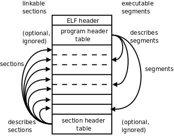
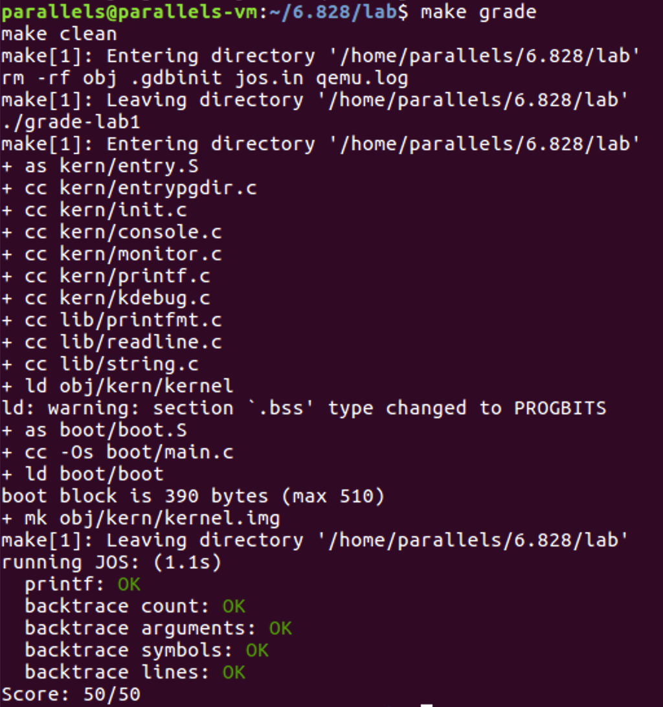

# Lab1

Booting a PC

#### Exercise 1

> Familiarize yourself with the assembly language materials available on [the 6.828 reference page](https://pdos.csail.mit.edu/6.828/2018/reference.html). You don't have to read them now, but you'll almost certainly want to refer to some of this material when reading and writing x86 assembly.
>
> We do recommend reading the section "The Syntax" in [Brennan's Guide to Inline Assembly](http://www.delorie.com/djgpp/doc/brennan/brennan_att_inline_djgpp.html). It gives a good (and quite brief) description of the AT&T assembly syntax we'll be using with the GNU assembler in JOS.

#### Inline Assembly

官方推荐的 *Brennn's Guide to Inline Assembly*学习笔记

Inline assembly 是运行在DJGPP上. 而DJGPP基于GCC, 所以它使用AT&T/UNIX语法。

* Register names are prefixed with "%".

  ```assembly
  AT&T: %eax
  Intel: eax
  ```

* The source is always on the left, and the destination is always on the right.

  ```assembly
  AT&T: movl %eax, %ebx
  Intel: mov ebx, eax
  ```

* All constant/immediate values are prefixed with "$".

  ```assembly
  AT&T: movl $_booga, %eax
  Intel: mov eax, _booga
  ```

* You must suffix the instruction with one of **b**, **w**, or **l** to specify the width of the destination register as a **byte**, **word** or **longword**.

  The equivalent forms for Intel is **byte ptr**, **word ptr**, and **dword ptr**.

  ```assembly
  AT&T: movw %ax, %bx
  Intel: mov bx, ax
  ```

* Referencing memory: immed32 + basepointer + indexpointer * indexscale

  ```assembly
  AT&T: immed32(basepointer, indexpointer, indexscale)
  Intel: [basepointer + indexpointer * indexscale + immed32]
  ```

  * Addressing a particular C variable

    ```assembly
    AT&T: _booga
    Intel: [_booga]
    ```

    `_` is how to get at static (global) C variables from assembler. This only works with global variables.

  * Addressing what a register points to

    ```assembly
    AT&T: (%eax)
    Intel: [eax]
    ```

  * Addressing a variable offset by a value in a register

    ```assembly
    AT&T: _variable(%eax)
    Intel: [eax + _variable]
    ```

  * Addressing a value in an array of integers

    ```assembly
    AT&T: _array(,%eax,4)
    Intel: [eax*4 + array]
    ```

    

## PC Bootstrap

### PC的物理地址空间

```shell

+------------------+  <- 0xFFFFFFFF (4GB)
|      32-bit      |
|  memory mapped   |
|     devices      |
|                  |
/\/\/\/\/\/\/\/\/\/\

/\/\/\/\/\/\/\/\/\/\
|                  |
|      Unused      |
|                  |
+------------------+  <- depends on amount of RAM
|                  |
|                  |
| Extended Memory  |
|                  |
|                  |
+------------------+  <- 0x00100000 (1MB)
|     BIOS ROM     |
+------------------+  <- 0x000F0000 (960KB)
|  16-bit devices, |
|  expansion ROMs  |
+------------------+  <- 0x000C0000 (768KB)
|   VGA Display    |
+------------------+  <- 0x000A0000 (640KB)
|                  |
|    Low Memory    |
|                  |
+------------------+  <- 0x00000000

```

* RAM可以简单地理解为主存。
* 0x00000000 - 0x000A0000是RAM and 0x000A0000 - 0x000FFFFF是早期PC使用的ROM或者现在PC使用的可更新闪存。
* 从0x000A0000到0x000FFFFF最重要的区域是BIOS (Basic Input/Output System), 占据从0x000F0000到0x000FFFFF的64KB。
* BIOS负责基础系统的初始化，例如激活video card和查看安装的内存。在完成初始化后, BIOS从合适的地方加载操作系统并将机器的控制权交给操作系统。
* 现代能够支持更大地址空间的PC仍然遵循早期只能支持1MB物理空间的PC的结构，来保证向后兼容性。
* 现代PC在物理内存中从0x000A0000到0x00100000有一个"hole"，把RAM分割成"low" or "conventional memory"（前640KB）和"extended memory"。
* 在PC的32位物理地址空间的头部，在所有物理RAM之前的一些空间，现在常被BIOS保留，用来使用32位PCI设备。
* 教程中没有提到一点**为什么32位PC需要4G的地址空间**？原因：对于32位PC来说，一次CPU计算需要32 bit。所以理论最大寻址空间为$2^{32} = 4294967296 = 4G$。
* 对于物理RAM超过4GB的RAM，BIOS必须在系统RAM的32位可寻址区域安排第二个hole，为32位设备留下空间进行映射。

### The ROM BIOS

* 运行

  * cd到安装目录

  * 运行QEMU，此时QEMU等待GDB运行

    ```shell
    make qemu-nox-gdb
    ```

  * 运行gdb

    ```shell
    make gdb
    ```

```
[f000:fff0] 0xffff0:	ljmp   $0xf000,$0xe05b
```

* 反汇编后GDB执行的第一条指令
  * IBM PC从物理地址0x000ffff0开始执行，位于ROM BIOS 64KB空间的顶部。
  * CS是代码段寄存器，IP是指令指针寄存器（相当于偏移地址）。修改CS、IP的指令不同于修改通用的寄存器值的指令，修改通用寄存器的值可以用mov 指令，mov指令被称为传送指令。修改CS、IP的指令是jmp指令。jmp指令被称为转移指令。
  * PC以CS = 0xf000和IP = 0xfff0作为偏移方式开始执行。
  * 第一条指令是jmp指令，转移到段地址CS = 0xf000, IP = 0xe05b。
  * 原因：Intel设计8088处理器的方式。BIOS 是硬连接到物理地址0x000f0000-0x000fffff。这样的设计能够保证BIOS能够一直在机器启动或者系统重启的时候控制机器。
  * 段地址0xf000:fff0转换成物理地址方法：机器是以实模式启动的，地址转换遵循 *physical address* = 16 * *segment* + *offset* 
  * 0xffff0到BIOS的结尾（0x100000）仅仅只剩16bytes，所以BIOS第一件事是要跳转到更前的位置。
* 当BIOS启动时，它会设置一个中断描述符表并初始化不同的设备，例如VGA显示器。这是在QEMU窗口中看到Starting SeaBIOS消息的来源。
* 在初始化完PCI总线和所有BIOS已知的重要设备后，BIOS会寻找可引导的设备，例如软盘、硬盘、CD-ROM。最后，当它找到一个可以引导的磁盘后，BIOS从磁盘中读取boot loader并把控制权交给它。

#### Exercise 2

> Use GDB's si (Step Instruction) command to trace into the ROM BIOS for a few more instructions, and try to guess what it might be doing. You might want to look at [Phil Storrs I/O Ports Description](http://web.archive.org/web/20040404164813/members.iweb.net.au/~pstorr/pcbook/book2/book2.htm), as well as other materials on the [6.828 reference materials page](https://pdos.csail.mit.edu/6.828/2018/reference.html). No need to figure out all the details - just the general idea of what the BIOS is doing first.

* 前22条指令及相应的作用

```assembly
[f000:fff0]    0xffff0: ljmp   $0xf000,$0xe05b #转移到段地址CS = 0xf000, IP = 0xe05b
[f000:e05b]    0xfe05b: cmpl   $0x0,%cs:0x6ac8 #比较立即数0与地址0xf6ac8的值
[f000:e062]    0xfe062: jne    0xfd2e1 #如果上一条比较命令等于0，跳转到0xfd2e1，否则顺序执行
[f000:e066]    0xfe066: xor    %dx,%dx #将dx置为0
[f000:e068]    0xfe068: mov    %dx,%ss  #将ss置为0
[f000:e06a]    0xfe06a: mov    $0x7000,%esp #将esp置为0x7000
[f000:e070]    0xfe070: mov    $0xf34c2,%edx #将edx置为0xf34c2
[f000:e076]    0xfe076: jmp    0xfd15c #跳转到0xfd15c
[f000:d15c]    0xfd15c: mov    %eax,%ecx #将ecx置为eax的值
[f000:d15f]    0xfd15f: cli #禁止中断发生
[f000:d160]    0xfd160: cld #传送方向从低地址到高地址
[f000:d161]    0xfd161: mov    $0x8f,%eax #将eax置为0x8f
[f000:d167]    0xfd167: out    %al,$0x70 #将al的值输出到端口0x70
[f000:d169]    0xfd169: in     $0x71,%al #将端口0x71的值输入到寄存器al
[f000:d16b]    0xfd16b: in     $0x92,%al #将端口0x92的值输入到al
[f000:d16d]    0xfd16d: or     $0x2,%al #将al的值与0x2作或运算，即将低2位bit置为1
[f000:d16f]    0xfd16f: out    %al,$0x92 #将al的值输出到端口0x92
[f000:d171]    0xfd171: lidtw  %cs:0x6ab8 #从物理地址cs:0x6ab8加载中断描述符到寄存器idtr
[f000:d177]    0xfd177: lgdtw  %cs:0x6a74 #从物理地址cs:0x6a74加载全局描述符到寄存器gdtr
[f000:d17d]    0xfd17d: mov    %cr0,%eax #将eax置为cr0中的值
[f000:d180]    0xfd180: or     $0x1,%eax #将eax的值与0x1作或运算，即将低1位bit置为1
[f000:d184]    0xfd184: mov    %eax,%cr0 #将cr0置为eax中的值
[f000:d187]    0xfd187: ljmpl  $0x8,$0xfd18f #转移到段地址CS = 0x8, IP = 0xfd18f
```

* 查阅相关博客，指令的执行过程如下：


* CLI：Clear Interupt，禁止中断发生。STL：Set Interupt，允许中断发生。CLI和STI是用来屏蔽中断和恢复中断用的，如设置栈基址SS和偏移地址SP时，需要CLI，因为如果这两条指令被分开了，那么很有可能SS被修改了，但由于中断，而代码跳去其它地方执行了，SP还没来得及修改，就有可能出错。
* CLD: Clear Director。STD：Set Director。在字行块传送时使用的，它们决定了块传送的方向。CLD使得传送方向从低地址到高地址，而STD则相反。
*  I/O端口0x70, 0x71是唯二能够访问CMOS（和Real-Time Clock）的端口，而CMOS储存了BIOS的信息以供启动关闭。在计算机关机的情况下，仍然有一块独立电池供电，使Clock和CMOS信息活动。
* 控制寄存器：控制寄存器（CR0～CR3）用于控制和确定处理器的操作模式以及当前执行任务的特性。CR0中含有控制处理器操作模式和状态的系统控制标志；CR1保留不用；CR2含有导致页错误的线性地址；CR3中含有页目录表物理内存基地址，因此该寄存器也被称为页目录基地址寄存器PDBR（Page-Directory Base address Register）。
* 最后一个跳转指令执行完后，机器进入保护模式，实模式结束，进入内核部分执行。

## The Boot Loader

* PC的软盘和硬盘都被分为512byte大小的区域，叫做扇区。扇区是磁盘的最小传输粒度：每一次读写操作都必须是一个或多个扇区的大小并且与扇区的边界对齐。
* 如果一个磁盘是可以引导的，那么它的第一个扇区称为boot sector，因为这是boot loader的代码所在地。
* 当BIOS找到一个可以引导的软盘或者硬盘后，它会把引导扇区加载到内存的0x7c00到0x7dff，然后用一个jmp指令把CS:IP设为0000:7c00，把控制权交给boot loader。
* 像BIOS加载地址一样，这些地址是相当随意的，但是他们对于PC来说是固定和标准的。
* 在PC的发展过程中，从CD-ROM引导的能力的出现要晚得多，因此PC架构师可以借机稍微重新思考引导过程。所以，现代BIOS从CD-ROM引导方法更加复杂且强大。CD-ROM使用2048byte而不是512byte的扇区，并且在交出控制权之前，BIOS可以从硬盘中加载更大的引导映像到内存（不仅仅一个扇区）。
* boot loader必须完成两个主要的功能：
  * 引导加载程序把处理器从实模式转换成32位保护模式，因为只有在这个模式，软件才可以所有在处理器1MB以上的物理地址空间。
  * 引导加载程序通过x86的特殊I / O指令直接访问IDE磁盘设备寄存器，从硬盘读取内核。
* 要想实现在分段式保护模式下成功的寻址，操作系统需要做的就是在内存中建立这个“表”，“表”里放好内存分段的描述信息，然后把这个“表”在内存的什么位置，以及这个“表”里有多少个内存分段的描述信息告诉 CPU。这个“表”有个学名叫 GDT 全局描述符表。
* 在分段式的保护模式下，16 位的“段基址”不再表示内存的物理地址，而是表示 GDT 表的下标，用来根据“段基址”从 GDT 表中取得对应下标的“段描述符”，从“段描述符”中取得真实的内存物理地址后在配合“偏移量”来计算出最终的内存地址。
* 引导加载程序由一个汇编语言源文件boot / boot.S和一个C源文件boot / main.c组成。文件obj / boot / boot.asm是GNUmakefile在编译引导加载程序后创建的引导加载程序的反汇编。同样，obj / kern / kernel.asm包含JOS内核的反汇编。

#### Exercise 3

> Take a look at the [lab tools guide](https://pdos.csail.mit.edu/6.828/2018/labguide.html), especially the section on GDB commands. Even if you're familiar with GDB, this includes some esoteric GDB commands that are useful for OS work.
>
> Set a breakpoint at address 0x7c00, which is where the boot sector will be loaded. Continue execution until that breakpoint. Trace through the code in `boot/boot.S`, using the source code and the disassembly file`obj/boot/boot.asm` to keep track of where you are. Also use the `x/i` command in GDB to disassemble sequences of instructions in the boot loader, and compare the original boot loader source code with both the disassembly in `obj/boot/boot.asm` and GDB.
>
> Trace into `bootmain()` in `boot/main.c`, and then into `readsect()`. Identify the exact assembly instructions that correspond to each of the statements in `readsect()`. Trace through the rest of `readsect()` and back out into `bootmain()`, and identify the begin and end of the `for` loop that reads the remaining sectors of the kernel from the disk. Find out what code will run when the loop is finished, set a breakpoint there, and continue to that breakpoint. Then step through the remainder of the boot loader.

分析boot/boot.s，可以发现boot loader主要做了初始化段寄存器、打开A20门、从实模式跳到保护模式，最后调用bootmain函数。

* 关于A20为什么要开启

  课程lab完全没有提及，查阅了相关资料才了解原因。在8088/8086时代，地址线只有20根。所以对于16位寄存器来说，FFFF:FFFF = 0x10FFEF。有第20位，但是地址线却只有20根。所以最终得到的地址是除掉第20位的。而对于后来的80286,地址线有了24根。0x10FFEF就是0x10FFEF，而不是0xFFEF。但是为了向前兼容，保证远古程序的运行，提供了一个开关，即A20。开启后，处理器才可以访问更高的地址空间。

> - At what point does the processor start executing 32-bit code? What exactly causes the switch from 16- to 32-bit mode?

在./boot/boot.S中，注释明显地标明了转换成32位的代码：

```assembly
  # Jump to next instruction, but in 32-bit code segment.
  # Switches processor into 32-bit mode.
  ljmp    $PROT_MODE_CSEG, $protcseg

  .code32                     # Assemble for 32-bit mode
```

处理器由16位代码到32位代码的切换，主要是通过设置CR0寄存器的PE位（是否开启保护模式）和PG位（启用分段式还是分页式）来触发的。CR0的第0位为PE，当PE=0时，处理器处于实模式，当PE=1时，处理器处于保护模式。

> - What is the *last* instruction of the boot loader executed, and what is the *first* instruction of the kernel it just loaded?

boot loader最后调用了bootmain函数，在bootmain函数的最后可以看到：

```c
	// call the entry point from the ELF header
	// note: does not return!
	((void (*)(void)) (ELFHDR->e_entry))();

bad:
	outw(0x8A00, 0x8A00);
	outw(0x8A00, 0x8E00);
	while (1)
		/* do nothing */;
```

bootmain函数正常情况下是不会返回的，bad是不会被执行的。所以boot loader执行的最后一条指令就是`((void (*)(void)) (ELFHDR->e_entry))();`，对应于boot.asm中，是：

```assembly
7d6b:	ff 15 18 00 01 00    	call   *0x10018
```

得到boot loader执行的最后一条指令地址为0x7d6b后，后一条执行的指令即为kernel的第一条指令。

```assembly
(gdb) si
=> 0x10000c:	movw   $0x1234,0x472
0x0010000c in ?? ()
```

而0x10018这个地址所存储的正是kernel的入口地址，0x10000c：

```assembly
(gdb) x/ix 0x10018
0x10018:	0x0010000c
```

> - *Where* is the first instruction of the kernel?

根据上一题的分析，可以轻易地知道，kernel的第一条指令地址为0x10000c。

> - How does the boot loader decide how many sectors it must read in order to fetch the entire kernel from disk? Where does it find this information?

读取扇区的操作是在readseg函数中完成的，而读取的方法是作为参数传递进去的：

```c
// Read 'count' bytes at 'offset' from kernel into physical address 'pa'.
// Might copy more than asked
void
readseg(uint32_t pa, uint32_t count, uint32_t offset)
```

所以回溯到调用readseg的地方及相关代码：

```c
#define SECTSIZE	512
#define ELFHDR		((struct Elf *) 0x10000) // scratch space

	struct Proghdr *ph, *eph;

	// read 1st page off disk
	readseg((uint32_t) ELFHDR, SECTSIZE*8, 0);

	//.....

	// load each program segment (ignores ph flags)
	ph = (struct Proghdr *) ((uint8_t *) ELFHDR + ELFHDR->e_phoff);
	eph = ph + ELFHDR->e_phnum;
	for (; ph < eph; ph++)
		// p_pa is the load address of this segment (as well
		// as the physical address)
		readseg(ph->p_pa, ph->p_memsz, ph->p_offset);
```

可以明显地看到，引导加载程序从ELF文件头中获取段数目，每段的偏移量等。

那么ELF又是什么呢？

* ELF是一种用于二进制文件、可执行文件、目标代码、共享库和核心转储格式文件。ELF 文件可以分为这样几个部分: ELF 文件头、程序头表(program header table)、节头表(section header table)和文件内容。而其中文件内容部分又可以分为这样的几个节:.text 节、.rodata 节、.stab 节、.stabstr 节、.data 节、.bss 节、.comment 节。

  ```
  						+------------------+ 
  						|    ELF 文件头     |
  						+------------------+  
  						|    程序头表       |
  						+------------------+  
  						|    .text 节      |
  						+------------------+                  
  						|    .rodata 节    |
  						+------------------+   
  						|    .stab 节      |
  						+------------------+        
  						|    .stabstr 节   |
  						+------------------+                                 
  						|    .data 节      |
  						+------------------+  
  						|    .bss 节       |
  						+------------------+  
  						|    .comment 节   |
  						+------------------+      
  						|    节头表         |
  						+------------------+                                                                                                                                                   
  ```

  ELF文件头的格式如下：

  ```c
  // ELF 文件头
  struct Elf {
  	uint32_t e_magic; // 标识是否是ELF文件
  	uint8_t e_elf[12]; // 魔数和相关信息 
  	uint16_t e_type; // 文件类型
  	uint16_t e_machine; 
  	uint16_t e_version; // 版本信息
  	uint32_t e_entry; // 程序入口点
  	uint32_t e_phoff; // 程序头表偏移值
  	uint32_t e_shoff; // 节头表偏移值
  	uint32_t e_flags; 
  	uint16_t e_ehsize;  // 文件头长度
  	uint16_t e_phentsize; // 程序头部长度 
  	uint16_t e_phnum; // 程序头部个数 
  	uint16_t e_shentsize; // 节头部长度 
  	uint16_t e_shnum; // 节头部个数 
  	uint16_t e_shstrndx; // 节头部字符索引
  };
  ```

  程序头表项的格式如下：

  ```c
  truct Proghdr { 
  	uint32_t p_type; // 段类型
  	uint32_t p_align; // 段在内存中的对齐标志
  	uint32_t p_offset; // 段位置相对于文件开始处的偏移量
  	uint32_t p_va; // 段的虚拟地址
  	uint32_t p_pa; // 段的物理地址
  	uint32_t p_filesz; // 段在文件中长度
  	uint32_t p_memsz; // 段在内存中的长度 
  	uint32_t p_flags; // 段标志
  }
  ```

### Loading the Kernel

#### Exercise 4

> Read about programming with pointers in C. The best reference for the C language is *The C Programming Language* by Brian Kernighan and Dennis Ritchie (known as 'K&R'). We recommend that students purchase this book (here is an [Amazon Link](http://www.amazon.com/C-Programming-Language-2nd/dp/0131103628/sr=8-1/qid=1157812738/ref=pd_bbs_1/104-1502762-1803102?ie=UTF8&s=books)) or find one of [MIT's 7 copies](http://library.mit.edu/F/AI9Y4SJ2L5ELEE2TAQUAAR44XV5RTTQHE47P9MKP5GQDLR9A8X-10422?func=item-global&doc_library=MIT01&doc_number=000355242&year=&volume=&sub_library=).
>
> Read 5.1 (Pointers and Addresses) through 5.5 (Character Pointers and Functions) in K&R. Then download the code for [pointers.c](https://pdos.csail.mit.edu/6.828/2018/labs/lab1/pointers.c), run it, and make sure you understand where all of the printed values come from. In particular, make sure you understand where the pointer addresses in printed lines 1 and 6 come from, how all the values in printed lines 2 through 4 get there, and why the values printed in line 5 are seemingly corrupted.
>
> There are other references on pointers in C (e.g., [A tutorial by Ted Jensen](https://pdos.csail.mit.edu/6.828/2018/readings/pointers.pdf) that cites K&R heavily), though not as strongly recommended.
>
> *Warning:* Unless you are already thoroughly versed in C, do not skip or even skim this reading exercise. If you do not really understand pointers in C, you will suffer untold pain and misery in subsequent labs, and then eventually come to understand them the hard way. Trust us; you don't want to find out what "the hard way" is.

使用GCC编译，运行结果如下：

```
1: a = 0x7ffea25a38f0, b = 0x17e9010, c = 0x7fbc00f0b5ff
2: a[0] = 200, a[1] = 101, a[2] = 102, a[3] = 103
3: a[0] = 200, a[1] = 300, a[2] = 301, a[3] = 302
4: a[0] = 200, a[1] = 400, a[2] = 301, a[3] = 302
5: a[0] = 200, a[1] = 128144, a[2] = 256, a[3] = 302
6: a = 0x7ffea25a38f0, b = 0x7ffea25a38f4, c = 0x7ffea25a38f1
```

1. a指向数组的首地址，b指向分配空间的首地址，c为未定义的指针。

2. a与c指向同一地址，所以最后修改c[0]，即修改a[0]。其余均为循环中赋值。

3. 三种都是从c向后偏移n的方法，分别向后偏移1，2，3。

4. 将c向后移动，指向数组第二个元素。再对于c指向的元素赋值，改变了第二个元素的值。

5. 将c转换为char类型指针加1后，由于char类型只占一个字节，而int类型占4个字节，此时c指向0x7ffea25a38f5。再将c转换为int类型指针后，此时c所指向的int占用了a[1]的前3个字节和a[2]的第一个字节。我们可以分析，在c更改之前，内存中情况如下：（查阅了相关资料，Intel的CPU是按照低位优先顺序存放的）

   ```
   0x7ffea25a38f4 0x90
   0x7ffea25a38f5 0x01
   0x7ffea25a38f6 0x0
   0x7ffea25a38f7 0x0
   0x7ffea25a38f8 0x2d
   0x7ffea25a38f9 0x1
   0x7ffea25a38fa 0x0
   0x7ffea25a38fb 0x0
   ```

   在对c指针指向的地址进行修改后，0x7ffea25a38f5变为0xf4，0x7ffea25a38f6变为0x1，而0x7ffea25a38f8则被置为了0x0。所以最后a[0]变为了0x1f490，即128144，a[1]变为了0x100，即256。

6. a，b都为int类型的指针。所以b为a指针指向地址加4，即0x7ffea25a38f5。((char *) a + 1)为0x7ffea25a38f1。再转回int类型，地址不变。所以c为0x7ffea25a38f1。

* 当我们编译并且链接一个像JOS的C语言程序时，编译器会将每个C源文件转换成目标文件。目标文件包含编码成符合硬件所需的二进制的指令。链接器然后会合并所有编译过的目标文件成一个二进制映像，例如obj/kern/kernel。这种文件就是ELF格式的二进制文件（可执行可链接格式）。

* 对于课程来说，只需要知道ELF包含了一个加载信息的文件头，后面跟着多个程序段表。每个程序段表是一个连续代码块或者数据，它们要被加载到内存具体地址中。boot loader不修改源码和数据，直接加载到内存中并运行。

* ELF开头是固定长度的ELFheader，之后是一个可变长度的程序头 program header，它列出了需要加载的程序段。ELF的其他格式在上一节已经总结过了，而且比教程上的更加详细。这里就补充一个图。

  

* 课程主要关注三个程序段：

  * `.text`:程序的可执行指令
  * `.rodata`:只读数据，例如由C编译器产生的ASCII字符串
  * `.data`:data section 包含程序的初始化数据。例如初始化过的全局变量

* 当链接器计算程序的内存占用时，它会为没有初始化的全局变量保留空间。保留在一个叫做.bss的段，在内存中紧跟在.data后面。C语言规定未初始化的全局变量为0，所以没有必要在.bss中保存内容。链接器值记录.bss的地址和大小。加载程序或者程序本身必须对.bss段安排0。

* 使用命令`objdump -h obj/kern/kernel`可以查看所有内核中所有段的名字、大小和链接地址。值得注意的是VMA（link address）和LMA（load address）。一个段的加载地址是这个段应该被加载进内存的地址。一个段的链接地址是这个段预计在内存中开始的地址。

* 链接器有不同的方法把链接地址编译成二进制。

* 通常，链接地址和加载地址是相同的。

* boot loader通过ELF程序头表来判断怎么加载段。程序头明确了ELF目标的哪一部分要加载进内存和每个的目的地址。使用命令`objdump -x obj/kern/kernel`可以查看程序头：

  ```
  Program Header:
      LOAD off    0x00001000 vaddr 0xf0100000 paddr 0x00100000 align 2**12
           filesz 0x00007120 memsz 0x00007120 flags r-x
      LOAD off    0x00009000 vaddr 0xf0108000 paddr 0x00108000 align 2**12
           filesz 0x0000a948 memsz 0x0000a948 flags rw-
     STACK off    0x00000000 vaddr 0x00000000 paddr 0x00000000 align 2**4
           filesz 0x00000000 memsz 0x00000000 flags rwx
  ```

  ELF中应该被加载进内存中的区域被标为了“LOAD”。每个程序头的其他信息也给出了，例如虚拟地址（vaddr），物理地址（paddr）和加载区域的大小（memsz和filesz）。

* boot/main.c中，ph->p_pa包含了每个段的目的物理地址。

* BIOS把引导扇区加载到0x7c00，所以这是引导扇区的加载地址。这也是引导扇区开始执行的地方，所以这也是它的链接地址。通过在`boot/Makefrag`中传递 `-Ttext 0x7C00` 参数来设置链接地址。

#### Exercise 5

> Trace through the first few instructions of the boot loader again and identify the first instruction that would "break" or otherwise do the wrong thing if you were to get the boot loader's link address wrong. Then change the link address in `boot/Makefrag` to something wrong, run make clean, recompile the lab with make, and trace into the boot loader again to see what happens. Don't forget to change the link address back and make clean again afterward!

```
$(OBJDIR)/boot/boot: $(BOOT_OBJS)
	@echo + ld boot/boot
	$(V)$(LD) $(LDFLAGS) -N -e start -Ttext 0x7C00 -o $@.out $^
	$(V)$(OBJDUMP) -S $@.out >$@.asm
	$(V)$(OBJCOPY) -S -O binary -j .text $@.out $@
	$(V)perl boot/sign.pl $(OBJDIR)/boot/boot
```

将以上代码中的0x7C00改为0x7C01，然后运行。随后报错：

```
(gdb) c
Continuing.

Program received signal SIGTRAP, Trace/breakpoint trap.
[   0:7c30] => 0x7c30:	ljmp   $0x8,$0x7c36
0x00007c30 in ?? ()
```

可以看到执行到`ljmp   $0x8,$0x7c36`这条指令时报错。

原因分析：将链接地址改动后，BIOS仍然把boot loader加载进内存中0x7C00。然后，到执行的时候，根据链接地址，却是从0x7C01开始执行的，一些未初始化的全局变量因此会进行错误的初始化，所以本来应该跳转成0x7c32，现在却跳转成0x7c36。查看boot.asm，可以发现这条指令就是进入32位模式的指令`ljmp    $PROT_MODE_CSEG, $protcseg`。


* 回过头来看kernel的加载地址和链接地址。和boot loader不一样，这两个地址不同。内核希望boot loader把它加载到低地址（1MB）。但却希望从高地址开始执行。
* 除了段信息，ELF头还有一个信息很重要，叫做e_entry。该字段保存程序中入口的链接地址：程序应该开始执行的程序文本部分中的内存地址。

#### Exercise6

> We can examine memory using GDB's x command. The [GDB manual](https://sourceware.org/gdb/current/onlinedocs/gdb/Memory.html) has full details, but for now, it is enough to know that the command x/*N*x *ADDR* prints *N* words of memory at *ADDR*. (Note that both '`x`'s in the command are lowercase.) *Warning*: The size of a word is not a universal standard. In GNU assembly, a word is two bytes (the 'w' in xorw, which stands for word, means 2 bytes).
>
> Reset the machine (exit QEMU/GDB and start them again). Examine the 8 words of memory at 0x00100000 at the point the BIOS enters the boot loader, and then again at the point the boot loader enters the kernel. Why are they different? What is there at the second breakpoint? (You do not really need to use QEMU to answer this question. Just think.)

结果如下：

```
(gdb) x/8x 0x00100000
0x100000:	0x00000000	0x00000000	0x00000000	0x00000000
0x100010:	0x00000000	0x00000000	0x00000000	0x00000000
(gdb) b *0x10000c
Breakpoint 1 at 0x10000c
(gdb) c
Continuing.
The target architecture is assumed to be i386
=> 0x10000c:	movw   $0x1234,0x472

Breakpoint 1, 0x0010000c in ?? ()
(gdb) x/8x 0x00100000
0x100000:	0x1badb002	0x00000000	0xe4524ffe	0x7205c766
0x100010:	0x34000004	0x0000b812	0x220f0011	0xc0200fd8
```

原因分析：第一次在BIOS启动boot loader时，boot loader刚开始执行，还未将任何内容加载进内存，所以全为0。第二次boot loader已经将kernel内容加载进了内存，所以有了内容。

那么第二次的内容是什么呢？反汇编结果如下：

```
(gdb) x/8i 0x00100000
   0x100000:	add    0x1bad(%eax),%dh
   0x100006:	add    %al,(%eax)
   0x100008:	decb   0x52(%edi)
   0x10000b:	in     $0x66,%al
   0x10000d:	movl   $0xb81234,0x472
   0x100017:	add    %dl,(%ecx)
   0x100019:	add    %cl,(%edi)
   0x10001b:	and    %al,%bl
```

可以看到，都为一些指令。所以说，boot loader将kernel的一些指令加载到了0x0010000c。

## The Kernel

* 和boot loader一样，kernel也使用一些汇编代码来设置一些东西，使得后续的C程序可以正确运行。

### Using virtual memory to work around position dependence

* 操作系统的内核通常喜欢链接并在一个很高的虚拟地址运行，像0xf0100000，为了给用户程序留下最够的低地址虚拟地址空间。
* 很多机器根本就没有0xf0100000这个物理内存，所以我们也不能把内核储存到那里。相反，我们将使用处理器的内存管理硬件，把虚拟地址0xf0100000（链接地址）映射到物理地址0x00100000（加载地址）。这样，尽管内核的虚拟地址给用户进程留了足够的地址空间，但是它仍被加载进了物理内存1MB的位置，就在BIOS之上。这种方法需要PC有至少几MB的物理内存（这样物理地址0x00100000才有效），但1990年以后生产的PC都满足。
* 实际上，在下一个Lab，会把物理地址0x00000000到0x0fffffff的整个底部256MB的物理地址空间映射到虚拟地址0xf0000000到0xffffffff，所以JOS只能使用前256MB的物理内存。
* 现在，暂时只映射前4MB物理内存。我们使用kern / entrypgdir.c中手写的，静态初始化的页面目录和页表来完成此操作。
* 直到kern/entry.S中设置 `CR0_PG` ，内存的引用始终被当做物理地址（严格地说，它们是线性地址，但boot / boot.S设置从线性地址到物理地址的相同映射）。一旦 `CR0_PG` 被设置了，内存引用就变成了虚拟地址。 `entry_pgdir` 把虚拟地址从0xf0000000到0xf0400000转换到物理地址从0x00000000到0x00400000，同样地，虚拟地址从0x00000000到0x00400000转换到物理地址从0x00000000到0x00400000。任何不属于这两个范围的虚拟地址都会导致硬件异常，因为我们还没有设置中断处理，将导致QEMU转储机器状态并退出。

#### Exercise7

> Use QEMU and GDB to trace into the JOS kernel and stop at the `movl %eax, %cr0`. Examine memory at 0x00100000 and at 0xf0100000. Now, single step over that instruction using the stepiGDB command. Again, examine memory at 0x00100000 and at 0xf0100000. Make sure you understand what just happened.
>
> What is the first instruction *after* the new mapping is established that would fail to work properly if the mapping weren't in place? Comment out the `movl %eax, %cr0` in `kern/entry.S`, trace into it, and see if you were right.

首先，找到 `movl %eax, %cr0`这条指令的地址。在kernel.asm中，明显看到指令的虚拟地址是0xf0100025，而根据映射规则，指令的物理地址为0x00100025。

设置断点，运行结果如下：

```
(gdb) b *0x100025
Breakpoint 1 at 0x100025
(gdb) c
Continuing.
The target architecture is assumed to be i386
=> 0x100025:	mov    %eax,%cr0

Breakpoint 1, 0x00100025 in ?? ()
```

接下来，查看内存中0x00100000和0xf0100000中的内容：

```
(gdb) x/1i 0x00100000
   0x100000:	add    0x1bad(%eax),%dh
(gdb) x/1i 0xf0100000
   0xf0100000 <_start+4026531828>:	add    %al,(%eax)
```

接下来执行，查看内容：

```
(gdb) stepi
=> 0x100028:	mov    $0xf010002f,%eax
0x00100028 in ?? ()
(gdb) x/1i 0x00100000
   0x100000:	add    0x1bad(%eax),%dh
(gdb) x/1i 0xf0100000
   0xf0100000 <_start+4026531828>:	add    0x1bad(%eax),%dh
```

发现内存中0x00100000和0xf0100000中的内容变成一样的了。原因就是修改了CR0的PE位，其实就是开启了保护模式，采取了虚拟地址（分页式）。0xf0100000的内容映射到了0x00100000。

注释掉这条代码，clean掉项目，重新生成。发现在执行完`jmp *%eax`后报错：

```
(gdb) si
=> 0x10002a:	jmp   *%eax
0x0010002a in ?? ()
(gdb) si
=> 0xf010002c <relocated>:	add    %al,(%eax)
relocated () at kern/entry.S:74
74              movl    $0x0,%ebp
```

在另一个窗口中可以看到，是访问地址越界。原因显而易见，没有开启分页式管理导致kernel认为0xf010002c就是物理地址，而实际上内存没有那么大的地址空间。

### Formatted Printing to the Console

#### Exercise 8

> We have omitted a small fragment of code - the code necessary to print octal numbers using patterns of the form "%o". Find and fill in this code fragment.

首先，回答 `kern/printf.c`, `lib/printfmt.c`和`kern/console.c`这三者的关系。在`kern/printf.c`的开头注释里很明确地写明了printf.c使用了printfmt.c中的printfmt()和console.c中的cputchar()。而在printfmt.c中又使用了printf.c中的putch()。所以printf.c，printfmt.c都依赖于其他两者，而前两者都依赖于console.c。

参考%d，修改代码如下

```c
			num = getuint(&ap, lflag);
			base = 8;
			goto number;
```

> 1. Explain the interface between `printf.c` and `console.c`. Specifically, what function does `console.c` export? How is this function used by `printf.c`?

console.c提供了cputchar()函数，而printf.c在putch()函数中调用了它。

那么，这个函数是用来干什么的呢？？？

查看cputchar的实现，发现又调用了cons_putc函数，再看cons_putc的实现，又发现它调用了三个函数	serial_putc()，lpt_putc()，cga_putc()。但在注释上已经写明了，cons_putc函数是用来将一个字符输出到控制台。稍微深究，查阅了相关资料，发现serial_putc()函数接收端口0x3FD的数据，在端口0x3F8输出；lpt_putc()函数将数据发送给并行端口；cga_putc()负责将内容显示到控制台。

> 2. Explain the following from `console.c`
>
> ```c
> 1      if (crt_pos >= CRT_SIZE) {
> 2              int i;
> 3              memmove(crt_buf, crt_buf + CRT_COLS, (CRT_SIZE - CRT_COLS) * sizeof(uint16_t));
> 4              for (i = CRT_SIZE - CRT_COLS; i < CRT_SIZE; i++)
> 5                      crt_buf[i] = 0x0700 | ' ';
> 6              crt_pos -= CRT_COLS;
> 7      }
> ```

首先，我们可以查看console.h中的代码，发现CRT_SIZE的定义：

```c
#define CRT_SIZE	(CRT_ROWS * CRT_COLS)
```

所以它表示的是控制台所能显示的字符总数。而crt_pos表示的是当前光标所在的位置。当当前光标位置大于所能现实的字符总数时，自然屏幕要向下滚动一行，即这些代码的作用。memmove将显示内容向后复制一行的空间，使得屏幕上少显示一行。对于空下的一行，接着用空格补充。最后，将光标移到最后一行的开头。

> 3. For the following questions you might wish to consult the notes for Lecture 2. These notes cover GCC's calling convention on the x86.
>
> Trace the execution of the following code step-by-step:
>
> ```
> int x = 1, y = 3, z = 4;
> cprintf("x %d, y %x, z %d\n", x, y, z);
> ```
>
> - In the call to `cprintf()`, to what does `fmt` point? To what does `ap` point?
> - List (in order of execution) each call to `cons_putc`, `va_arg`, and `vcprintf`. For `cons_putc`, list its argument as well. For `va_arg`, list what `ap` points to before and after the call. For `vcprintf` list the values of its two arguments.

* 查看printf.c中的定义结合输入可知，fmt指向格式化的字符串，ap指向fmt的后一个参数：

  ```c
  int
  cprintf(const char *fmt, ...)
  {
  	va_list ap;
  	int cnt;
  
  	va_start(ap, fmt);
  	cnt = vcprintf(fmt, ap);
  	va_end(ap);
  
  	return cnt;
  }
  ```

  我们可以看到，第二个参数是一个可变形参。va_start将ap指向fmt的下一个参数，随后在printfmt.c中的vcprintfmt()中可以使用va_arg依次读取后续的可变参数。

* 在kern/entry.S中跳转到C代码有这么一句：

  ```
    # now to C code
    call  i386_init
  ```

  所以找到同目录下的文件kern/init.c，在函数void i386_init(void)内有：

  ```c
  cprintf("6828 decimal is %o octal!\n", 6828);
  ```

  在这条语句之前插入代码，重新编译。可以在kernel.asm中看到：

  ```assembly
  	int x = 1, y = 3, z = 4; 
  	cprintf("x %d, y %x, z %d\n", x, y, z);
  f01000b6:	6a 04                	push   $0x4
  f01000b8:	6a 03                	push   $0x3
  f01000ba:	6a 01                	push   $0x1
  f01000bc:	68 57 18 10 f0       	push   $0xf0101857
  f01000c1:	e8 42 08 00 00       	call   f0100908 <cprintf>
  ```

  阅读代码，可以明显地看到各个函数的调用顺序cprintf => vcprintf => vprintfmt => putch => cputchar => cons_putc => vprintfmt => getint（%d）/getuint（%x） => va_arg。这一点我暂时没有想到更好的方法。因为va_arg是一个宏，而我没有找到它的反汇编文件，所以导致我不知道在何处打断点来观察ap的变化。但是这样知道调用顺序后，可以转而观察调用getint/getuint的前后ap的变化。

  当然，也有另一种方法，在所有va_arg出现的外部函数上打断点。但vprintfmt也出现了调用（但这个调用没有出现在%d和%x中）。如果不理清调用关系，观察的结果也不容易理解。

  查看，可以发现四个函数对应的地址，f0100302 <cons_putc>、f0100f8a \<getint>、f0100c92 \<getuint>、f01008e2 \<vcprintf>。分别设置断点，另外，额外再在f0100908 \<cprintf> 设置断点，检验是否运行（结果很多就不全部贴出来了）：

  ```
  (gdb) b *0xf0100908
  Breakpoint 1 at 0xf0100908: file kern/printf.c, line 27.
  (gdb) b *0xf0100302
  Breakpoint 2 at 0xf0100302: file kern/console.c, line 434.
  (gdb) b *0xf0100f8a
  Breakpoint 3 at 0xf0100f8a: file lib/printfmt.c, line 70.
  (gdb) b *0xf0100c92
  Breakpoint 4 at 0xf0100302: file lib/printfmt.c, line 56.
  (gdb) b *0xf01008e2
  Breakpoint 5 at 0xf01008e2: file kern/printf.c, line 18.
  
  vcprintf (fmt=0xf0101857 "x %d, y %x, z %d\n", ap=0xf010ffd4 "\001")
  
  cons_putc (c=-267380648)
  
  Before: 0xf010ffd4:	0x00000001
  After: 0xf010ffd4:	0x00000003
  ```

  > 4. Run the following code.
  >
  > ```
  >     unsigned int i = 0x00646c72;
  >     cprintf("H%x Wo%s", 57616, &i);
  > ```
  >
  > What is the output? Explain how this output is arrived at in the step-by-step manner of the previous exercise. [Here's an ASCII table](http://web.cs.mun.ca/~michael/c/ascii-table.html)
  >
  > The output depends on that fact that the x86 is little-endian. If the x86 were instead big-endian what would you set `i` to in order to yield the same output? Would you need to change `57616` to a different value?

  输出为：He110 World

  首先，十进制的57616就是十六进制的e110。由于int被强制转换为char，i会被分解成4个char。又因为是低位优先，所以先是0x72 = 'r', 0x6c = 'l', 0x64 = 'd'。0x00正好作为字符串的结束标志。

  如果高位优先，i要改为0x726c6400。57616不用修改。

  > 5. In the following code, what is going to be printed after `'y='`
  >
  > ```c
  >     cprintf("x=%d y=%d", 3);
  > ```

  格式化字符串的变量是连续存在栈中的。y输出的是3后面4个字节，不属于栈的不确定数。

  > 6. Let's say that GCC changed its calling convention so that it pushed arguments on the stack in declaration order, so that the last argument is pushed last. How would you have to change `cprintf` or its interface so that it would still be possible to pass it a variable number of arguments?

  在最后添加一个变量记录可变参数的个数。这样当个数递减到0时，就可以知道栈中下一项就是格式化字符串。

  > *Challenge* Enhance the console to allow text to be printed in different colors. The traditional way to do this is to make it interpret [ANSI escape sequences](http://rrbrandt.dee.ufcg.edu.br/en/docs/ansi/) embedded in the text strings printed to the console, but you may use any mechanism you like. There is plenty of information on [the 6.828 reference page](https://pdos.csail.mit.edu/6.828/2018/reference.html) and elsewhere on the web on programming the VGA display hardware. If you're feeling really adventurous, you could try switching the VGA hardware into a graphics mode and making the console draw text onto the graphical frame buffer.

  色彩控制在console.c中的cga_putc()函数中。`int c`一共32bit，其中高16位用来表示属性，低16位用来表示字符。因此，与`0xff`作 `&`运算就是去掉属性，只看字符内容。与`~0xff`作`&`运算就是去掉字符，只看属性。与`0x0700`作 or运算就是设为默认属性。

  首先，我们需要定义一个全局变量来控制，在inc/csa.h中定义了int csa。

  在vprintfmt中添加%z转义字符修改控制变量：

  ```c
  		case 'z':
  			csa = getint(&ap, lflag);
  			break;
  ```

  接下来修改cag_putc()函数：

  ```c
  	if (!csa)
  		csa = 0x0700;
  	if (!(c & ~0xFF))
  		c |= csa;
  ```

  不要忘了还要添加头文件#include <inc/csa.h>。

### The Stack

#### Exercise 9

> Determine where the kernel initializes its stack, and exactly where in memory its stack is located. How does the kernel reserve space for its stack? And at which "end" of this reserved area is the stack pointer initialized to point to?

在kernel.asm中可以看到这条指令：

```
	# Set the stack pointer
	movl	$(bootstacktop),%esp
f0100034:	bc 00 00 11 f0       	mov    $0xf0110000,%esp
```

所以说栈顶虚拟地址是0xf0110000，物理地址就应该为0x110000。栈由高地址向低地址拓展。

在entry.S的最后，可以看到初始化栈的代码：

```assembly
.data
###################################################################
# boot stack
###################################################################
	.p2align	PGSHIFT		# force page alignment
	.globl		bootstack
bootstack:
	.space		KSTKSIZE
	.globl		bootstacktop   
bootstacktop:
```

KSTKSIZE就是栈的大小。可以在inc/memlayout.h中找到KSTKSIZE的定义：

```c
// Kernel stack.
#define KSTACKTOP	KERNBASE
#define KSTKSIZE	(8*PGSIZE)   		// size of a kernel stack
#define KSTKGAP		(8*PGSIZE)   		// size of a kernel stack guard
```

PGSIZE的定义可以在inc/mmu.h中找到：

```c
// Page directory and page table constants.
#define NPDENTRIES	1024		// page directory entries per page directory
#define NPTENTRIES	1024		// page table entries per page table

#define PGSIZE		4096		// bytes mapped by a page
#define PGSHIFT		12		// log2(PGSIZE)
```

所以栈的大小是32KB。

* x86的栈指针（esp）指向栈中正在使用的最低地址。栈中所有低于这个地址的区域都是空闲的。把一个值压入栈包括减小栈指针然后把值写入栈指针指向的地方。把一个值弹出同理。
* 在32位模式中，栈只能保存32位值。esp总是能被4整除。不同的x86指令，例如调用，是硬连线来使用栈指针寄存器的。
* ebp（基指针）寄存器，主要通过软件转换来连接栈。在一个C函数的入口，这个函数的prologue代码通常通过压入栈来保存前一个函数的基指针，然后在函数执行期间把现在的esp的值拷入ebp。如果所有的函数都遵循这个转换，那么在程序执行的任意一点，都可以通过跟踪保存的ebp指针链并确切地确定嵌套的函数调用序列。

#### Exercise 10

> To become familiar with the C calling conventions on the x86, find the address of the `test_backtrace` function in `obj/kern/kernel.asm`, set a breakpoint there, and examine what happens each time it gets called after the kernel starts. How many 32-bit words does each recursive nesting level of `test_backtrace` push on the stack, and what are those words?
>
> Note that, for this exercise to work properly, you should be using the patched version of QEMU available on the [tools](https://pdos.csail.mit.edu/6.828/2018/tools.html) page or on Athena. Otherwise, you'll have to manually translate all breakpoint and memory addresses to linear addresses.

可以看到，f0100040 <test_backtrace>。结果如下：

```
(gdb) b *0xf0100040
Breakpoint 1 at 0xf0100040: file kern/init.c, line 13.
(gdb) c
Continuing.
The target architecture is assumed to be i386
=> 0xf0100040 <test_backtrace>:	push   %ebp

Breakpoint 1, test_backtrace (x=5) at kern/init.c:13
13	{
(gdb) info registers
//......
esp            0xf010ffdc	0xf010ffdc
ebp            0xf010fff8	0xf010fff8
//......
(gdb) info stack
#0  test_backtrace (x=5) at kern/init.c:13
#1  0xf01000d4 in i386_init () at kern/init.c:39
#2  0xf010003e in relocated () at kern/entry.S:80
(gdb) c
Continuing.
=> 0xf0100040 <test_backtrace>:	push   %ebp

Breakpoint 1, test_backtrace (x=4) at kern/init.c:13
13	{
(gdb) info registers
//......
esp            0xf010ffbc	0xf010ffbc
ebp            0xf010ffd8	0xf010ffd8
//......
(gdb) info stack
#0  test_backtrace (x=4) at kern/init.c:13
#1  0xf0100068 in test_backtrace (x=5) at kern/init.c:16
#2  0xf01000d4 in i386_init () at kern/init.c:39
#3  0xf010003e in relocated () at kern/entry.S:80

```

可以看到两次递归直接esp变化了0x20，所以栈中压入了8个32位字。

那么，压入了什么内容呢？打印栈中0xf010ffbc内容如下：

```
(gdb) x/8x 0xf010ffbc
0xf010ffbc:	0xf0100068	0x00000004	0x00000005	0x00000000
0xf010ffcc:	0x00010094	0x00010094	0x00010094	0xf010fff8
```

得出结果：

```
saved eip
var x for calling current test_backtrace
var x for calling previous test_backtrace
abandoned
abandoned
abandoned
abandoned
saved ebp
```

- ebp值表示进入该函数使用的堆栈的基指针：即，刚进入函数后的堆栈指针的位置和函数序言代码设置基指针。
- 列出的eip值是函数的指向返回指令指针：当函数返回时控件将返回的指令地址。**返回指令指针通常指向调用指令之后的指令**

#### Exercise 11

> Implement the backtrace function as specified above. Use the same format as in the example, since otherwise the grading script will be confused. When you think you have it working right, run make grade to see if its output conforms to what our grading script expects, and fix it if it doesn't. *After* you have handed in your Lab 1 code, you are welcome to change the output format of the backtrace function any way you like.
>
> If you use `read_ebp()`, note that GCC may generate "optimized" code that calls `read_ebp()` *before*`mon_backtrace()`'s function prologue, which results in an incomplete stack trace (the stack frame of the most recent function call is missing). While we have tried to disable optimizations that cause this reordering, you may want to examine the assembly of `mon_backtrace()` and make sure the call to `read_ebp()` is happening after the function prologue.

Lecture 2的note中描述了栈的结构，和上一道题中得出的结果一致：

```
		       +------------+   |
		       | arg 2      |   \
		       +------------+    >- previous function's stack frame
		       | arg 1      |   /
		       +------------+   |
		       | ret %eip   |   /
		       +============+   
		       | saved %ebp |   \
		%ebp-> +------------+   |
		       |            |   |
		       |   local    |   \
		       | variables, |    >- current function's stack frame
		       |    etc.    |   /
		       |            |   |
		       |            |   |
		%esp-> +------------+   /
```

这样，思路就很明显了。沿着ebp，类似链表一样，不断地回溯，直到到达ebp的初始值0，结束。而其他相关的值都可以根据ebp在栈中的位置相对地推出来。代码如下：

```c
int
mon_backtrace(int argc, char **argv, struct Trapframe *tf)
{
	uint32_t* ebp = (uint32_t*) read_ebp();
	while (ebp) {
		cprintf("ebp %x eip %x args ", ebp, *(ebp+1));
		for (int i = 0; i < 5; i++)
			cprintf("%08x ", *(ebp+2+i));
		cprintf("\n");
		ebp = (uint32_t*) (*ebp);
	}
	return 0;
}
```

结果如下：

```
entering test_backtrace 5
entering test_backtrace 4
entering test_backtrace 3
entering test_backtrace 2
entering test_backtrace 1
entering test_backtrace 0
ebp f010ff18 eip f010007b args 00000000 00000000 00000000 00000000 f010092e 
ebp f010ff38 eip f0100068 args 00000000 00000001 f010ff78 00000000 f010092e 
ebp f010ff58 eip f0100068 args 00000001 00000002 f010ff98 00000000 f010092e 
ebp f010ff78 eip f0100068 args 00000002 00000003 f010ffb8 00000000 f010092e 
ebp f010ff98 eip f0100068 args 00000003 00000004 00000000 00000000 00000000 
ebp f010ffb8 eip f0100068 args 00000004 00000005 00000000 00010094 00010094 
ebp f010ffd8 eip f01000d4 args 00000005 00001aac 00000640 00000000 00000000 
ebp f010fff8 eip f010003e args 00111021 00000000 00000000 00000000 00000000 
leaving test_backtrace 0
leaving test_backtrace 1
leaving test_backtrace 2
leaving test_backtrace 3
leaving test_backtrace 4
leaving test_backtrace 5
```

#### Exercise 12

> Modify your stack backtrace function to display, for each `eip`, the function name, source file name, and line number corresponding to that `eip`.
>
> In `debuginfo_eip`, where do `__STAB_*` come from? This question has a long answer; to help you to discover the answer, here are some things you might want to do:
>
> - look in the file `kern/kernel.ld` for `__STAB_*`
> - run objdump -h obj/kern/kernel
> - run objdump -G obj/kern/kernel
> - run gcc -pipe -nostdinc -O2 -fno-builtin -I. -MD -Wall -Wno-format -DJOS_KERNEL -gstabs -c -S kern/init.c, and look at init.s.
> - see if the bootloader loads the symbol table in memory as part of loading the kernel binary
>
> Complete the implementation of `debuginfo_eip` by inserting the call to `stab_binsearch` to find the line number for an address.
>
> Add a `backtrace` command to the kernel monitor, and extend your implementation of `mon_backtrace` to call `debuginfo_eip` and print a line for each stack frame of the form:
>
> ```
> K> backtrace
> Stack backtrace:
>   ebp f010ff78  eip f01008ae  args 00000001 f010ff8c 00000000 f0110580 00000000
>          kern/monitor.c:143: monitor+106
>   ebp f010ffd8  eip f0100193  args 00000000 00001aac 00000660 00000000 00000000
>          kern/init.c:49: i386_init+59
>   ebp f010fff8  eip f010003d  args 00000000 00000000 0000ffff 10cf9a00 0000ffff
>          kern/entry.S:70: <unknown>+0
> K> 
> ```
>
> Each line gives the file name and line within that file of the stack frame's `eip`, followed by the name of the function and the offset of the `eip` from the first instruction of the function (e.g., `monitor+106`means the return `eip` is 106 bytes past the beginning of `monitor`).
>
> Be sure to print the file and function names on a separate line, to avoid confusing the grading script.
>
> Tip: printf format strings provide an easy, albeit obscure, way to print non-null-terminated strings like those in STABS tables.	`printf("%.*s", length, string)` prints at most `length` characters of `string`. Take a look at the printf man page to find out why this works.
>
> You may find that some functions are missing from the backtrace. For example, you will probably see a call to `monitor()` but not to `runcmd()`. This is because the compiler in-lines some function calls. Other optimizations may cause you to see unexpected line numbers. If you get rid of the `-O2` from `GNUMakefile`, the backtraces may make more sense (but your kernel will run more slowly).

debuginfo_eip的整个过程，注释中写的十分详细了。总的来说，就是根据地址，查询符号表，得到相关信息，填充到info中。

首先，查看stab.h中的定义：

```c
#define	N_SLINE		0x44	// text segment line number

struct Stab {
	uint32_t n_strx;	// index into string table of name
	uint8_t n_type;         // type of symbol
	uint8_t n_other;        // misc info (usually empty)
	uint16_t n_desc;        // description field
	uintptr_t n_value;	// value of symbol
};
```

可以看到，与行数相关的类型是N_SLINE。

然后查看按照步骤生成的init.S:

```assembly
.LM1:
	movl	%edi, %esi
	.stabn	68,0,13,.LM2-.LFBB1
```

可以看到第四个13代表了行数，即对应n_decs属性。

修改debuginfo_eip代码为：

```c
	stab_binsearch(stabs, &lline, &rline, N_SLINE, addr);
	if (lline <= rline)
		info->eip_line = stabs[lline].n_desc;
	else
		return -1;
```

修改mon_backtrace代码为：

```c
int
mon_backtrace(int argc, char **argv, struct Trapframe *tf)
{
	uint32_t* ebp = (uint32_t*) read_ebp();
	while (ebp) {
		uint32_t eip = *(ebp+1);
		cprintf("ebp %x eip %x args", ebp, eip);
		for (int i = 0; i < 5; i++)
			cprintf("%08x ", *(ebp+2+i));
		cprintf("\n");
		struct Eipdebuginfo debug_info;
		debuginfo_eip(eip, &debug_info);
		cprintf("%s:%d: %.*s+%d\n",debug_info.eip_file, debug_info.eip_line, debug_info.eip_fn_namelen, debug_info.eip_fn_name, eip-debug_info.eip_fn_addr);
		ebp = (uint32_t*) (*ebp);
	}
	return 0;
}
```

在monitor里添加backtrace命令：

```c
static struct Command commands[] = {
	{ "help", "Display this list of commands", mon_help },
	{ "kerninfo", "Display information about the kernel", mon_kerninfo },
	{ "backtrace", "Track the call list of functions", mon_backtrace}
};
```


完成结果如下：




