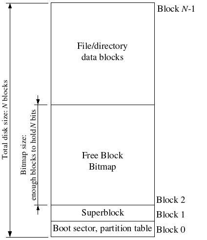
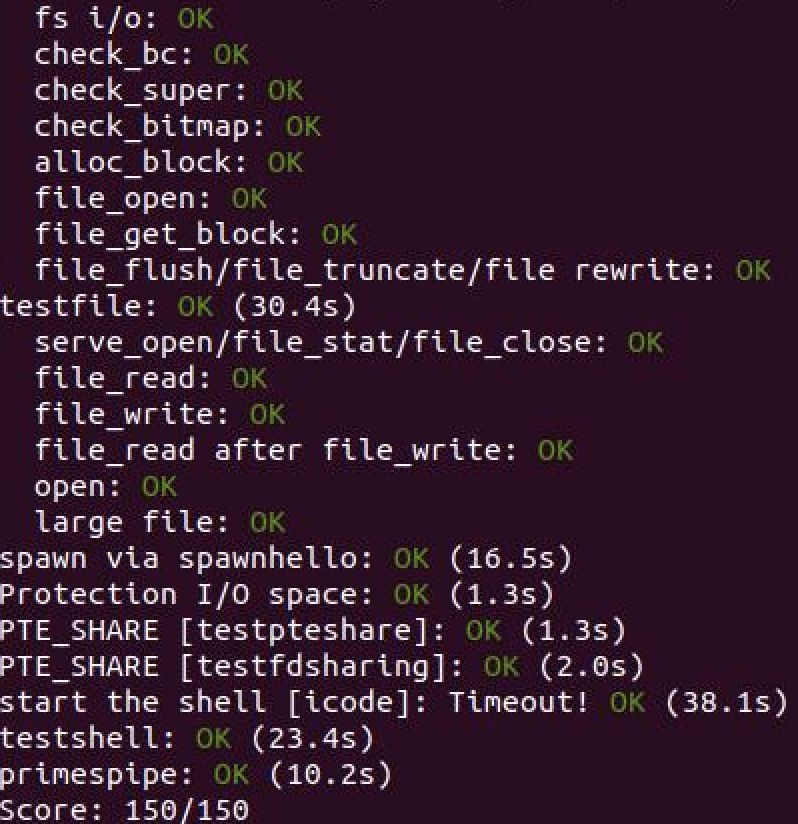

# Lab5

## File system preliminaries

您将使用的文件系统比大多数“真实”文件系统（包括xv6 UNIX）简单得多，但它足以提供基本功能：创建，读取，写入和删除以分层目录结构组织的文件。

我们（目前无论如何）只开发一个单用户操作系统，它提供足以捕获错误的保护，但不保护多个相互可疑的用户。因此，我们的文件系统不支持UNIX文件所有权或权限的概念。我们的文件系统目前也不支持像大多数UNIX文件系统那样的硬链接，符号链接，时间戳或特殊设备文件。

### On-Disk File System Structure

大多数UNIX文件系统将可用磁盘空间划分为两种主要类型的区域：inode区域和数据区域。 UNIX文件系统为文件系统中的每个文件分配一个inode;文件的inode保存有关文件的关键元数据，例如其stat属性和指向其数据块的指针。数据区域被划分为更大（通常8KB或更多）的数据块，文件系统在其中存储文件数据和目录元数据。目录条目包含文件名和指向inode的指针;如果文件系统中的多个目录条目引用该文件的inode，则称文件是硬链接的。由于我们的文件系统不支持硬链接，因此我们不需要这种级别的间接，因此可以方便地进行简化：我们的文件系统根本不会使用inode，而只是存储所有文件（或子目录）描述该文件的（唯一的）目录条目中的元数据。

文件和目录在逻辑上都包含一系列数据块，这些数据块可能分散在整个磁盘中，就像环境的虚拟地址空间的页面可以分散在整个物理内存中一样。文件系统环境隐藏了块布局的细节，提供了用于在文件中的任意偏移处读取和写入字节序列的接口。文件系统环境在内部处理对目录的所有修改，作为执行文件创建和删除等操作的一部分。我们的文件系统允许用户环境直接读取目录元数据（例如，通过读取），这意味着用户环境本身可以执行目录扫描操作（例如，实现ls程序），而不是必须依赖额外的特殊调用到文件系统。目录扫描的这种方法的缺点，以及大多数现代UNIX变体阻止它的原因在于，它使应用程序依赖于目录元数据的格式，使得很难在不改变或至少改变文件系统的内部布局的情况下重新编译应用程序。

### Sectors and Blocks

大多数磁盘不能以字节粒度执行读写操作，而是以扇区为单位执行读写操作。 在JOS中，扇区各为512字节。 文件系统实际上以块为单位分配和使用磁盘存储。 警惕两个术语之间的区别：扇区大小是磁盘硬件的属性，而块大小是使用磁盘的操作系统的一个方面。 文件系统的块大小必须是底层磁盘扇区大小的倍数。 UNIX xv6文件系统使用512字节的块大小，与底层磁盘的扇区大小相同。 然而，大多数现代文件系统使用更大的块大小，因为存储空间变得更便宜并且以更大的粒度管理存储更有效。 我们的文件系统将使用4096字节的块大小，方便地匹配处理器的页面大小。

### Superblocks

文件系统通常在磁盘上的“易于查找”位置保留某些磁盘块（例如从最开始或最后）以保存描述文件系统属性的元数据，例如块大小，磁盘大小，查找根目录所需的任何元数据，上次挂载文件系统的时间，上次检查文件系统错误的时间等。这些特殊块称为超级块。

我们的文件系统只有一个超级块，它总是位于磁盘上的块1。它的布局由inc / fs.h中的struct Super定义。块0通常被保留用于保存引导加载程序和分区表，因此文件系统通常不使用第一个磁盘块。许多“真实”文件系统维护多个超级块，在磁盘的几个间隔很大的区域中复制，因此如果其中一个被破坏或磁盘在该区域中出现介质错误，其他超级块仍然可以找到并用于访问文件系统。

### File Meta-data

描述文件系统中文件的元数据的布局由inc / fs.h中的struct File描述。此元数据包括文件的名称，大小，类型（常规文件或目录）以及指向包含该文件的块的指针。如上所述，我们没有inode，因此这个元数据存储在磁盘上的目录条目中。与大多数“真实”文件系统不同，为简单起见，我们将使用这一个文件结构来表示磁盘和内存中出现的文件元数据。 struct File中的f_direct数组包含用于存储文件的前10个（NDIRECT）块的块编号的空间，我们将其称为文件的直接块。对于最大10 * 4096 = 40KB大小的小文件，这意味着所有文件块的块编号将直接适合文件结构本身。但是，对于较大的文件，我们需要一个位置来保存文件块号的其余部分。因此，对于任何大小超过40KB的文件，我们会分配一个额外的磁盘块，称为文件的间接块，以容纳最多4096/4 = 1024个附加块号。因此，我们的文件系统允许文件最大为1034个块，或者大小超过4兆字节。为了支持更大的文件，“真正的”文件系统通常也支持双重和三重间接块。


### Directories versus Regular Files

我们的文件系统中的文件结构可以表示常规文件或目录; 这两种类型的“文件”由文件结构中的类型字段区分。 文件系统以完全相同的方式管理常规文件和目录文件，除了它根本不解释与常规文件关联的数据块的内容，而文件系统将目录文件的内容解释为一系列 描述目录中的文件和子目录的文件结构。 我们的文件系统中的超级块包含一个File结构（struct Super中的根字段），它保存文件系统根目录的元数据。 此目录文件的内容是一系列文件结构，描述位于文件系统根目录中的文件和目录。 根目录中的任何子目录可以依次包含表示子子目录的更多文件结构，依此类推。



## The File System

本实验的目标不是让您实现整个文件系统，而是让您只实现某些关键组件。 特别是，您将负责将块读取到块缓存中并将它们刷回磁盘; 分配磁盘块; 将文件偏移映射到磁盘块; 并在IPC接口中实现读，写和打开。 因为您不会自己实现所有文件系统，所以熟悉所提供的代码和各种文件系统接口非常重要。

### Disk Access

我们的操作系统中的文件系统环境需要能够访问磁盘，但我们尚未在内核中实现任何磁盘访问功能。我们改为将IDE磁盘驱动程序作为用户级文件的一部分实现，而不是采用传统的“单片”操作系统策略向内核添加IDE磁盘驱动程序以及必要的系统调用以允许文件系统访问它。我们仍然需要稍微修改内核，以便进行设置，以便文件系统环境具有实现磁盘访问本身所需的权限。

只要我们依赖轮询，基于“编程I / O”（PIO）的磁盘访问并且不使用磁盘中断，就可以很容易地以这种方式在用户空间中实现磁盘访问。也可以在用户模式下实现中断驱动的设备驱动程序（例如，L3和L4内核执行此操作），但由于内核必须对设备进行中断并将其分派到正确的用户模式环境，因此更加困难。

x86处理器使用EFLAGS寄存器中的IOPL位来确定是否允许保护模式代码执行特殊的器件I / O指令，如IN和OUT指令。由于我们需要访问的所有IDE磁盘寄存器都位于x86的I / O空间而不是内存映射，因此为文件系统环境提供“I / O特权”是我们唯一需要做的事情。允许文件系统访问这些寄存器。实际上，EFLAGS寄存器中的IOPL位为内核提供了一种简单的“全有或全无”方法，用于控制用户模式代码是否可以访问I / O空间。在我们的例子中，我们希望文件系统环境能够访问I / O空间，但我们不希望任何其他环境能够访问I / O空间。

#### Exercise 1

> `i386_init` identifies the file system environment by passing the type `ENV_TYPE_FS` to your environment creation function, `env_create`. Modify `env_create` in `env.c`, so that it gives the file system environment I/O privilege, but never gives that privilege to any other environment.
>
> Make sure you can start the file environment without causing a General Protection fault. You should pass the "fs i/o" test in make grade.

根据类型进行筛选，然后给予权限就可以了：

```c
        if (type == ENV_TYPE_FS)
              e->env_tf.tf_eflags |= FL_IOPL_MASK;
```

> **Question**
>
> 1. Do you have to do anything else to ensure that this I/O privilege setting is saved and restored properly when you subsequently switch from one environment to another? Why?

不需要，因为不同的进程有自己的Trapframe

## The Block Cache

在我们的文件系统中，我们将在处理器的虚拟内存系统的帮助下实现一个简单的“缓冲区缓存”（实际上只是一个块缓存）。块缓存的代码在`fs / bc.c中`。

我们的文件系统将仅限于处理大小为3GB或更小的磁盘。我们保留文件系统环境地址空间的大的固定3GB区域，从0x10000000（`DISKMAP`）到0xD0000000（`DISKMAP+DISKMAX`），作为磁盘的“内存映射”版本。例如，磁盘块0映射到虚拟地址0x10000000，磁盘块1映射到虚拟地址0x10001000，依此类推。`fs / bc.c中`的`diskaddr`函数 实现了从磁盘块编号到虚拟地址的转换（以及一些健全性检查）。

由于我们的文件系统环境有自己的虚拟地址空间，独立于系统中所有其他环境的虚拟地址空间，并且文件系统环境唯一需要做的是实现文件访问，因此保留大部分文件是合理的。以这种方式文件系统环境的地址空间。由于现代磁盘大于3GB，因此在32位计算机上实现真正的文件系统是很尴尬的。在具有64位地址空间的机器上，这种缓冲区高速缓存管理方法仍然是合理的。

当然，将整个磁盘读入内存需要很长时间，因此我们将实现一种*请求分页*形式，其中我们只在磁盘映射区域中分配页面并从磁盘读取相应的块以响应此区域中的页面错误。这样，我们可以假装整个磁盘都在内存中。

#### Exercise 2

> Implement the `bc_pgfault` and `flush_block` functions in `fs/bc.c`. `bc_pgfault` is a page fault handler, just like the one your wrote in the previous lab for copy-on-write fork, except that its job is to load pages in from the disk in response to a page fault. When writing this, keep in mind that (1) `addr` may not be aligned to a block boundary and (2) `ide_read` operates in sectors, not blocks.
>
> The `flush_block` function should write a block out to disk *if necessary*. `flush_block` shouldn't do anything if the block isn't even in the block cache (that is, the page isn't mapped) or if it's not dirty. We will use the VM hardware to keep track of whether a disk block has been modified since it was last read from or written to disk. To see whether a block needs writing, we can just look to see if the `PTE_D` "dirty" bit is set in the `uvpt` entry. (The `PTE_D` bit is set by the processor in response to a write to that page; see 5.2.4.3 in [chapter 5](http://pdos.csail.mit.edu/6.828/2011/readings/i386/s05_02.htm) of the 386 reference manual.) After writing the block to disk, `flush_block` should clear the `PTE_D` bit using `sys_page_map`.
>
> Use make grade to test your code. Your code should pass "check_bc", "check_super", and "check_bitmap".

根据提示，有两点要注意：1. 地址可能不对齐 2. ide_read是在扇区而不是块上进行的。所以要在除了分配页面外，注意这两点：

```c
	addr = ROUNDDOWN(addr, PGSIZE);
	if ((r = sys_page_alloc(0, addr, PTE_U | PTE_P | PTE_W)) < 0)
		panic("in bc_pgfault, sys_page_alloc: %e", r);
	if ((r = ide_read(blockno * BLKSECTS, addr, BLKSECTS)) < 0)
		panic("in bc_pgfault, ide_read: %e", r);
```

首先，对齐addr。然后有两种情况下要刷新缓冲区里的块，被映射或被修改。然后写会磁盘，最后清空缓冲区对应的块：

```c
void
flush_block(void *addr)
{
	uint32_t blockno = ((uint32_t)addr - DISKMAP) / BLKSIZE;

	if (addr < (void*)DISKMAP || addr >= (void*)(DISKMAP + DISKSIZE))
		panic("flush_block of bad va %08x", addr);

	// LAB 5: Your code here.
	int r;
	addr = ROUNDDOWN(addr, PGSIZE);
	if (va_is_mapped(addr) && va_is_dirty(addr)) {
		if ((r = ide_write(blockno * BLKSECTS, addr, BLKSECTS)) < 0)
			panic("in flush_block, ide_write: %e", r);
		if ((r = sys_page_map(0, addr, 0, addr, uvpt[PGNUM(addr)] & PTE_SYSCALL)) < 0)
			panic("in flush_block, sys_page_map: %e", r);
	}
}
```

## The Block Bitmap

在fs_init设置位图指针之后，我们可以将位图视为一个打包的位数组，一个用于磁盘上的每个块。 例如，请参见block_is_free，它仅检查位图中是否标记了给定块。

#### Exercise 3

> Use `free_block` as a model to implement `alloc_block` in `fs/fs.c`, which should find a free disk block in the bitmap, mark it used, and return the number of that block. When you allocate a block, you should immediately flush the changed bitmap block to disk with `flush_block`, to help file system consistency.
>
> Use make grade to test your code. Your code should now pass "alloc_block".

首先，循环查找位图，如果为空闲的话，释放该块，然后刷新缓冲区：

```c
int
alloc_block(void)
{
	// LAB 5: Your code here.
	uint32_t blockno;
	for (blockno = 0; blockno < super->s_nblocks; blockno++) {
		if (block_is_free(blockno)) {
			bitmap[blockno/32] ^= 1<<(blockno%32);
			flush_block(bitmap);
			return blockno;
		}
	}
	return -E_NO_DISK;
}
```

### File Operations

我们在fs / fs.c中提供了各种函数来实现解释和管理文件结构所需的基本功能，扫描和管理目录文件的条目，并从根目录中遍历文件系统以解决绝对问题路径名。 

- file_block_walk(struct File *f, uint32_t filebno, uint32_t **ppdiskbno, bool alloc)： 　　
  - 寻找一个文件结构f中的第fileno个块指向的磁盘块编号放入ppdiskbno。如果filebno小于NDIRECT，则返回属于f.direct[NDIRECT]中的相应链接，否则返回f_indirect中查找的块。如果alloc为真且相应磁盘块不存在，则分配1个。
- dir_lookup(struct File *dir, const char *name, struct File *\*file)： 　　
  - 在目录dir中查找名字为name的文件，如果找到则让file指向该文件结构体。 　　
- dir_alloc_file(struct File *dir, struct File **file)： 　　
  - 在dir对应的File结构体中分配1个File的指针连接给file，用于添加文件的操作。 　　
- skip_slash(const char *p)： 　　
  - 用于路径中的字符串处理，跳过斜杠。 　　
- walk_path(const char *path, struct File **pdir, struct File **pf, char *lastelem)： 　　
  - path为从绝对路径的文件名，如果成功找到该文件，则把相应的文件结构体赋值给pf，其所在目录的文件结构体赋值给pdir，lastlem为失效时最后剩下的文件名。 　　
- file_free_block(struct File *f, uint32_t filebno)： 　　
  - 释放1个文件中的第filebno个磁盘块。此函数在file_truncate_blocks中被调用。 　　
- file_truncate_blocks(struct File *f, off_t newsize)： 　　
  - 将文件设置为缩小后的新大小，清空那些被释放的物理块。

#### Exercise 4

> Implement `file_block_walk` and `file_get_block`. `file_block_walk` maps from a block offset within a file to the pointer for that block in the`struct File` or the indirect block, very much like what `pgdir_walk` did for page tables. `file_get_block` goes one step further and maps to the actual disk block, allocating a new one if necessary.
>
> Use make grade to test your code. Your code should pass "file_open", "file_get_block", and "file_flush/file_truncated/file rewrite", and "testfile".

首先，检查是否越界，是否需要间接块，最后分配块，然后设置指针，清空块：

```c
static int
file_block_walk(struct File *f, uint32_t filebno, uint32_t **ppdiskbno, bool alloc)
{
    // LAB 5: Your code here.
	int r;
	if (filebno >= NDIRECT + NINDIRECT)
		return -E_INVAL;
	if (filebno < NDIRECT) {
		if (ppdiskbno)
			*ppdiskbno = f->f_direct + filebno;
		return 0;
	}
	if (!alloc && !f->f_indirect)
		return -E_NOT_FOUND;
	if (!f->f_indirect) {
		if ((r = alloc_block()) < 0)
			return -E_NO_DISK;
		f->f_indirect = r;
		memset(diskaddr(r), 0, BLKSIZE);
		flush_block(diskaddr(r));
	}
	if (ppdiskbno)
		*ppdiskbno = (uint32_t*)diskaddr(f->f_indirect) + filebno - NDIRECT;
	return 0;
}
```

首先，得到块的磁盘编号。然后分配一个块，最后设置指针：

```c
int
file_get_block(struct File *f, uint32_t filebno, char **blk)
{
	// LAB 5: Your code here.
	int r;
	uint32_t *ppdiskbno;

	if ((r = file_block_walk(f, filebno, &ppdiskbno, 1)) < 0)
		return r;
	if (*ppdiskbno == 0) {
		if ((r = alloc_block()) < 0)
			return -E_NO_DISK;
		*ppdiskbno = r;
		memset(diskaddr(r), 0, BLKSIZE);
		flush_block(diskaddr(r));

	}
	*blk = diskaddr(*ppdiskbno);
	return 0;
}
```

## The file system interface

既然我们在文件系统环境中拥有必要的功能，我们必须使其可以访问希望使用文件系统的其他环境。 由于其他环境无法直接调用文件系统环境中的函数，因此我们将通过远程过程调用或在JOS的IPC机制上构建的RPC抽象来公开对文件系统环境的访问。 从图形上看，这是对文件系统服务器（例如，读取）的调用

```
      Regular env           FS env
   +---------------+   +---------------+
   |      read     |   |   file_read   |
   |   (lib/fd.c)  |   |   (fs/fs.c)   |
...|.......|.......|...|.......^.......|...............
   |       v       |   |       |       | RPC mechanism
   |  devfile_read |   |  serve_read   |
   |  (lib/file.c) |   |  (fs/serv.c)  |
   |       |       |   |       ^       |
   |       v       |   |       |       |
   |     fsipc     |   |     serve     |
   |  (lib/file.c) |   |  (fs/serv.c)  |
   |       |       |   |       ^       |
   |       v       |   |       |       |
   |   ipc_send    |   |   ipc_recv    |
   |       |       |   |       ^       |
   +-------|-------+   +-------|-------+
           |                   |
           +-------------------+
```

虚线下方的所有内容都只是从常规环境向文件系统环境获取读取请求的机制。从头开始，read（我们提供）可以在任何文件描述符上工作，只需调度到相应的设备读取函数，在本例中为devfile_read（我们可以有更多的设备类型，比如管道）。 devfile_read专门为磁盘文件实现读取。这个和lib / file.c中的其他devfile_ *函数实现了FS操作的客户端，并且所有工作都以大致相同的方式工作，在请求结构中捆绑参数，调用fsipc发送IPC请求，以及解包和返回结果。 fsipc函数只处理向服务器发送请求和接收回复的常见细节。

文件系统服务器代码可以在fs / serv.c中找到。它在服务函数中循环，无休止地通过IPC接收请求，将该请求分派给适当的处理函数，并通过IPC发回结果。在read示例中，serve将调度给serve_read，它将处理特定于读取请求的IPC详细信息，例如解压缩请求结构，最后调用file_read以实际执行文件读取。

回想一下，JOS的IPC机制允许环境发送一个32位数字，并可选择共享一个页面。要从客户端向服务器发送请求，我们使用32位数字作为请求类型（文件系统服务器RPC已编号，就像系统调用的编号一样）并将参数存储在联合Fsipc上的请求中通过IPC共享的页面。在客户端，我们总是在fsipcbuf共享页面;在服务器端，我们将传入的请求页面映射到fsreq（0x0ffff000）。

服务器还通过IPC发回响应。我们使用32位数字作为函数的返回码。对于大多数RPC来说，这就是他们返回的全部内容。 FSREQ_READ和FSREQ_STAT也返回数据，它们只是写入客户端发送请求的页面。没有必要在响应IPC中发送此页面，因为客户端首先与文件系统服务器共享它。此外，在其响应中，FSREQ_OPEN与客户端共享一个新的“Fd页面”。我们很快就会返回文件描述符页面。

OpenFile结构是服务端进程维护的一个映射，它将一个真实文件struct File和用户客户端打开的文件描述符struct Fd对应到一起。每个被打开文件对应的struct Fd都被映射到FILEEVA(0xd0000000)往上的1个物理页，服务端和打开这个文件的客户端进程共享这个物理页。客户端进程和文件系统服务端通信时使用0_fileid来指定要操作的文件。

```c
struct OpenFile {
        uint32_t o_fileid;      // file id
        struct File *o_file;    // mapped descriptor for open file
        int o_mode;             // open mode
        struct Fd *o_fd;        // Fd page
};
```

文件系统默认最大同时可以打开的文件个数为1024，所以有1024个strcut Openfile，对应着服务端进程地址空间0xd0000000往上的1024个物理页，用于映射这些对应的struct Fd。 struct Fd是1个抽象层，JOS和Linux一样，所有的IO都是文件，所以用户看到的都是Fd代表的文件。但是Fd会记录其对应的具体对象，比如真实文件、Socket和管道等等。现在只用文件，所以union中只有1个FdFile。

```c
    struct Fd {
        int fd_dev_id;
        off_t fd_offset;
        int fd_omode;
        union {
                // File server files
                struct FdFile fd_file;
        };
    };
```

#### Exercise 5

> Implement `serve_read` in `fs/serv.c`.
>
> `serve_read`'s heavy lifting will be done by the already-implemented `file_read` in `fs/fs.c` (which, in turn, is just a bunch of calls to `file_get_block`).`serve_read` just has to provide the RPC interface for file reading. Look at the comments and code in `serve_set_size` to get a general idea of how the server functions should be structured.
>
> Use make grade to test your code. Your code should pass "serve_open/file_stat/file_close" and "file_read" for a score of 70/150.

首先，查找对应的openfile，然后从o_file中读取内容到ret_buf中，最后移动文件指针：

```c
int
serve_read(envid_t envid, union Fsipc *ipc)
{
	struct Fsreq_read *req = &ipc->read;
	struct Fsret_read *ret = &ipc->readRet;

	if (debug)
		cprintf("serve_read %08x %08x %08x\n", envid, req->req_fileid, req->req_n);

	// Lab 5: Your code here:
	struct OpenFile *o;
	int r, req_n;

	if ((r = openfile_lookup(envid, req->req_fileid, &o)) < 0)
		return r;
	req_n = req->req_n > PGSIZE ? PGSIZE : req->req_n;
	if ((r = file_read(o->o_file, ret->ret_buf, req_n, o->o_fd->fd_offset)) < 0)
		return r;
	o->o_fd->fd_offset += r;
	return 0;
}
```

#### Exercise 6

> Implement `serve_write` in `fs/serv.c` and `devfile_write` in `lib/file.c`.
>
> Use make grade to test your code. Your code should pass "file_write", "file_read after file_write", "open", and "large file" for a score of 90/150.

与读操作类似：

```c
int
serve_write(envid_t envid, struct Fsreq_write *req)
{
	if (debug)
		cprintf("serve_write %08x %08x %08x\n", envid, req->req_fileid, req->req_n);

	// LAB 5: Your code here.
       struct OpenFile *o;
       int r;
       if ((r = openfile_lookup(envid, req->req_fileid, &o) < 0))
               return r;

       r = file_write(o->o_file, req->req_buf, req->req_n, o->o_fd->fd_offset);
       if (r < 0)
               return r;

       o->o_fd->fd_offset += r;
       return r;
}
```

参考devfile_read中的代码很容易写出来：

```c
static ssize_t
devfile_write(struct Fd *fd, const void *buf, size_t n)
{
	// LAB 5: Your code here
    fsipcbuf.write.req_fileid = fd->fd_file.id;
	fsipcbuf.write.req_n = MIN(n, PGSIZE);
	memmove(fsipcbuf.write.req_buf, buf, fsipcbuf.write.req_n);
	int r = fsipc(FSREQ_WRITE, NULL);
	return r;
}
```

## Spawning Processes

我们已经为您提供了spawn的代码（请参阅lib / spawn.c），该代码创建了一个新环境，将文件系统中的程序映像加载到其中，然后启动运行该程序的子环境。 然后父进程继续独立于子进程运行。 spawn函数在UNIX中有效地像一个fork，后面跟着子进程中的一个exec。

我们实现了spawn而不是UNIX风格的exec，因为在没有内核特殊帮助的情况下，spawn更容易以“exokernel方式”从用户空间实现。 想想为了在用户空间中实现exec你必须做些什么，并确保你理解为什么它更难。

#### Exercise 7

> `spawn` relies on the new syscall `sys_env_set_trapframe` to initialize the state of the newly created environment. Implement`sys_env_set_trapframe` in `kern/syscall.c` (don't forget to dispatch the new system call in `syscall()`).
>
> Test your code by running the `user/spawnhello` program from `kern/init.c`, which will attempt to spawn `/hello` from the file system.
>
> Use make grade to test your code.

找到环境后，拷贝环境。然后根据注释，设置相应的位即可：

```c
static int
sys_env_set_trapframe(envid_t envid, struct Trapframe *tf)
{
	// LAB 5: Your code here.
	// Remember to check whether the user has supplied us with a good
	// address!
	struct Env *e;
	int r;

	if ((r = envid2env(envid, &e, true)) < 0)
		return -E_BAD_ENV;
	// copy register state from parent env
	user_mem_assert(e, tf, sizeof(struct Trapframe), PTE_U);
	e->env_tf = *tf;
	e->env_tf.tf_cs |= 3;
	e->env_tf.tf_eflags |= FL_IF;
}
```

添加相应的分发：

```c
		case SYS_env_set_trapframe:
        	return sys_env_set_trapframe((envid_t)a1, (struct Trapframe *)a2);
```

## Sharing library state across fork and spawn

UNIX文件描述符是一个通用概念，它还包含管道，控制台I / O等。在JOS中，这些设备类型中的每一个都具有相应的struct Dev，其中包含指向实现读/写/等的函数的指针。对于该设备类型。 lib / fd.c在此基础上实现了类似UNIX的通用文件描述符接口。每个结构Fd表示其设备类型，并且lib / fd.c中的大多数函数只是将操作分派给适当的struct Dev中的函数。

lib / fd.c还在每个应用程序环境的地址空间中维护文件描述符表区域，从FDTABLE开始。该区域为应用程序可以一次打开的每个最多MAXFD（当前为32个）文件描述符保留一个页面值（4KB）的地址空间。在任何给定时间，当且仅当相应的文件描述符正在使用时，才映射特定的文件描述符表页面。每个文件描述符在从FILEDATA开始的区域中也有一个可选的“数据页面”，设备可以选择使用。

我们希望跨fork和spawn共享文件描述符状态，但文件描述符状态保存在用户空间内存中。现在，在fork上，内存将被标记为copy-on-write，因此状态将被复制而不是共享。 （这意味着环境将无法在文件中寻找他们自己没有打开的文件，并且管道将无法在fork中工作。）在spawn上，内存将被遗忘，而不是完全复制。 （实际上，生成的环境从没有打开的文件描述符开始。）

我们将更改fork以了解“库操作系统”使用的某些内存区域，并且应始终共享。我们不是在某处对某个区域列表进行硬编码，而是在页表条目中设置一个未使用的位（就像我们在fork中使用PTE_COW位一样）。

我们在inc / lib.h中定义了一个新的PTE_SHARE位。该位是Intel和AMD手册中标记为“可供软件使用”的三个PTE位之一。我们将建立一个约定，如果页表项已设置此位，则应在fork和spawn中将PTE直接从父项复制到子项。请注意，这与标记copy-on-write不同：如第一段所述，我们希望确保共享页面更新。

#### Exercise 8

> Change `duppage` in `lib/fork.c` to follow the new convention. If the page table entry has the `PTE_SHARE` bit set, just copy the mapping directly. (You should use `PTE_SYSCALL`, not `0xfff`, to mask out the relevant bits from the page table entry. `0xfff` picks up the accessed and dirty bits as well.)
>
> Likewise, implement `copy_shared_pages` in `lib/spawn.c`. It should loop through all page table entries in the current process (just like `fork` did), copying any page mappings that have the `PTE_SHARE` bit set into the child process.

添加PTE_SHARE位判断：

```c
	void *addr;
	pte_t pte;
	int perm;

	addr = (void *)((uint32_t)pn * PGSIZE);
	pte = uvpt[pn];
	perm = PTE_P | PTE_U;
	if (pte & PTE_SHARE) {
		if ((r = sys_page_map(sys_getenvid(), addr, envid, addr, pte & PTE_SYSCALL)) < 0) {
			panic("duppage: page mapping failed %e", r);
			return r;
		}
	}
	else
	{
		if ((pte & PTE_W) || (pte & PTE_COW))
			perm |= PTE_COW;
		if ((r = sys_page_map(thisenv->env_id, addr, envid, addr, perm)) < 0) {
			panic("duppage: page remapping failed %e", r);
			return r;
		}
		if (perm & PTE_COW) {
			if ((r = sys_page_map(thisenv->env_id, addr, thisenv->env_id, addr, perm)) < 0) {
				panic("duppage: page remapping failed %e", r);
				return r;
			}
		}
	}
```

遍历进程页表所有入口，拷贝设置了PTE_SHARE位的页映射到子进程：

```c
static int
copy_shared_pages(envid_t child)
{
	// LAB 5: Your code here.
	int i, j, pn, r;
	for (i = PDX(UTEXT); i < PDX(UXSTACKTOP); i++) {
		if (uvpd[i] & PTE_P) {
			for (j = 0; j < NPTENTRIES; j++) {
				pn = PGNUM(PGADDR(i, j, 0));
				if (pn == PGNUM(UXSTACKTOP - PGSIZE))
					break;
				if ((uvpt[pn] & PTE_P) && (uvpt[pn] & PTE_SHARE)) {
					if ((r = sys_page_map(0, (void *)PGADDR(i, j, 0), child, (void *)PGADDR(i, j, 0), uvpt[pn] & PTE_SYSCALL)) < 0)
						return r;
				}
			}
		}
	}
	return 0;
}
```

## The keyboard interface

为了使shell工作，我们需要一种方法来输入它。 QEMU一直在显示我们写入CGA显示器和串口的输出，但到目前为止我们只在内核监视器中输入了输入。 在QEMU中，在图形窗口中键入的输入显示为从键盘到JOS的输入，而输入到控制台的输入在串行端口上显示为字符。 kern / console.c已包含自实验1以来内核监视器使用的键盘和串行驱动程序，但现在需要将这些驱动程序附加到系统的其余部分。

#### Exercise 9

> In your `kern/trap.c`, call `kbd_intr` to handle trap `IRQ_OFFSET+IRQ_KBD` and `serial_intr` to handle trap `IRQ_OFFSET+IRQ_SERIAL`.

可以参考其他中断：

```c
	if (tf->tf_trapno == IRQ_OFFSET + IRQ_KBD) {
		kbd_intr();
		return;
	}
	if (tf->tf_trapno == IRQ_OFFSET + IRQ_SERIAL) {
		serial_intr();
		return;
	}
```

## The Shell

##### Exercise 10

> The shell doesn't support I/O redirection. It would be nice to run sh <script instead of having to type in all the commands in the script by hand, as you did above. Add I/O redirection for < to `user/sh.c`.
>
> Test your implementation by typing sh <script into your shell
>
> Run make run-testshell to test your shell. `testshell` simply feeds the above commands (also found in `fs/testshell.sh`) into the shell and then checks that the output matches `fs/testshell.key`.

根据注释，一步一步完成即可：

```c
			if ((fd = open(t, O_RDONLY)) < 0) {
				cprintf("open %s for write: %e", t, fd);
				exit();
			}
			if (fd != 0) {
				dup(fd, 0);
				close(fd);
			}
```




